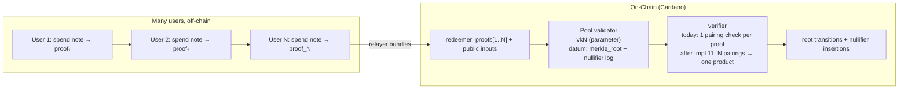

# F5 — Multi-User Private Pools (Aiken)

> **One-line summary:** a Cardano **privacy pool for many users at once** — one shared shielded pool where deposits, spends, and withdrawals hide identity, amounts, and the transaction graph behind a single Merkle root of note commitments, verified by an Aiken Pool validator — demonstrated end-to-end with the **current Groth16 implementation** (one proof per spend). Batched multi-spend verification is the upgrade that follows the demonstration, delivered by the **next Groth16 implementation** (Impl 11: batch verification + proof aggregation).

> **Status:** ⏳ Definition phase — goals, rationale, capabilities (no code yet).
>
> **Sequence (explicit):** **1)** demonstrate F5 with the *current* Groth16 implementation and the *existing* `aiken/groth16` verifier (single 192-byte proof per spend, ~20% script CPU each); **2)** document the e2e and measure it (proof sizes, script CPU, timings, pool root dynamics), matching the `step3` script style; **3)** *only then* start the next Groth16 implementation — **Implementation 11 (batch verification + proof aggregation)** — which upgrades the pool to batched spends (N proofs → one multi-pairing product). Pool work is not blocked on batching; batching is scheduled after the measured demo.
>
> **Companion docs:** concept and constraint budget → [`groth16-prover/docs/F5_RESEARCH_DIRECTION.md`](../../groth16-prover/docs/F5_RESEARCH_DIRECTION.md); the single-user privacy pool this multiplies → [`aiken/selective-disclosure/README.md`](../selective-disclosure/README.md) (Step 3); the (current and next) prover implementations → [`groth16-prover/README.md`](../../groth16-prover/README.md) **Implementation 7** (current, shipped) and **Implementation 11** (batch verification + proof aggregation, roadmap).

---

## Table of Contents

1. [Goals](#goals)
2. [Rationale](#rationale)
3. [Capabilities](#capabilities)
4. [How it boosts selective disclosure](#how-it-boosts-selective-disclosure)

---

## Goals

Take the selective-disclosure pipeline's single-user privacy pool (Step 3) and make it a **shared pool many users can live in**, without giving up any of its privacy properties — demonstrated first on the current stack, then scaled with batching.

| Goal | What it means | How it is met |
|------|---------------|---------------|
| **One pool, many users** | Every user's note lives in the same Merkle tree | Pool validator keeps a single root; deposits add leaves |
| **Same privacy per user** | No address, identity, credential, or amount is ever public | Spend = Groth16 proof: Merkle membership + fresh nullifier + range + value conservation |
| **Demo on the current stack** | Reproducible, measured e2e before any prover work | Current Groth16 impl (Impl 7, shipped) + `aiken/groth16` verifier: **one proof per spend, ~20% script CPU each** |
| **Batched spends (after the demo)** | N users withdraw/spend in one transaction | **Next** Groth16 impl (Impl 11): N per-user proofs → **one multi-pairing product** (or one aggregated proof) — only once the demo above is e2e, documented, and measured |
| **No new trust** | The pool adds nothing a user must trust beyond the existing `vk` ceremony | Same Groth16 proofs, same `aiken/groth16` verifier, same circom circuits |
| **Reuse, not rebuild** | Everything that already works stays untouched | `privacy_pool.circom`, the 192-byte proofs, `step3` e2e scripts, both proof-path options |

**Non-goals:** cross-chain delivery (canonical-bridge stealth — the F5 research direction's L1→L2 story, dependent on ecosystem maturity); auditor reveal mechanics (already Steps 4/5 of the pipeline); new proof systems (both Groth16 Path A and NovaSlim Path B stay available, unchanged).

---

## Rationale

### One big pool beats many small gates

The privacy that matters is the size of the **anonymity set** — the set of notes among which a spend hides. In the single-user (Gate) pattern each gate is a small, isolated set, and the confidentiality offered is only as good as the busiest gate. A single shared pool concentrates every depositor into one set: with each new user, the anonymity of *every* user grows. This is the same argument the F5 research direction makes for concentrating across chains — applied to Cardano alone.

### The transaction graph is the last thing a mix must hide

Step 1 hides credentials, Step 2 hides amounts, Step 3 hides identity — but in a fragmented pool, an observer can still see "this address deposits to gate X, withdraws instantly". A multi-user pool makes deposits and spends indistinguishable, and batched spends in particular destroy timing/distribution linkability: N users moving value in one transaction is observable only as "N notes in, N notes out".

### Demonstrate first, scale later

The multi-user pool does **not** require batching to be demonstrated. With the current implementation, each spend is a 192-byte proof consuming ~20% of script CPU — a single transaction can already legally carry a small batch (two or three users), and more importantly the *whole flow* (deposit → N independent spends → root transitions → stealth withdrawal) can be proven, documented, and measured today. Batching (Impl 11) then changes the *cost curve* — N spends → one multi-pairing product — turning the pool's scale-up into a verification-economics improvement. That is why the sequencing is: demo with what exists, measure it, and only then build the next Groth16 implementation.

### The pool is the substrate for the compliant steps

Steps 4/5 (auditor reveal of amount and recipient) layer oversight *on top of* a shielded pool. Those layers only matter at scale — a compliance story for two users is theater. F5 gives Steps 4/5 the deployment shape they were designed for: a busy, many-user pool where a designated auditor can decrypt designated fields.

---

## Capabilities

### What the pool can do (demonstrated on the current implementation)

| Capability | Description |
|------------|-------------|
| **Deposit** | Anyone locks ADA, gets a note commitment (`Poseidon(nullifier, amount, blinding)`) inserted as a leaf; root updates; no public identity or amount |
| **Private spend / transfer** | Holder proves ownership of an unspent note (Merkle path), burns its nullifier, mints new notes with range-checked amounts and value conservation — all in one 192-byte Groth16 proof against the pool's `vk`, checked by the existing `aiken/groth16` verifier |
| **Multi-user (current impl)** | Multiple users each spend with their own proof, verified one per spend (small batches fit the script budget at ~20% CPU each); root and nullifier log stay coherent across all of them |
| **Withdraw to stealth** | The last hop is a spend whose output note the recipient can open with a viewing key — no public address ever touches the withdrawal |
| **Nullifier integrity** | A spent-nullifier set in the datum guarantees each note is spent at most once, forever, across every user |
| **Composes with compliance** | Same spend can carry Step 4/5 auditor ciphertexts; the pool treats them as normal public inputs |

### Batched spend (after the next Groth16 implementation)

| Capability | Description |
|------------|-------------|
| **Batched verification** | N spends in one transaction arrive as N proofs verified with **one multi-pairing product** (Impl 11 item (m)) — the bundler case |
| **Proof aggregation** | N proofs → **one aggregated proof**, one pairing (Impl 11 item (q)) — the large-batch / forwarding case |
| **One root transition** | A batch of spends performs one coherent root transition in a single transaction |

These are *post-demonstration* capabilities: they exist to scale the pool once the current-implementation demo has been measured, and they are delivered by the next Groth16 implementation (Impl 11).

### Single-user Step 3 vs multi-user F5

| Aspect | Step 3 (today) | F5 (multi-user pool) |
|--------|----------------|----------------------|
| Users per pool | 1 | **Many** |
| Spends per transaction | 1 | 1 today (**N after Impl 11**) |
| Proofs verified on-chain / tx | 1 Groth16 (~20% CPU) | 1 per spend today; **N → 1 multi-pairing product after Impl 11** |
| Root transition per tx | 1 note in → 2 notes out | 1 per spend today; **batch → one coherent root after Impl 11** |
| Anonymity set | All depositors (property, in principle) | All depositors — **large, concentrated, and growing** |
| Transaction-graph hiding | Per-tx | Per-tx today; **batch-level after Impl 11** |
| Relayer / bundler | Impractical (per-user tx) | Practical for small batches today; **fee-efficient at scale after Impl 11** |

### Intended flow

### Where the next Groth16 implementation fits

The next Groth16 implementation (`groth16-prover/README.md`, **Implementation 11 — batch verification and proof aggregation**, roadmap items (m)/(q)) is the *upgrade step after the demonstration*, not a precondition. It supplies three capabilities the pool will then be built on:

| Impl 11 capability | Effect for the pool |
|--------------------|---------------------|
| **Prepared verifier** | The heavy G2/Miller-loop preparation is done **once per pool `vk`** — not per proof — the pool verifies against the same key forever |
| **Batched pairing verification** | N per-user proofs → a **single multi-pairing product** (reference data: N=16 `18.212 ms → 13.854 ms`); this is the bundler case |
| **Proof aggregation** | N proofs → **one aggregated proof**, one pairing — the large-batch / forwarding case |

Start condition for that implementation: the F5 demo (above) is **e2e, documented, and measured**. Until then, Groth16 work stays exactly where it is — the shipped Implementation 7 sprint — and the pool is demonstrated on it.

---

## How it boosts selective disclosure

1. **Makes Step 3's headline property actually hold.** The selective-disclosure README's privacy table already claims *"anonymity set: all users who ever deposited."* F5 is the mechanism that makes that claim true at scale: the same Step-3 spend circuit, but shared so the set is large, concentrated in one pool, and growing with every deposit.

2. **Adds a dimension Step 3 lacks: batch-level unlinkability.** A single-user pool leaks timing and distribution patterns. A multi-user pool, and later batches of bundled spends, hides the transaction graph across all users of the batch — the "transaction graph hidden" row that Step 3 promises but only delivers when the pool is actually multi-user.

3. **Demonstrates on the already-measured stack.** Every ingredient is reused verbatim: `privacy_pool.circom` (1-in/2-out, ~7.1K constraints at depth 4), 192-byte Groth16 proofs, the `aiken/groth16` verifier, the `step3` e2e scripts. The demo's numbers are directly comparable to Step 3's because it runs the same proof system — nothing about the pipeline's proof layer changes until the batching upgrade is separately measured.

4. **Both proof-path options scale together.** Groth16 (Path A, 192 B) and NovaSlim (Path B, ~0.4–2.5 KiB slim) are both already demonstrated per-step for the pool; F5 multiplies the throughput of whichever is deployed without picking a side.

5. **Compounds with the compliance steps.** Step 4 (amount reveal) and Step 5 (amount + recipient reveal) are designated-auditor layers meant for a busy pool. F5 is the deployment shape those layers were designed for — put them on a single-user gate and both the anonymity set and the compliance story shrink to a strawman.

6. **Stays honest about what Groth16 buys.** Scale-up is made affordable by classical batched-pairing math on BLS12-381 — not by a new proof system, not by a new ceremony, and not by a per-batch circuit (a monolithic m-in/k-out circuit would multiply constraints and force per-batch ceremonies). The pool keeps the smallest proofs (192 B), one `vk`, and the measured ~20%-per-proof economics — compressed to ~one verification per batch only after the next Groth16 implementation lands.

---

## References

1. [`groth16-prover/docs/F5_RESEARCH_DIRECTION.md`](../../groth16-prover/docs/F5_RESEARCH_DIRECTION.md) — shielded cross-chain privacy pool; F5a constraint budget (~65K for 2-in/2-out at depth 20).
2. [`aiken/selective-disclosure/README.md`](../selective-disclosure/README.md) — Step 3 privacy pool (single-user, both proof paths); Step 0 on-chain verifier costs (~20% script CPU).
3. [`groth16-prover/README.md`](../../groth16-prover/README.md) — **Implementation 7** (current, shipped: the sparse-prover sprint that this pool's demo runs on) and **Implementation 11** (batch verification + proof aggregation; items (m)/(q); roadmap row (t) *shielded cross-chain privacy pool (F5)*).
4. [`circom/PrivacyPool/README.md`](../../circom/PrivacyPool/README.md) — the reusable 1-in/2-out spend circuit, note commitment, Merkle gadget, and Nova step variant.