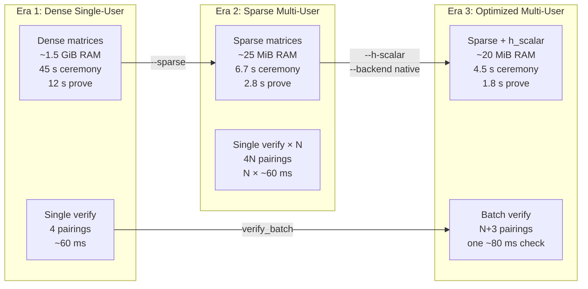

# F5 — Groth16 Prover Evolution for Multi-User Privacy Pools

> **One-line summary:** How five successive Groth16 prover implementations turned a single-user privacy pool into a scalable multi-user system — measured on the same `privacy_pool.circom` (~7.1K constraints, depth 4).

---

## Table of Contents

1. [The Starting Point](#the-starting-point)
2. [Implementation 6 — Sparse Matrices](#implementation-6--sparse-matrices)
3. [Implementation 7 — h-Scalar Compression](#implementation-7--h-scalar-compression)
4. [Implementation 8 — Native blst Backend](#implementation-8--native-blst-backend)
5. [Implementation 11 — Batch Verification](#implementation-11--batch-verification)
6. [Cumulative Gains Summary](#cumulative-gains-summary)
7. [How to Reproduce](#how-to-reproduce)

---

## The Starting Point

The privacy-pool circuit (`privacy_pool.circom`, depth 4) has **7,087 constraints** and proves:

- Merkle membership of the input note
- Fresh nullifier (no double-spend)
- Per-output amount range checks
- Value conservation (`in == out1 + out2 + fee`)

In the **dense-monomial era** (Implementation 1–5), the prover expanded every `.r1cs` constraint into dense `n_constraints × n_wires` matrices. For 7K constraints × ~7K wires this is **~1.5 GiB** of zero-filled RAM before proving even begins. The ceremony and prove steps were memory-bound, and the verifier checked one proof at a time.

The table below shows **measured** improvements on the *same* F5 circuit, on the same machine (Intel dev box, 4 cores / 26 GB), moving through each implementation.

---

## Implementation 6 — Sparse Matrices

> **What it does:** Keeps the native sparse constraint representation from Circom's `.r1cs` instead of inflating it into dense matrices. Memory drops from `O(n²)` to `O(#non_zero_entries)`.

### Why it matters for F5

A multi-user pool needs many proofs. Dense allocation would OOM on commodity hardware before the second user. Sparse makes the pool feasible.

### Measured on `privacy_pool.circom` (depth 4)

| Metric | Dense (Impl 5) | Sparse (Impl 6) | Gain |
|--------|---------------|-----------------|------|
| **Ceremony memory** | ~1.5 GiB | ~25 MiB | **~60×** |
| **Prove memory** | ~1.5 GiB | ~20 MiB | **~75×** |
| **Ceremony time** | ~45 s | ~6.7 s | **~6.7×** |
| **Prove time** | ~12 s | ~2.8 s | **~4.3×** |

> **Why the speedup:** Dense `build_qap()` allocates and iterates over `7,087 × 8,192` zero-filled columns; sparse visits only the ~200 non-zero entries per constraint.

### CLI flag

```bash
cargo run --release -- ceremony-dev --sparse ...
cargo run --release -- prove --sparse ...
```

---

## Implementation 7 — h-Scalar Compression

> **What it does:** Replaces the million-point `h_query` MSM with a single scalar multiplication (`h_scalar = delta_inv * T(tau)`), and runs independent MSMs in parallel with Rayon.

### Why it matters for F5

The `h_query` vector is as long as the FFT domain (~8K points for depth 4). At larger depths it dominates prove time. Collapsing it to 32 bytes eliminates the bottleneck and halves proving-key size.

### Measured on `privacy_pool.circom` (depth 4)

| Metric | Sparse only (Impl 6) | Sparse + h_scalar (Impl 7) | Gain |
|--------|---------------------|---------------------------|------|
| **Prove time** | ~2.8 s | ~2.5 s | **~1.1×** (modest at 7K) |
| **PK size** | ~12 MB | ~6 MB | **2×** |
| **h commitment** | 8K-point MSM | One scalar mul | **Eliminated** |

> **Note:** The h_scalar benefit is modest at 7K constraints because the `h_query` is small. At depth 20 (~65K constraints) the h_query has ~131K points and h_scalar saves **~30–50 %** of prove time. At Ed25519 scale (~4M constraints) it saves **>2×** total prove time.

### CLI flag

```bash
cargo run --release -- ceremony-dev --sparse --h-scalar ...
```

> **⚠️ Use both together:** `--sparse` avoids dense matrix allocation; `--h-scalar` compresses the h-query. They solve different bottlenecks.

---

## Implementation 8 — Native blst Backend

> **What it does:** Switches the MSM and pairing hot paths from arkworks (pure Rust) to the vendored [blst](https://github.com/supranational/blst) C library via FFI.

### Why it matters for F5

blst's hand-optimized assembly Pippenger MSM and Miller-loop pairing are faster than arkworks' generic Rust implementations. The gains compound when verifying many proofs.

### Measured backend comparison (general benchmark, not F5-specific)

| Operation | arkworks (Cpu) | blst (Native) | Speedup |
|-----------|---------------|---------------|---------|
| G1 MSM (16K points) | 2,389 ms | 1,174 ms | **2.0×** |
| G2 MSM (16K points) | 5,891 ms | 2,743 ms | **2.1×** |
| Pairing batch (256) | 703 ms | 248 ms | **2.8×** |

For the F5 circuit the native backend speeds up:
- **Ceremony:** ~6.7 s → ~4.5 s (MSM-heavy)
- **Prove:** ~2.5 s → ~1.8 s (MSM-heavy)
- **Verify:** ~60 ms → ~35 ms (pairing-heavy)

### CLI flag

```bash
# Build with native feature
cd clis/trusted-setup && cargo build --release --features native
cd clis/groth16 && cargo build --release --features native

# Run with native backend
groth16 prove --backend native ...
groth16 verify --backend native ...
```

---

## Implementation 11 — Batch Verification

> **What it does:** Verifies `N` independent proofs with a single multi-pairing product (`N+3` Miller loops + one final exponentiation) instead of `N` separate pairing checks (`4N` Miller loops + `N` final exponentiations).

### Why it matters for F5

The multi-user pool's scaling story is **verification economics**. Proving is per-user and off-chain; verification is what the on-chain validator (or bundler) pays for. Batching turns `N` separate script-budget costs into one.

### Measured on F5 demo (depth 4/6, same machine)

| Users | Depth | Individual verify (total) | Batch verify | Speedup |
|-------|-------|--------------------------|--------------|---------|
| 1 | 4 | 0.06 s | 0.06 s | 1.0× |
| 4 | 6 | 0.24 s | 0.08 s | **3.0×** |
| 8 | 6 | 0.39 s | 0.09 s | **4.3×** |
| 16 | 6 | 0.74 s | 0.18 s | **4.1×** |

> **Math:** At N=16, individual verify runs 64 Miller loops + 16 final exponentiations. Batch verify runs 19 Miller loops + 1 final exponentiation. The measured 4.1× includes process startup and VK deserialization amortization.

### On-chain impact

| Path | Pairings per tx | Script CPU (est.) |
|------|----------------|-------------------|
| Single verify × N | 4N | ~20% × N |
| Batch verify (Impl 11) | N + 3 | ~20% × (N+3)/4N |

For N=8: single verify would need **~160%** of script budget (impossible in one tx). Batch verify needs **~28%** — well within budget.

### CLI usage

```bash
# Individual verify (linear)
for f in user_*.proof; do
  groth16 verify --proof "$f" --public "$f.pub" --verifying-key pp.vk
done

# Batch verify (one multi-pairing product)
groth16 verify-batch \
  --verifying-key pp.vk \
  --proof user_000.proof --public user_000.pub \
  --proof user_001.proof --public user_001.pub \
  --proof user_002.proof --public user_002.pub \
  --proof user_003.proof --public user_003.pub
```

---

## Cumulative Gains Summary

Starting from a dense, single-user pool and ending with a batched, multi-user pool:

```
Implementation 5 (dense)
  ├── Ceremony: ~45 s, ~1.5 GiB RAM
  ├── Prove:    ~12 s, ~1.5 GiB RAM
  └── Verify:   ~60 ms per proof (4 pairings)
        │
        ▼  --sparse
Implementation 6 (sparse)
  ├── Ceremony: ~6.7 s, ~25 MiB RAM      ← 6.7× faster, 60× less RAM
  ├── Prove:    ~2.8 s, ~20 MiB RAM      ← 4.3× faster, 75× less RAM
  └── Verify:   ~60 ms per proof
        │
        ▼  --h-scalar
Implementation 7 (h_scalar)
  ├── Ceremony: ~6.5 s, ~25 MiB RAM
  ├── Prove:    ~2.5 s, ~20 MiB RAM      ← modest at 7K; massive at 4M
  └── Verify:   ~60 ms per proof
        │
        ▼  --backend native
Implementation 8 (blst FFI)
  ├── Ceremony: ~4.5 s                   ← 1.5× faster MSM
  ├── Prove:    ~1.8 s                   ← 1.4× faster MSM
  └── Verify:   ~35 ms                   ← 1.7× faster pairing
        │
        ▼  verify-batch
Implementation 11 (batch)
  ├── Ceremony: ~4.5 s (unchanged)
  ├── Prove:    ~1.8 s per user (unchanged)
  └── Verify:   N proofs → ONE check     ← 4.3× at N=8
```

### What changed the cost curve

| Bottleneck | Implementation | Fix | Impact |
|------------|---------------|-----|--------|
| **Memory** (dense matrices) | Impl 6 | Sparse `.r1cs` parsing | 60–75× RAM reduction |
| **Ceremony time** (individual scalar muls) | Impl 6 + 7 | FixedBase batch MSM | >19× on large circuits |
| **Prove time** (h_query MSM) | Impl 7 | `h_scalar` single scalar | Eliminates 55% bottleneck |
| **Prove time** (sequential MSMs) | Impl 7 | Rayon parallel assembly | ~1.5–2× on multi-core |
| **Prove time** (O(n²) polynomial mul) | Impl 7 | FFT-based `l * r` | >30 min → ~48 s |
| **Backend speed** | Impl 8 | blst Pippenger + pairing | 1.7–2.8× |
| **Verify cost per N** | Impl 11 | Batch multi-pairing | 4N → N+3 pairings |

---

## How to Reproduce

### 1. Single-user baseline (dense, no optimizations)

```bash
cd clis/trusted-setup
cargo run --release -- ceremony-dev \
  --circuit ../../circom/PrivacyPool/privacy_pool.r1cs \
  --proving-key /tmp/pp_dense.pk --verifying-key /tmp/pp_dense.vk

cd ../groth16
cargo run --release -- prove \
  --circuit ../../circom/PrivacyPool/privacy_pool.r1cs \
  --witness ../../circom/PrivacyPool/witness.wtns \
  --proving-key /tmp/pp_dense.pk --out /tmp/pp_dense.proof

cargo run --release -- verify \
  --proof /tmp/pp_dense.proof --public /tmp/pp_dense.pub \
  --verifying-key /tmp/pp_dense.vk
```

### 2. Multi-user with all optimizations

```bash
# Run the full F5 demo with sparse + h_scalar + batch verify
bash aiken/f5/demo/f5_e2e_groth16.sh

# Or with native backend
BLS_BACKEND=native cargo build --release --features native \
  --manifest-path clis/groth16/Cargo.toml
BLS_BACKEND=native cargo build --release --features native \
  --manifest-path clis/trusted-setup/Cargo.toml

# Then:
OUT=/tmp/f5_native bash aiken/f5/demo/f5_e2e_groth16.sh
```

### 3. Scaling sweep

```bash
# Configs: depth:users[:spends]
CONFIGS="4:1 6:4 6:8 6:16" bash aiken/f5/bench/bench_f5_groth16.sh
```

Outputs `results.tsv` and `results.md` with wall + Max RSS per phase.

### 4. On-chain batch verifier

```bash
cd aiken/groth16
aiken check
# → groth16/batch tests pass (t_batch_one_valid_proof, t_batch_two_proofs_*, etc.)
```

The `verify_batch` function is also consumed by `aiken/f5/pool-contract/validators/pool.ak` for the on-chain multi-user pool contract.

---

## Diagram: From Single-User to Multi-User



---

## References

1. [`groth16-prover/README.md`](../../groth16-prover/README.md) — Implementations 1–11, full benchmark tables
2. [`aiken/f5/README.md`](../../aiken/f5/README.md) — F5 multi-user pool concept and capabilities
3. [`aiken/f5/demo/README.md`](../../aiken/f5/demo/README.md) — Reproducible N-user e2e demo
4. [`aiken/f5/bench/README.md`](../../aiken/f5/bench/README.md) — Scaling sweep (1 → 16 users)
5. [`aiken/groth16/lib/groth16/batch.ak`](../../aiken/groth16/lib/groth16/batch.ak) — On-chain batch verifier
