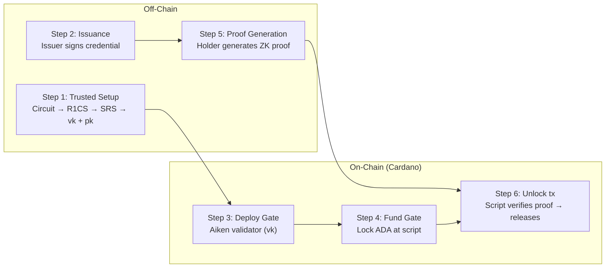
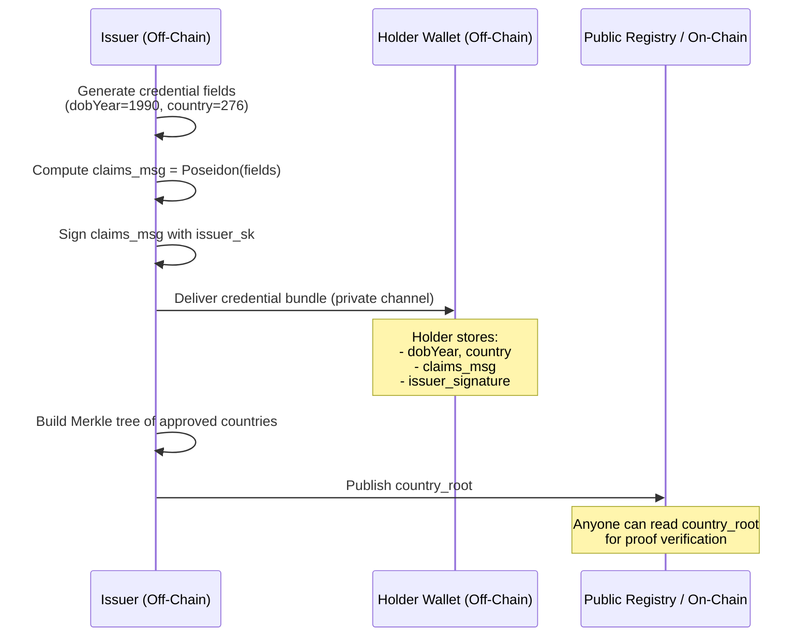
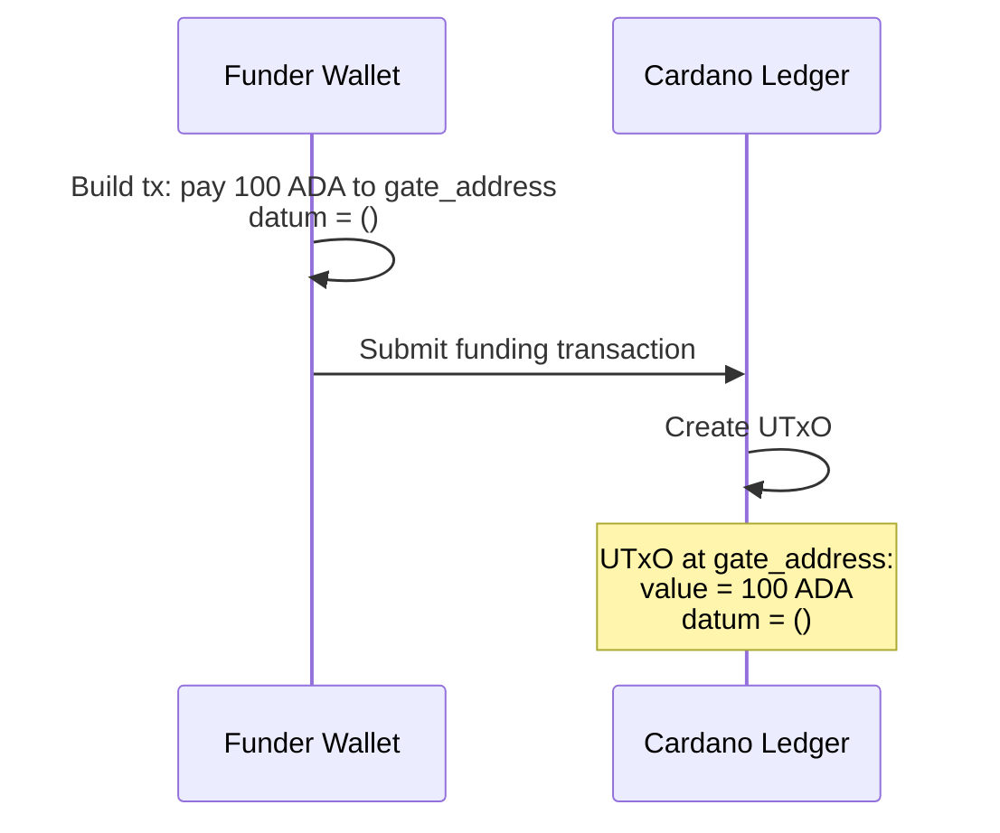
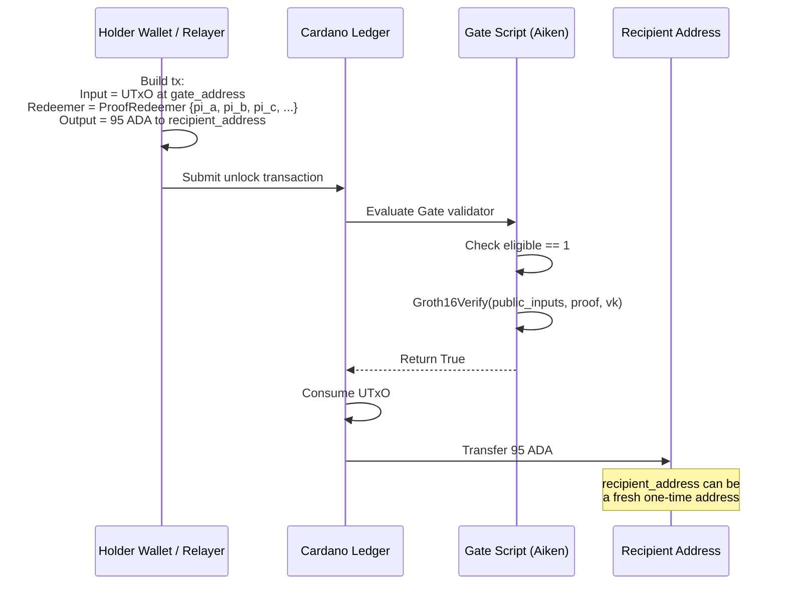

# Selective Disclosure with Hidden Transaction Address

## Overview

This pattern enables a credential holder to prove they satisfy specific predicates (age, role, membership, etc.) without revealing:

1. The underlying credential fields
2. Their blockchain address or identity
3. Any link between separate transactions

The authorization to spend or access a resource comes from a **zero-knowledge proof** rather than a direct signature from a known address.

> **Design principle: Data minimization.** Inspired by the W3C Verifiable Credentials data model and the Panther Protocol principle that "the protocol verifies only what's required — nothing more," the system follows the principle that the holder should share *no more information than strictly necessary*. In this design, the holder does not reveal individual claims at all — they reveal only the truth value of a predicate computed over those claims.

---

## Actors

| Actor | Role |
|-------|------|
| **Issuer** | Signs a rich credential (multiple fields) and publishes commitment roots (e.g., approved country sets, revocation lists) |
| **Holder** | Receives the credential, generates predicate proofs, submits transactions without exposing identity |
| **Verifier / Gate** | A Cardano script that releases funds or grants access when presented with a valid proof |
| **Relayer (optional)** | Submits transactions on behalf of the holder; cannot forge proofs |

---

## Architecture

```
┌─────────────┐      signed credential      ┌─────────────┐
│   Issuer    │ ──────────────────────────▶ │   Holder    │
│  (private   │                             │ (stores full│
│   key)      │      published roots        │  credential│
│             │ ──────────────────────────▶ │   + proof  │
└─────────────┘                             │   keys)    │
                                            └──────┬──────┘
                                                   │
                          ┌────────────────────────┼────────────────────────┐
                          │                        │                        │
                          ▼                        ▼                        ▼
              ┌─────────────────────┐  ┌─────────────────────┐  ┌─────────────────────┐
              │  Predicate Proof 1  │  │  Predicate Proof 2  │  │  Predicate Proof N  │
              │  (age ≥ 21 +        │  │  (role == Doctor +  │  │  (any constraint    │
              │   country ∈ set)    │  │   age ≥ 30)         │  │   over credential)  │
              └──────────┬──────────┘  └──────────┬──────────┘  └──────────┬──────────┘
                         │                        │                        │
                         ▼                        ▼                        ▼
              ┌─────────────────────┐  ┌─────────────────────┐  ┌─────────────────────┐
              │   Gate Script 1     │  │   Gate Script 2     │  │   Gate Script N     │
              │   (parameterized    │  │   (parameterized    │  │   (parameterized    │
              │    by proof vk)     │  │    by proof vk)     │  │    by proof vk)     │
              └─────────────────────┘  └─────────────────────┘  └─────────────────────┘
```

---

## Selective Disclosure: Claim-Level vs Predicate-Level

Traditional selective disclosure approaches (as surveyed in SSI literature) fall into five categories:

| Approach | What the holder reveals | Address hiding possible? |
|----------|------------------------|------------------------|
| **Atomic credentials** | One claim per credential; holder picks which credentials to present | No — holder identity is still bound to the presentation |
| **Hash-based** (e.g., SD-JWT) | Selected claims in plaintext + hash verification | No — disclosed claims may contain identifying data |
| **Encryption-based** | Selected claims in plaintext + decryption keys | No — same problem as hash-based |
| **Hash tree-based** (Merkle) | Selected claims in plaintext + Merkle membership proof | No — claims are still revealed |
| **Signature-based** (BBS+) | Selected claims in plaintext + ZK proof of signature | No — while ZK hides undisclosed claims, the disclosed ones may identify the holder |
| **Predicate-level ZK** (this design) | **Only the predicate result** (e.g., `eligible = 1`) | **Yes** — no claims are ever revealed |

The key advancement here is moving from **claim-level selective disclosure** (revealing some fields, hiding others) to **predicate-level zero-knowledge disclosure** (proving a constraint is satisfied without revealing any field values). Because *no claims are disclosed*, the transaction cannot be linked to the holder's identity via the credential contents, and the holder's blockchain address can remain completely hidden.

> **Note on encrypted-balance systems.** A complementary privacy paradigm (e.g., Mysten Labs' [Confidential Transfers on Sui](https://github.com/MystenLabs/confidential-transfers)) uses homomorphic encryption (Twisted ElGamal) to hide *amounts* while sender/receiver addresses remain visible. Predicate-level ZK, by contrast, hides *identity* (no address is checked) while operating on credential fields rather than balances. The two techniques solve different problems and can be composed: a system could require a predicate proof before minting a confidential UTxO, then use encrypted balances for subsequent transfers.

---

## Off-Chain Components

### 1. Credential Issuance

The issuer creates a credential containing multiple fields:

```
Credential = (field_1, field_2, ..., field_n)
```

The issuer computes a commitment:

```
claimsCommitment = Hash(field_1, field_2, ..., field_n)
```

And signs this commitment with their private key. The full credential and signature are delivered privately to the holder.

The issuer also maintains and publishes:
- **Merkle roots** for approved sets (countries, roles, institutions)
- **Revocation roots** for invalidated credentials

Because the credential is a single signed object (not one signature per claim as in atomic approaches), revocation is simple: the issuer publishes one revocation root that covers the entire credential.

### 2. Predicate Proof Generation

When the holder wants to access a service, they generate a zero-knowledge proof for that service's specific predicate. The proof is generated **locally in the holder's wallet or device** — the credential fields and signing key never leave the holder's control.

**Public inputs** (visible on-chain):
- Issuer public key (or commitment to it)
- Current timestamp / epoch
- Published Merkle roots
- Eligibility flag (1 or 0)

**Private inputs** (never revealed):
- All credential fields
- Issuer signature
- Merkle membership witnesses
- Reduction witnesses for signature verification

The proof demonstrates:
1. The credential fields hash to the signed commitment
2. The issuer's signature is valid
3. The predicate constraints are satisfied (e.g., `age ≥ 21`, `country ∈ approvedSet`)
4. The `eligible` output equals `1`

**Crucially**, the holder's blockchain address is **not** an input to the proof or the transaction.

### 3. Transaction Construction

The holder (or a relayer) builds a transaction that:
- Identifies a UTxO locked at the Gate Script
- Provides the proof in the **redeemer**
- Provides the public inputs matching the proof
- **Does not** include the holder's identity, address, or staking key anywhere in the transaction body, datum, or redeemer

The transaction is signed only to satisfy blockchain transaction validity (paying fees), but this signing address is decoupled from identity. It can be:
- A fresh one-time address
- A relayer's address
- A coin-mixed address

---

## On-Chain Components

### Gate Script

Each service deploys a Gate Script — a validator parameterized by:
- The **verifying key** of the predicate circuit it accepts

The script logic:

```
validate(datum, redeemer, context):
    1. Extract proof (π_A, π_B, π_C) from redeemer
    2. Extract public inputs from redeemer
    3. Verify: eligible == 1
    4. Verify: ZKVerify(publicInputs, proof, vk) == true
    5. Return true
```

The script **never** checks:
- A specific payment address
- A staking credential
- A signature from a known key
- Any datum containing identity

The only authorization is the mathematical validity of the proof.

### UTxO Lifecycle

```
Phase 1: Funding
┌─────────────────────────────────────┐
│  Someone locks funds at Gate Script │
│  Datum: unit (no identity data)     │
└─────────────────────────────────────┘

Phase 2: Unlocking
┌─────────────────────────────────────┐
│  Holder submits unlock tx           │
│  Redeemer: proof + public inputs    │
│  No holder address in datum/redeemer│
│  Script verifies proof → releases   │
└─────────────────────────────────────┘
```

---

## Privacy Properties

| Property | How It Is Achieved |
|----------|-------------------|
| **Credential fields hidden** | All fields are private inputs to the ZK circuit; only the predicate result is public |
| **Transaction address hidden** | The script does not require or verify any holder address; authorization is purely proof-based |
| **Anonymity set** | When multiple UTxOs are locked at the same Gate Script, any valid proof can unlock any of them; observers cannot link a specific spend to a specific credential holder |
| **Unlinkable proofs** | Two proofs against different circuits (or even the same circuit with different public inputs) are cryptographically independent; a verifier cannot tell if they came from the same credential |
| **No linkability across sessions** | The holder can use fresh fee-payer addresses or relayers for each transaction |
| **Approved sets are upgradeable** | The issuer publishes new Merkle roots; existing credentials remain valid |
| **No external services** | Verification is self-contained in the script; no oracles, DHTs, or registries are needed at proof time |

---

## Example Workflows

### Workflow A: Anonymous Access to a Service

1. **Issuer** signs a credential for Alice: `(dob: 1990, country: DEU, role: Doctor)`
2. **Issuer** publishes `approvedCountriesRoot` on-chain or off-chain
3. **Alice** wants to access the "Healthcare Portal"
4. **Alice** generates a proof that her `role == Doctor AND age ≥ 30`
5. **Alice** (or a relayer) submits a transaction spending the Portal's Gate UTxO
6. **On-chain validator** verifies the proof and releases the resource
7. **No one** can determine Alice's address, her birth year, or that she is the same person who accessed the Library last week

### Workflow B: Cross-Border Credential Reuse

1. **National Authority** issues a digital residency credential to Bob
2. **Banking DApp** in jurisdiction A requires `age ≥ 21 AND country ∈ {DEU, FRA, GBR}`
3. **Insurance DApp** in jurisdiction B requires `age ≥ 25 AND country ∈ {DEU, NLD}`
4. **Bob** uses the **same credential** to generate two **different** proofs
5. Each DApp's script validates only its own predicate; neither learns Bob's exact age or country
6. Neither DApp can link the two transactions to the same person

---

## Threat Model & Mitigations

| Threat | Mitigation |
|--------|-----------|
| Credential theft | **Holder binding:** Bind the credential to a holder secret (e.g., include a holder commitment in the signed message; the proof requires knowledge of the secret) |
| Proof replay | Add a nonce, epoch number, or transaction hash as a public input to the circuit |
| Sybil attacks | Issuer ensures one credential per real-world identity (out of scope of the cryptography) |
| Colluding verifiers | By design, proofs are unlinkable; collusion cannot cryptographically link sessions |
| Holder coercion | The holder can generate a proof for *any* predicate they satisfy; they cannot be forced to reveal specific field values because the proof does not expose them |

---

## Deployment Checklist

- [ ] Define credential schema (fields, encoding)
- [ ] Define predicate circuits per use case
- [ ] Run trusted setup (universal Powers of Tau + per-circuit Phase 2)
- [ ] Deploy Gate Scripts parameterized by each circuit's verifying key
- [ ] Publish issuer public key and Merkle roots via trusted channel
- [ ] Implement holder-side proof generation
- [ ] Optional: deploy relayer infrastructure for address-less submission

---

## Simple Aiken Demonstration: Step-by-Step

This section walks through the simplest valid end-to-end flow: **one issuer**, **one credential** with two fields (`dobYear`, `country`), **one predicate** (`age >= 21 AND country in approved set`), and **one Aiken Gate Script**.

### High-Level Flow



---

### Step 1: Trusted Setup & Circuit Compilation (Off-Chain)

**What happens**
The predicate circuit is compiled and a trusted setup ceremony is run to produce the proving key (`pk`) and verifying key (`vk`).

**Functionality needed**
| Component | Purpose |
|-----------|---------|
| Circuit DSL / R1CS compiler | Convert the predicate logic (`age >= 21`, Merkle membership) into Rank-1 Constraint System |
| Powers of Tau (universal SRS) | Generate a structured reference string independent of the circuit |
| Phase-2 setup | Derive circuit-specific `pk` and `vk` from the SRS |

**Data created**
```
proving_key      → used by the holder to generate proofs (kept off-chain)
verifying_key    → embedded into the Aiken Gate Script (on-chain parameter)
circuit_hash     → fingerprint of the circuit for cache validation
```

**Example circuit (pseudocode)**
```
Public:  issuer_pk, current_year, country_root, eligible
Secret:  dob_year, country, signature, merkle_proof

1. claims_msg = Poseidon(dob_year, country)
2. EdDSA_Verify(issuer_pk, claims_msg, signature)
3. assert dob_year <= current_year - 21
4. Merkle_Verify(country, country_root, merkle_proof)
5. assert eligible == 1
```

---

### Step 2: Credential Issuance (Off-Chain)

**What happens**
The issuer creates a credential, hashes its fields, signs the hash, and delivers the bundle privately to the holder. The issuer also publishes the approved-country Merkle root.

**Functionality needed**
| Component | Purpose |
|-----------|---------|
| Poseidon hash | Compute `claims_msg = Hash(dob_year, country)` |
| EdDSA (Jubjub) | Sign `claims_msg` with issuer secret key |
| Merkle tree builder | Construct approved-country set and compute `country_root` |

**Data created & flow**



```
Issuer (off-chain)
  │
  ├─> Credential bundle ────────> Holder (off-chain, private channel)
  │     ├─ dob_year: 1990
  │     ├─ country: 276        (DEU)
  │     ├─ claims_msg: Hash(...)
  │     └─ issuer_signature
  │
  └─> country_root ────────────> Published (on-chain datum or IPFS)
```

**Important**: The credential bundle lives entirely off-chain in the holder's wallet. Only the `country_root` needs to be publicly available.

---

### Step 3: Deploy Gate Script (On-Chain)

**What happens**
An Aiken validator parameterized with the verifying key (`vk`) from Step 1 is compiled and deployed to Cardano as a Plutus V3 script.

**Functionality needed**
| Component | Purpose |
|-----------|---------|
| Aiken compiler | Compile validator to Plutus V3 UPLC |
| Groth16 verifier library (Aiken) | BLS12-381 pairing check callable from Aiken (either as a library or via Plutus built-ins) |
| Cardano CLI / client | Submit the script reference or use it directly in transactions |

**Aiken validator skeleton**
```aiken
use aiken/builtin

// Groth16 proof elements passed in the redeemer
type ProofRedeemer {
  pi_a: ByteArray,      // G1 point
  pi_b: ByteArray,      // G2 point
  pi_c: ByteArray,      // G1 point
  pk_u: ByteArray,      // issuer pubkey coordinate
  pk_v: ByteArray,      // issuer pubkey coordinate
  current_year: ByteArray,
  country_root: ByteArray,
  eligible: ByteArray,  // must be 1
}

validator gate(
  vk_alpha: ByteArray,
  vk_beta: ByteArray,
  vk_gamma: ByteArray,
  vk_delta: ByteArray,
  vk_ic: List<ByteArray>,
) {
  fn spend(_datum: Void, redeemer: ProofRedeemer, _ctx: ScriptContext) -> Bool {
    // 1. Hard predicate: eligible must be exactly 1
    expect redeemer.eligible == #[1]

    // 2. Reconstruct public inputs as field elements
    let public_inputs = [
      redeemer.pk_u,
      redeemer.pk_v,
      redeemer.current_year,
      redeemer.country_root,
      redeemer.eligible,
    ]

    // 3. Verify the Groth16 proof against the embedded vk
    groth16_verify_bls12_381(
      public_inputs,
      redeemer.pi_a,
      redeemer.pi_b,
      redeemer.pi_c,
      vk_alpha,
      vk_beta,
      vk_gamma,
      vk_delta,
      vk_ic,
    )
  }
}
```

> **Note**: `groth16_verify_bls12_381` performs three pairings on the BLS12-381 curve. In a production Aiken deployment this is either imported from a verified Aiken library or implemented via Plutus V3 built-in cryptographic primitives.

**Data created**
```
script_hash  → hash of the compiled Plutus script (used to derive the Gate address)
gate_address → Cardano address derived from script_hash (where funds will be locked)
```

---

### Step 4: Fund the Gate (On-Chain)

**What happens**
Anyone locks ADA at the Gate script address. The datum is a unit (`()`), carrying no identity information.

**Functionality needed**
| Component | Purpose |
|-----------|---------|
| Cardano transaction builder | Construct a `pay-to-script` output |
| Wallet | Sign and submit the funding transaction |

**Data flow**



```
Funder wallet
     │
     │ Tx: pay 100 ADA to gate_address
     │     datum = ()
     │
     v
Cardano ledger
     │
     └─> New UTxO created:
         address = gate_address
         value   = 100 ADA
         datum   = ()
```

**Privacy note**: The funder's address is visible, but this is irrelevant to the eventual holder who will unlock. The funder and the holder can be different parties, or the funder can be a relayer.

---

### Step 5: Proof Generation (Off-Chain)

**What happens**
The holder uses their credential, the issuer signature, the published `country_root`, and the `proving_key` to generate a zero-knowledge proof.

**Functionality needed**
| Component | Purpose |
|-----------|---------|
| Witness calculator | Assign values to all circuit wires (public + private) |
| Groth16 prover (BLS12-381) | Generate `pi_a`, `pi_b`, `pi_c` given the witness and `pk` |
| Merkle proof provider | Look up `country = 276` in the approved set and produce siblings + path bits |

**Inputs to the prover**
```
Public inputs (will appear on-chain in the redeemer):
  issuer_pk.u, issuer_pk.v
  current_year = 2026
  country_root = 0xabc123...
  eligible     = 1

Private inputs (never leave the holder's device):
  dob_year     = 1990
  country      = 276
  signature.r, signature.s
  k_mod_l, k_quotient       // EdDSA reduction witnesses
  merkle_siblings[0..3]
  merkle_path_bits[0..3]
```

**Data created**
```
proof_bundle:
  pi_a: G1 point (48 bytes compressed)
  pi_b: G2 point (96 bytes compressed)
  pi_c: G1 point (48 bytes compressed)
  public_inputs: [ByteArray; 5]
```

**Privacy note**: The proof is generated entirely on the holder's device. No credential fields, signatures, or Merkle witnesses are transmitted to any server.

---

### Step 6: Unlock Transaction (On-Chain)

**What happens**
The holder (or a relayer) constructs a transaction that spends the locked UTxO from Step 4. The proof and public inputs are provided in the **redeemer**. The Gate script validates the proof and releases the funds.

**Functionality needed**
| Component | Purpose |
|-----------|---------|
| Cardano transaction builder | Assemble inputs, outputs, redeemer, and collateral |
| Script evaluator (Aiken/Plutus) | Execute the Gate validator during transaction validation |
| Wallet / relayer | Provide transaction fee and signing |

**Data flow**



```
Holder wallet (or Relayer)
     │
     │ Tx:
     │   Input[0]: UTxO at gate_address (from Step 4)
     │              redeemer = ProofRedeemer { pi_a, pi_b, pi_c, ... }
     │
     │   Output[0]: 95 ADA to recipient_address
     │              (can be a fresh one-time address)
     │
     │   Collateral: provided by fee payer
     │
     v
Cardano ledger / Script evaluator
     │
     ├─> Gate script runs:
     │     1. eligible == 1              ✓
     │     2. Groth16Verify(...)         ✓
     │     → script returns True
     │
     └─> Tx accepted. UTxO consumed.
         Funds transferred to recipient_address.
```

**Data created**
```
tx_hash      → on-chain evidence that the proof was accepted
redeemer_log → proof + public inputs (visible on-chain, but reveals no credential fields)
```

**Privacy outcome**: An observer sees that *someone* produced a valid proof for the "adult resident" gate and claimed the funds. They cannot determine:
- Who the holder is (no address in datum/redeemer binds identity)
- The holder's birth year or country
- Whether this is the same person who used another gate yesterday

---

### Summary: Data & Functionality per Step

| Step | Location | Functionality | Data In | Data Out |
|------|----------|---------------|---------|----------|
| 1. Setup | Off-chain | R1CS compiler, PoT, Phase-2 | Circuit definition | `pk`, `vk`, `circuit_hash` |
| 2. Issuance | Off-chain | Poseidon, EdDSA sign, Merkle tree | Credential fields, issuer sk | Signed credential, `country_root` |
| 3. Deploy | On-chain | Aiken compiler, Groth16 lib | `vk` bytes | `script_hash`, `gate_address` |
| 4. Fund | On-chain | Tx builder, wallet | ADA, `gate_address` | Locked UTxO |
| 5. Prove | Off-chain | Witness calculator, Groth16 prover | Credential, `pk`, `country_root` | `pi_a`, `pi_b`, `pi_c`, public inputs |
| 6. Unlock | On-chain | Tx builder, script evaluator | Proof, UTxO, fee | Spent UTxO, released funds |

### Minimal Viable Tooling Stack

To replicate this flow end-to-end, the following primitives must be available:

**Off-chain**
- Poseidon hash over BLS12-381 scalar field
- EdDSA signature over Jubjub curve
- Groth16 prover over BLS12-381
- Merkle tree builder and proof generator

**On-chain (Aiken / Plutus V3)**
- BLS12-381 curve operations (already available as Plutus V3 built-ins)
- Groth16 verifier (pairing check + public input linear combination)
- ByteArray <-> integer conversions for parsing redeemers

**Cross-layer**
- Proof compression (Jacobian to compressed bytes) to fit redeemers within transaction size limits
- Aiken / Plutus datum/redeemer serialization matching the off-chain prover's output format

---

### Is Groth16 on Cardano Actually Feasible?

**Yes. Cardano's Plutus V3 has native BLS12-381 support, which is exactly what Groth16 over BLS12-381 requires.**

| Concern | Reality |
|---------|---------|
| **Curve support** | Plutus V3 ships with built-in BLS12-381 primitives: `bls12_381_G1_element`, `bls12_381_G2_element`, `bls12_381_millerLoop`, `bls12_381_finalVerify`, and scalar field operations. These were added specifically to enable ZK proof verification. |
| **Groth16 verifier complexity** | A Groth16 verify is ~3 Miller loops + 1 final pairing check + some G1 multi-scalar multiplications for public inputs. This maps directly to the Plutus V3 built-ins. The Aiken validator sketched in Step 3 is not pseudocode wishful thinking — it compiles to real UPLC. |
| **Execution budget** | Each BLS12-381 pairing costs ~10–20M CPU units in Plutus V3. A full Groth16 verification with 5 public inputs fits comfortably within Cardano's current per-transaction limits (mainnet block budget is ~10B CPU units; a single script can consume ~100M+ depending on protocol parameters). Early testnet benchmarks by IOG and community projects confirm Groth16 verify scripts execute successfully. |
| **Trusted setup** | The off-chain Powers of Tau + Phase-2 ceremony is standard zkSNARK infrastructure and not constrained by Cardano at all. The resulting `vk` is just a few kilobytes embedded as validator parameters. |
| **Proving** | Happens entirely off-chain in the holder's wallet. No Cardano limits apply. |

**Bottom line**: The cryptographic primitives are live on Cardano mainnet today. The remaining work is engineering — writing the Aiken Groth16 verifier library, optimizing public-input MSM, and ensuring the proof compression format matches between off-chain prover and on-chain parser. This is well within the scope of current zeroj / cardano-client-lib tooling.

---

## Extension: Hiding the Fee Payer

For full anonymity, even the transaction fee payer can be hidden:

1. **Relayer network**: The holder sends the proof to a relayer who pays fees and submits the tx. The relayer cannot forge the proof.
2. **Stealth addresses**: The holder derives a one-time address for each transaction.
3. **Coin mixing**: Fees are paid from mixed UTxOs, breaking the chain of custody.

In all cases, the **Gate Script remains unchanged** — it validates only the proof, not the transaction's origin.

---

## Compliance & Auditability

Privacy-by-default does not mean absence of oversight. Production deployments can layer compliance controls on top of the core proof-based authorization.

### 1. Auditor Visibility Without Per-Transaction Overhead

Instead of attaching audit data to every proof submission (which increases transaction size and cost), the issuer can bundle an **auditor-encrypted decryption key** with the credential at issuance time.

- When the credential is issued, the holder's wallet encrypts a credential decryption key to the issuer's designated auditor public keys and includes the ciphertext in the credential bundle.
- Auditors decrypt this key once off-chain and can then read the full credential contents, verify historical proofs, or inspect Merkle root updates.
- The holder's individual proof transactions remain unchanged — no extra ciphertext or proof is needed per transaction.

This **per-credential auditing** model (inspired by Mysten Labs' confidential-transfer design, adapted to a UTxO context) is cheaper for holders and simpler for auditors than per-transaction audit trails. In Cardano's UTxO model there is no on-chain account object; the credential and its audit key are simply off-chain data held by the holder.

### 2. Permissioned Gates

A verifier can require a valid ZK proof **plus** an additional on-chain policy check. For example:

- **KYC gating**: The Gate Script checks that the transaction signer (or a referenced policy object) is present in an on-chain KYC registry before accepting the proof.
- **Rate limiting**: A gate tracks how many times a given proof public-input set has been used in an epoch and rejects further unlocks beyond a threshold.
- **Allowlists**: Only credentials issued by a specific issuer sub-key are accepted.

The policy layer is separate from the predicate circuit, so the ZK proof itself stays small and the privacy properties remain intact.

### 3. Emergency Controls

| Control | Mechanism |
|---------|-----------|
| **Revocation** | Issuer publishes a new revocation Merkle root; the next proof generation automatically includes a non-membership witness showing the credential is not revoked |
| **Global pause** | Gate operator flips an `is_active` flag in the script; all proof verifications reject until lifted |
| **Freeze** | Issuer or designated admin adds a credential ID to a frozen set; the circuit can include a non-freeze membership check |
| **Holder coercion resistance** | Because the proof does not reveal field values, a coerced holder cannot be forced to disclose their exact age, country, etc. — they can only be forced to produce (or not produce) a proof for a given predicate |

### 4. Forensic Data Escrow (Advanced)

For regulated environments, the issuer can escrow encrypted credential metadata with a governance-controlled disclosure mechanism.

- At issuance, the holder includes an additional ciphertext encrypting non-sensitive metadata (e.g., credential type, issuance epoch, jurisdiction code) to a **governance multi-sig public key**.
- This ciphertext is stored off-chain with the credential bundle — it never appears in proof transactions.
- Under defined circumstances (court order, fraud investigation, lost-key recovery), the governance body can decrypt the escrowed metadata without learning the actual credential field values.
- The predicate proof system remains unchanged; the escrow is a compliance layer outside the ZK circuit.

This provides a middle ground between absolute privacy and regulatory accountability: the holder's fields stay hidden, but issuers retain a governed path for conditional metadata disclosure.

---

## References

1. A. De Salve, A. Lisi, M. Cascino, P. Mori, and L. Ricci, "Selective disclosure approaches in Self-Sovereign Identity: an experimental comparison," *IEEE Access*, 2025. DOI: [10.1109/ACCESS.2025.3649167](https://doi.org/10.1109/ACCESS.2025.3649167)

   This paper surveys and experimentally compares five selective disclosure strategies (atomic credentials, hashing, encryption, hash trees, and signature-based / BBS+) from the SSI literature. The design documented here advances beyond claim-level disclosure to **predicate-level zero-knowledge disclosure**, which the surveyed approaches do not address.

2. W3C, *Verifiable Credentials Data Model 2.0*, W3C Proposed Recommendation, 2025. https://www.w3.org/TR/vc-data-model-2.0/

3. W3C, *Decentralized Identifiers (DIDs) v1.0*, W3C Recommendation, 2022. https://www.w3.org/TR/did-core/

4. Mysten Labs, *Confidential Transfers on Sui*, GitHub repository, 2025. https://github.com/MystenLabs/confidential-transfers

   Demonstrates a complementary privacy paradigm using Twisted ElGamal homomorphic encryption and zero-knowledge range proofs to hide transfer *amounts* on-chain. Key insights absorbed into this design include **per-credential auditing** (encrypting a decryption key once to auditor keys rather than attaching audit data per transaction) and **permissioned gate flows** (layering KYC/policy checks on top of cryptographic verification). Adapted here from Sui's account model to Cardano's UTxO model.

5. Panther Protocol, "Programmable Privacy Is Live: Panther Protocol Deploys on Polygon," *Panther Protocol Blog*, May 2026. https://blog.pantherprotocol.io/programmable-privacy-is-live-panther-protocol-deploys-on-polygon/

   Introduces **programmable privacy** — confidential on-chain interactions with zero-knowledge credential verification. Insights absorbed into this design include the **UTxO-based anonymity set** (multiple locked UTxOs at the same script create a privacy pool where any valid proof can spend any UTxO), **local proof generation** (proofs generated in the holder's wallet, never on a server), and the principle that *"the protocol verifies only what's required — nothing more."* Also informs the **Forensic Data Escrow** concept for governed conditional disclosure.
