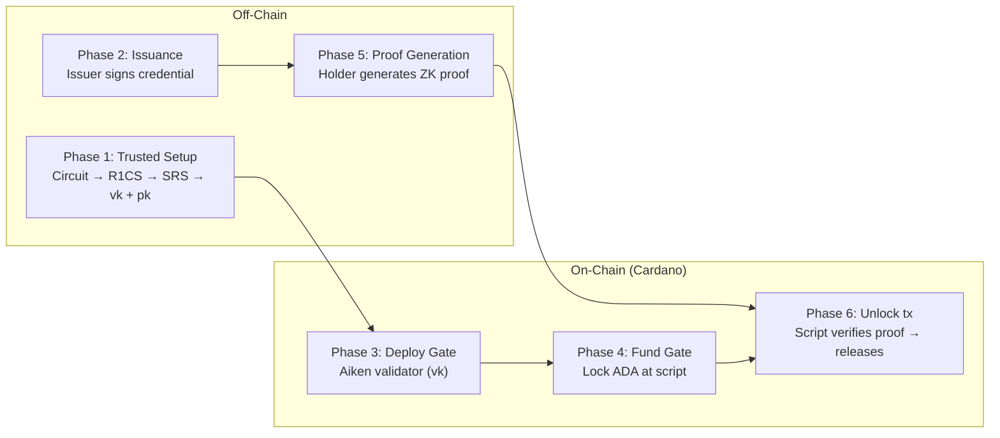

# Selective Disclosure with Hidden Transaction Address

> **One-line summary:** A credential holder proves they satisfy a predicate (age, role, residency) without revealing their identity, address, or any credential field. Authorization comes from a zero-knowledge proof verified by an Aiken Gate Script on Cardano.

---

## Table of Contents

1. [Overview](#overview)
2. [Design](#design)
3. [Step 0: Proof System Implementation (Prerequisite)](#step-0-proof-system-implementation-prerequisite)
4. [Step 1: Predicate Proofs with Aiken](#step-1-predicate-proofs-with-aiken)
5. [Step 2: Twisted ElGamal Extension](#step-2-twisted-elgamal-extension)
6. [Step 3: Privacy Pools & Shielded Transactions](#step-3-privacy-pools--shielded-transactions)
7. [Runnable e2e Scripts & Timing](#runnable-e2e-scripts--timing)
8. [Comparison with CIP proposal: Native Confidential Transfers](#comparison-with-cip-proposal-native-confidential-transfers)
9. [Compliance & Auditability](#compliance--auditability)
10. [Threat Model & Deployment](#threat-model--deployment)
11. [References](#references)

---

## Overview

This pattern enables a credential holder to prove they satisfy specific predicates (age, role, membership, etc.) without revealing:

1. The underlying credential fields
2. Their blockchain address or identity
3. Any link between separate transactions

The authorization to spend or access a resource comes from a **zero-knowledge proof** rather than a direct signature from a known address.

> **Design principle: Data minimization.** Inspired by the W3C Verifiable Credentials data model and the Panther Protocol principle that "the protocol verifies only what's required — nothing more," the system follows the principle that the holder should share *no more information than strictly necessary*. In this design, the holder does not reveal individual claims at all — they reveal only the truth value of a predicate computed over those claims.

---

## Design

<details>
<summary><b>Expand</b></summary>

### Actors

| Actor | Role |
|-------|------|
| **Issuer** | Signs a rich credential (multiple fields) and publishes commitment roots (e.g., approved country sets, revocation lists) |
| **Holder** | Receives the credential, generates predicate proofs, submits transactions without exposing identity |
| **Verifier / Gate** | A Cardano script that releases funds or grants access when presented with a valid proof |
| **Relayer (optional)** | Submits transactions on behalf of the holder; cannot forge proofs |

### Architecture

```
Issuer ──signed credential──▶ Holder
        ──published roots───▶ (Merkle roots, revocation lists)

Holder ──predicate proof───▶ Gate Script (parameterized by vk)
                               └── verifies proof on-chain ──▶ release resource
```

The holder's proof is generated **locally** on their device. The script never checks an address, staking key, or known signature — only the mathematical validity of the proof.

### Off-Chain Flow

1. **Credential Issuance:** The issuer creates a credential, computes `claimsCommitment = Hash(field_1, ..., field_n)`, signs it, and delivers the bundle privately to the holder. Published roots (approved sets, revocation lists) are made public.
2. **Predicate Proof Generation:** The holder generates a ZK proof locally. Public inputs (visible on-chain) include issuer public key, timestamp, Merkle roots, and an `eligible` flag. Private inputs (never revealed) include all credential fields, issuer signature, Merkle witnesses, and reduction witnesses.
3. **Transaction Construction:** The holder (or relayer) builds a transaction spending a UTxO locked at the Gate Script, providing the proof in the **redeemer**. The holder's blockchain address is **not** included in the datum or redeemer.

### On-Chain Flow

```
Phase 1: Funding
  Someone locks funds at Gate Script
  Datum: unit (no identity data)

Phase 2: Unlocking
  Holder submits unlock tx
  Redeemer: proof + public inputs
  Script verifies proof → releases funds
```

### Privacy Properties

| Property | How It Is Achieved |
|----------|-------------------|
| **Credential fields hidden** | All fields are private inputs; only the predicate result is public |
| **Transaction address hidden** | The script does not require or verify any holder address |
| **Anonymity set** | Any valid proof can unlock any UTxO at the same Gate Script |
| **Unlinkable proofs** | Proofs against different circuits are cryptographically independent |
| **No external services** | Verification is self-contained; no oracles or registries needed |

### Example Workflows

**Anonymous Access:** Alice holds a credential `(dob: 1990, country: DEU, role: Doctor)`. She generates a proof that `role == Doctor AND age ≥ 30`, submits it to the Healthcare Portal's Gate Script, and gains access without revealing her identity, birth year, or address.

**Cross-Border Reuse:** Bob uses the same residency credential to generate two different proofs for a Banking DApp (`age ≥ 21 AND country ∈ {DEU, FRA, GBR}`) and an Insurance DApp (`age ≥ 25 AND country ∈ {DEU, NLD}`). Neither learns his exact age or country, and neither can link the two transactions.

</details>

---

## Step 0: Proof System Implementation (Prerequisite)

<details>
<summary><b>Expand</b></summary>

Before any selective-disclosure flow can run end-to-end, we need a working proof system over BLS12-381 split into an off-chain prover and an on-chain verifier.

| Path | Off-chain prover | On-chain verifier | Trusted setup | Proof size | Status |
|------|-----------------|-------------------|---------------|------------|--------|
| **A — Groth16** | `circom` + [`groth16-prover`](../../groth16-prover/README.md) (Rust/arkworks) | [`aiken/groth16`](../../aiken/groth16/README.md) (pairing check) | Per-circuit Phase-2 | 192 bytes | ✅ Working e2e |
| **B — Nova IVC** | [`nova-slim`](../../../nova-slim/README.md) (Rust, folding) + Circom step circuits | [`nova-slim/cardano/nova-slim-verifier/`](../../../nova-slim/cardano/) (sumcheck verification) | None (transparent) | ~0.4–2.5 KiB slim | ✅ Working e2e |

**Path A** is the reference implementation: Circom circuits → R1CS → Rust Groth16 prover → Aiken on-chain pairing check.

**Path B** uses [`nova-slim`](../../../nova-slim/README.md): the predicate is decomposed into identical step circuits, the holder folds N steps off-chain into a single compressed proof, and the on-chain verifier checks a sumcheck argument. No trusted setup; proof size is ~0.4–2.5 KiB depending on step-circuit size.

Both paths use BLS12-381 and the same Circom circuit infrastructure. The key trade-off is **proof size vs. flexibility**: Groth16 gives 192-byte proofs but requires a separate circuit per predicate; Nova gives ~0.4–2.5 KiB proofs but allows predicate composition by folding different step circuits.

### When to Use Which

| Consideration | Groth16 (Path A) | Nova IVC (Path B) |
|---------------|-----------------|-------------------|
| **Proof size** | 192 bytes | ~0.4–2.5 KiB |
| **On-chain cost** | ~20% of script CPU (pairing check) | ~25% of script CPU (sumcheck verify) |
| **Trusted setup** | Per-circuit Phase-2 ceremony | None |
| **Predicate composition** | One circuit per predicate combination | Fold different step circuits freely |
| **Proof generation** | Single-shot (prover → proof) | Sequential folding (N steps → compress) |
| **Best for** | Fixed predicates, minimal on-chain cost | Dynamic predicates, credential composition |

### Ingredient Inventory (Path A)

The Step 1 predicate circuit requires five cryptographic primitives:

| Primitive | Needed for | Status | Source |
|-----------|-----------|--------|--------|
| **Poseidon hash (BLS12-381)** | `claims_msg = Poseidon(dob_year, country)`, Merkle tree nodes | ✅ Working e2e | `circom/PoseidonPreimage/poseidon_bls12_381.circom` |
| **Range proof** | `assert dob_year <= current_year - 21` | ✅ Working e2e | `circom/RangeProof/range_proof_simple.circom` |
| **Merkle verify (Poseidon-based)** | `Merkle_Verify(country, country_root, merkle_proof)` | ✅ Working e2e | `circom/PoseidonMerkle/poseidon_merkle.circom` |
| **EdDSA verify (JubJub)** | `EdDSA_Verify(issuer_pk, claims_msg, signature)` | ✅ Working e2e | `circom/EdDSAJubJub/eddsa_jubjub.circom` |
| **Groth16 prover + Aiken verifier** | All steps | ✅ Working e2e | `groth16-prover/` + `aiken/groth16/` |

### Quick-Start: Groth16 (Path A)

1. Compile a Circom circuit → `.r1cs` + `.wasm`
2. Generate a witness with `snarkjs` → `.wtns`
3. Run a dev ceremony with the Rust CLI → `.pk` + `.vk`
4. Generate a proof with the Rust CLI → `proof.bin`
5. Export the VK to Aiken → `.ak` source file
6. Verify in Aiken — paste the proof bytes into an Aiken test or validator

See [`aiken/groth16/README.md`](../../aiken/groth16/README.md) and [`circom/README.md`](../../circom/README.md) for step-by-step commands.

### Quick-Start: Nova IVC (Path B)

1. **Prepare step witnesses** — one JSON per step
2. **Fold** — `nova-slim fold --circuit <step.r1cs> --steps <witness-dir> --out <fold.json>`
3. **Compress** — `nova-slim compress --slim --ivc <fold.json> --out <proof.cbor>`
4. **Verify** — `nova-slim verify --ivc <fold.json> --slim-proof <proof.cbor>`
5. **On-chain** — the slim proof is submitted as a redeemer; the Aiken sumcheck verifier checks it

See [`nova-slim/README.md`](../../../nova-slim/README.md) and [`nova-slim/cardano/`](../../../nova-slim/cardano/) for details.

</details>

---

## Step 1: Predicate Proofs with Aiken

<details>
<summary><b>Expand</b></summary>

The simplest valid end-to-end flow: one issuer signs a two-field credential (`dobYear`, `country`), the holder generates a proof that `age >= 21 AND country in approved set`, and an Aiken Gate Script verifies the proof on-chain before releasing locked ADA.


```mermaid
graph LR
    subgraph OffChain["Off-Chain"]
        P1["Phase 1: Trusted Setup<br/>Circuit → R1CS → SRS → vk + pk"]
        P2["Phase 2: Issuance<br/>Issuer signs credential"]
        P5["Phase 5: Proof Generation<br/>Holder generates ZK proof"]
    end
    subgraph OnChain["On-Chain (Cardano)"]
        P3["Phase 3: Deploy Gate<br/>Aiken validator (vk)"]
        P4["Phase 4: Fund Gate<br/>Lock ADA at script"]
        P6["Phase 6: Unlock tx<br/>Script verifies proof → releases"]
    end
    P1 --> P3
    P2 --> P5
    P3 --> P4
    P5 --> P6
    P4 --> P6
```

---

### Path A: Groth16

#### Phase 1 — Trusted Setup & Circuit Compilation (Off-Chain)

The predicate circuit is compiled and a trusted setup ceremony is run to produce the proving key (`pk`) and verifying key (`vk`).

**Data created:** `proving_key` (holder use, off-chain), `verifying_key` (embedded in Gate Script), `circuit_hash` (cache validation).

**Example circuit (pseudocode):**
```
Public:  issuer_pk, current_year, country_root, eligible
Secret:  dob_year, country, signature, merkle_proof

1. claims_msg = Poseidon(dob_year, country)
2. EdDSA_Verify(issuer_pk, claims_msg, signature)
3. assert dob_year <= current_year - 21
4. Merkle_Verify(country, country_root, merkle_proof)
5. assert eligible == 1
```

#### Phase 2 — Credential Issuance (Off-Chain)

The issuer creates a credential, hashes its fields, signs the hash, and delivers the bundle privately to the holder. The issuer also publishes the approved-country Merkle root.

**Important:** The credential bundle lives entirely off-chain in the holder's wallet. Only the `country_root` needs to be publicly available.

#### Phase 3 — Deploy Gate Script (On-Chain)

An Aiken validator parameterized with the verifying key (`vk`) from Phase 1 is compiled and deployed to Cardano as a Plutus V3 script.

```aiken
validator gate(
  vk_alpha: ByteArray,
  vk_beta: ByteArray,
  vk_gamma: ByteArray,
  vk_delta: ByteArray,
  vk_ic: List<ByteArray>,
) {
  fn spend(_datum: Void, redeemer: ProofRedeemer, _ctx: ScriptContext) -> Bool {
    expect redeemer.eligible == #[1]
    let public_inputs = [
      redeemer.pk_u, redeemer.pk_v,
      redeemer.current_year, redeemer.country_root, redeemer.eligible,
    ]
    groth16_verify_bls12_381(public_inputs, redeemer.pi_a, redeemer.pi_b, redeemer.pi_c,
      vk_alpha, vk_beta, vk_gamma, vk_delta, vk_ic)
  }
}
```

**Data created:** `script_hash` (Gate address derivation), `gate_address` (where funds are locked).

#### Phase 4 — Fund the Gate (On-Chain)

Anyone locks ADA at the Gate script address. The datum is a unit (`()`), carrying no identity information. The funder's address is visible but irrelevant to the eventual holder.

#### Phase 5 — Proof Generation (Off-Chain)

The holder uses their credential, issuer signature, published `country_root`, and `proving_key` to generate a zero-knowledge proof entirely on their device.

**Public inputs (on-chain redeemer):** `issuer_pk.u`, `issuer_pk.v`, `current_year`, `country_root`, `eligible = 1`

**Private inputs (never leave holder's device):** `dob_year`, `country`, `signature.r`, `signature.s`, `k_mod_l`, `k_quotient`, `merkle_siblings`, `merkle_path_bits`

**Data created:** `pi_a` (G1, 48 B), `pi_b` (G2, 96 B), `pi_c` (G1, 48 B), public inputs.

#### Phase 6 — Unlock Transaction (On-Chain)

The holder (or relayer) constructs a transaction spending the locked UTxO. The proof and public inputs are in the **redeemer**. The Gate script validates and releases funds.

**Privacy outcome:** An observer sees that *someone* produced a valid proof. They cannot determine:
- Who the holder is
- The holder's birth year or country
- Whether this is the same person who used another gate yesterday

#### Copy-paste: Groth16 end-to-end (reproducible)

The phases above are the architecture; this is the exact command sequence to
reproduce a valid proof **from scratch**. Everything runs off-chain in the
`bls/` repo; inputs are deterministic (same seed ⇒ same proof inputs). It uses
`circom/Predicate` (the composite Step 1 circuit) and the `--sparse` path for
the ~10.4K-constraint circuit.

```bash
# 0. (one-time) build the two Rust CLIs, then alias them
cargo build --release --manifest-path clis/trusted-setup/Cargo.toml
cargo build --release --manifest-path clis/groth16/Cargo.toml
TS=clis/trusted-setup/target/release/trusted-setup
G16=clis/groth16/target/release/groth16

# 1. Off-chain scenario: issuer keypair + approved-countries Merkle root +
#    signed credential (dob_year=1990, country=DEU). Deterministic via --seed.
mkdir -p /tmp/pred
python3 circom/Predicate/gen_predicate_input.py --depth 2 \
  --output /tmp/pred/input.json --seed 1
#    → input.json  (issuer pk, current_year, country_root, eligible,
#                   dob_year, country, signature, merkle witness)

# 2. Compile the circuit
cd circom/Predicate
circom predicate_depth2.circom --r1cs --wasm --sym --prime bls12381 \
  -o /tmp/pred \
  -l ../EdDSAJubJub -l ../PoseidonPreimage -l ../EdDSAJubJub/node_modules/circomlib/circuits
cd ../..

# 3. Generate the witness (holder device)
snarkjs wtns calculate /tmp/pred/predicate_depth2_js/predicate_depth2.wasm \
  /tmp/pred/input.json /tmp/pred/predicate.wtns

# 4. Dev trusted-setup ceremony (use --sparse for this circuit's size)
$TS ceremony-dev --sparse \
  --circuit /tmp/pred/predicate_depth2.r1cs \
  --proving-key /tmp/pred/predicate.pk --verifying-key /tmp/pred/predicate.vk

# 5. Prove (holder device)
$G16 prove --sparse \
  --circuit /tmp/pred/predicate_depth2.r1cs \
  --witness /tmp/pred/predicate.wtns \
  --proving-key /tmp/pred/predicate.pk --out /tmp/pred/predicate.proof

# 6. Verify off-chain
$G16 verify \
  --proof /tmp/pred/predicate.proof --public /tmp/pred/predicate.pub \
  --verifying-key /tmp/pred/predicate.vk
# → Verification result: VALID

# 7. Aiken integration (on-chain Gate verifies the same proof)
$G16 export-vk --verifying-key /tmp/pred/predicate.vk --out /tmp/pred/predicate_vk.ak
```

**Verified end-to-end:** the sequence above produces `VALID`. The public
inputs are `pku, pkv, current_year, country_root, eligible=1`; the private
inputs `dob_year, country, Ru, Rv, S, sibling, direction` never leave the
holder's device. The resulting 192-byte proof + 5-field public list are exactly
what the Aiken `gate` validator (Phase 3) consumes.

> **Tip:** the same reproducible pattern is used for Steps 2 and 3 — only the
> circuit directory and its input generator change. See
> [`circom/Predicate/README.md`](../../circom/Predicate/README.md) for the
> rejected-tamper cases.

#### Is Groth16 on Cardano Actually Feasible?

**Yes.** Cardano's Plutus V3 has native BLS12-381 support: `bls12_381_G1_element`, `bls12_381_G2_element`, `bls12_381_millerLoop`, `bls12_381_finalVerify`, and scalar field operations.

| Concern | Reality |
|---------|---------|
| **Curve support** | Built-ins added specifically for ZK proof verification |
| **Verifier complexity** | ~3 Miller loops + 1 final pairing check + G1 MSMs; maps directly to Plutus V3 built-ins |
| **Execution budget** | A full Groth16 verification with 5 public inputs fits comfortably within current per-transaction limits |
| **Trusted setup** | Standard zkSNARK infrastructure; `vk` is a few kilobytes embedded as validator parameters |
| **Proving** | Entirely off-chain in the holder's wallet |

---

### Path B: NovaSlim e2e

Below is a complete end-to-end run of the same predicate flow using [`nova-slim`](../../../nova-slim/README.md). All commands assume you are in the `bls/` repo root and `nova-slim` is built as a sibling directory.

```bash
# Build the nova-slim CLI (one time)
cargo build --release --manifest-path ../nova-slim/cli/Cargo.toml
NOVA=../nova-slim/cli/target/release/nova-slim
```

#### Phase 1 — Compile the step circuit & prepare witnesses (off-chain)

```bash
cd circom/Predicate
circom --prime bls12381 -l ../../node_modules/circomlib/circuits \
  predicate_nova.circom --r1cs --wasm --sym
cd ../..
```

Generate one JSON witness per step. For a composite predicate this is typically 255 steps:

```bash
python3 ../nova-slim/benchmarks/gen_step_witnesses.py \
  --wasm circom/Predicate/predicate_nova_js/predicate_nova.wasm \
  --initial credential_input.json \
  --steps 255 --dir steps/
```

#### Phase 2 — Fold (off-chain)

```bash
$NOVA fold --curve bls12-381 \
  --circuit circom/Predicate/predicate_nova.r1cs \
  --steps steps/ --out predicate.ivc.cbor
```

#### Phase 3 — Compress (off-chain)

```bash
$NOVA compress --slim --curve bls12-381 \
  --ivc predicate.ivc.cbor --out predicate_slim.proof.cbor
```

#### Phase 4 — Verify off-chain (optional)

```bash
$NOVA verify --curve bls12-381 \
  --ivc predicate.ivc.cbor --slim-proof predicate_slim.proof.cbor
```

#### Phase 5 — Deploy Gate Script (on-chain)

Deploy the Aiken validator parameterized with the expected `CircuitParams` and `PredicatePolicy`. The script uses the NovaSlim sumcheck verifier instead of a Groth16 pairing check. See [`aiken/nova`](../../aiken/nova/README.md).

#### Phase 6 — Submit unlock tx (on-chain)

The redeemer contains the slim proof (~1.0 KiB for a 7.7K-constraint step circuit) and public inputs. The Gate Script re-derives Fiat-Shamir challenges on-chain, runs the sumcheck verifier, and releases funds.

</details>

---

## Step 2: Twisted ElGamal Extension

<details>
<summary><b>Expand</b></summary>

Only use this if your use case requires hiding **amounts** (balances, transfer values) in addition to hiding identity. Twisted ElGamal is realizable on Cardano by substituting Ristretto255 with **BLS12-381 G1** — all required operations (point addition, scalar multiplication, negation, equality) are already in Plutus V3. The catch is that messages live in the exponent, so amounts must be split into `u16` limbs and range proofs added to the Groth16 circuit.

**Skip this if your use case is identity-only.** For identity-only selective disclosure (age verification, role checks, residency), encrypted balances are pure overhead.

| Aspect | Step 1 Only | + Twisted ElGamal |
|--------|-------------|-------------------|
| **On-chain state** | Unit datum | Datum stores encrypted G1 points |
| **Circuit complexity** | Signature + Merkle + comparison | Same + ElGamal equations + range decomposition |
| **What is hidden** | Identity + credential fields | Identity + credential fields + amounts |

If you go this route, the composition is: **predicate proof for identity + ElGamal encryption for amounts**, verified by a single Groth16 proof checked by the same Aiken Gate Script.

#### Circuits

Implemented (compiles clean, BLS12-381 scalar field) in [`circom/TwistedElGamal/`](../../circom/TwistedElGamal/README.md):

- `twisted_elgamal.circom` — prove knowledge of `(m, r)` for `E = r·G`, `C = m·H + r·PK` (JubJub).
- `limb_decompose.circom` — split an amount into `u16` limbs (the selective-disclosure primitive).
- `transfer.circom` — single monolithic transfer with value conservation + range checks.
- `twisted_elgamal_nova.circom` — **Nova IVC step**: one `u16` limb per step, `state_out = state_in + (new_limb − old_limb)`.

Compile (note the `-l` Circomlib include paths):

```bash
cd circom/TwistedElGamal
circom twisted_elgamal_nova.circom --r1cs --wasm --sym --prime bls12381 \
  -l ../EdDSAJubJub/node_modules/circomlib/circuits \
  -l ./node_modules/circomlib/circuits
cd ../..
```

#### Path A: Groth16 e2e (mention-only amounts)

The whole transfer in one monolithic `transfer.circom` proof (32 non-linear constraints), checked on-chain by the standard pairing check. Every command below assumes you are in the `bls/` repo root and uses the Rust CLIs from [`groth16-prover`](../../groth16-prover/README.md) / [`clis/trusted-setup`](../../clis/trusted-setup/README.md).

1. **Compile the transfer circuit & generate a witness** (off-chain):

```bash
cd circom/TwistedElGamal
circom transfer.circom --r1cs --wasm --sym --prime bls12381 \
  -l ../EdDSAJubJub/node_modules/circomlib/circuits \
  -l ./node_modules/circomlib/circuits
snarkjs wtns calculate transfer_js/transfer.wasm input_transfer.json witness.wtns
cd ../..
```

`input_transfer.json` supplies the private `amount` and the public `oldBalance` / `newBalance` (satisfying `newBalance == oldBalance - amount`).

2. **Run a dev ceremony** (one time per circuit — produces the proving/verifying keys):

```bash
cargo run --release --manifest-path clis/trusted-setup/Cargo.toml -- ceremony-dev \
  --circuit circom/TwistedElGamal/transfer.r1cs \
  --proving-key /tmp/transfer.pk \
  --verifying-key /tmp/transfer.vk
```

3. **Prove** (off-chain, holder device):

```bash
cargo run --release --manifest-path clis/groth16/Cargo.toml -- prove \
  --circuit circom/TwistedElGamal/transfer.r1cs \
  --witness circom/TwistedElGamal/witness.wtns \
  --proving-key /tmp/transfer.pk \
  --out /tmp/transfer.proof
```

4. **Verify** off-chain:

```bash
cargo run --release --manifest-path clis/groth16/Cargo.toml -- verify \
  --proof /tmp/transfer.proof \
  --public /tmp/transfer.pub \
  --verifying-key /tmp/transfer.vk
# → Verification result: VALID
```

5. **Export the verifying key to Aiken** (on-chain integration):

```bash
cargo run --release --manifest-path clis/groth16/Cargo.toml -- export-vk \
  --verifying-key /tmp/transfer.vk \
  --out /tmp/transfer_vk.ak
```

Paste the generated `VerificationKey` into the Gate Script's parameter block and submit `oldBalance` + `newBalance` as the public inputs in the redeemer, with the 192-byte `proof` alongside. See [`aiken/groth16/README.md`](../../aiken/groth16/README.md).

#### Path B: NovaSlim e2e (mention-only amounts)

A single transfer folded with Nova instead of a big monolithic Groth16 circuit. Every command below assumes you are in the `bls/` repo root with `nova-slim` built as a sibling:

```bash
NOVA=../nova-slim/cli/target/release/nova-slim
```

1. **Compile & generate limb witnesses** — decompose the transfer into `nLimbs` steps, one limb per step:

```bash
python3 ../nova-slim/benchmarks/gen_step_witnesses.py \
  --wasm circom/TwistedElGamal/twisted_elgamal_nova_js/twisted_elgamal_nova.wasm \
  --initial .input/teg_transfer.json \
  --steps 8 --dir teg_steps/
```

2. **Fold** the 8 limb-steps into one IVC proof:

```bash
$NOVA fold --curve bls12-381 \
  --circuit circom/TwistedElGamal/twisted_elgamal_nova.r1cs \
  --steps teg_steps/ --out teg.ivc.cbor
```

3. **Compress** to a slim (~KiB) proof:

```bash
$NOVA compress --slim --curve bls12-381 \
  --ivc teg.ivc.cbor --out teg_slim.proof.cbor
```

4. **Verify** off-chain:

```bash
$NOVA verify --curve bls12-381 \
  --ivc teg.ivc.cbor --slim-proof teg_slim.proof.cbor
```

The final folded state equals `−amount` (sum of `new_limb − old_limb` over all limbs), giving value conservation. Compute the `initial` state as `0` and validate the final `state_out` against the intended transfer amount.

</details>

---

## Step 3: Privacy Pools & Shielded Transactions

Steps 1 and 2 solve two independent problems: (1) hiding identity via predicate proofs, and (2) hiding amounts via Twisted ElGamal. **Step 3 composes both into a single system: a privacy pool where users can deposit, privately transfer, and withdraw funds without revealing their address, identity, or transaction value.**

| Aspect | Step 1 (Predicate Only) | Step 2 (+ ElGamal) | Step 3 (Privacy Pool) |
|--------|------------------------|-------------------|----------------------|
| **What is hidden** | Identity + credential fields | + Amounts | + Transaction graph |
| **On-chain state** | Unit datum | G1 ciphertexts | **Merkle root of note commitments** |
| **Circuit proves** | Signature + Merkle + comparison | + ElGamal + range constraints | **Merkle membership + range proofs + value conservation + nullifier uniqueness** |
| **Anonymity set** | All users of the same Gate | Same | **All users who ever deposited** |

The Pool Script maintains a Merkle root that evolves as notes are spent and created. The circuit is a direct composition of five gadgets already working end-to-end in `circom/`: Poseidon commitments, Merkle verification, range proofs, value conservation, and nullifier hashing. See [`groth16-prover/docs/F5_RESEARCH_DIRECTION.md`](../../groth16-prover/docs/F5_RESEARCH_DIRECTION.md) for the full constraint budget (~65K for 2-in/2-out/depth-20).

#### Circuits

Implemented (compiles clean, BLS12-381 scalar field) in [`circom/PrivacyPool/`](../../circom/PrivacyPool/README.md):

- `note.circom` — note commitment `Poseidon(Poseidon(nullifier, amount), blinding)` + `nullifier_hash`.
- `merkle.circom` — reusable Poseidon Merkle membership over a supplied leaf.
- `privacy_pool.circom` — **1-in / 2-out spend**: Merkle membership + nullifier-uniqueness + range checks + conservation (`in == out1 + out2 + fee`). ~7.1K constraints at depth 4.
- `privacy_pool_nova.circom` — **Nova IVC step**, one Merkle level per step (`state_out = Poseidon(switch(state_in, sibling, direction))`).
- `gen_privacy_input.py` / `gen_nova_privpool_steps.py` — off-chain witness builders.

Compile:

```bash
cd circom/PrivacyPool
circom privacy_pool.circom --r1cs --wasm --sym --prime bls12381 \
  -l ../RangeProof/node_modules/circomlib/circuits -l ./node_modules/circomlib/circuits
cd ../..
```

#### Path A: Groth16 e2e

```bash
# 1. Off-chain values
python3 circom/PrivacyPool/gen_privacy_input.py 4          # → circom/PrivacyPool/input.json
cd circom/PrivacyPool
snarkjs wtns calculate privacy_pool_js/privacy_pool.wasm input.json witness.wtns

# 2. Dev ceremony (--sparse for this circuit's size)
cargo run --release --manifest-path ../../clis/trusted-setup/Cargo.toml -- ceremony-dev --sparse \
  --circuit privacy_pool.r1cs --proving-key /tmp/pp.pk --verifying-key /tmp/pp.vk

# 3. Prove & verify
cargo run --release --manifest-path ../../clis/groth16/Cargo.toml -- prove --sparse \
  --circuit privacy_pool.r1cs --witness witness.wtns --proving-key /tmp/pp.pk --out /tmp/pp.proof
cargo run --release --manifest-path ../../clis/groth16/Cargo.toml -- verify \
  --proof /tmp/pp.proof --public /tmp/pp.pub --verifying-key /tmp/pp.vk
# → Verification result: VALID
```

**Verified e2e run** (depth 4): a 100-ADA input note → two outputs of 40 + 55 plus a 5-ADA fee, with a fresh nullifier/blinding per output. Public inputs (`merkle_root`, `nullifier_hash`, `out_commitment_1`, `out_commitment_2`, `fee`) are committed in the tree; the proof verifies as `VALID`.

#### Path B: NovaSlim e2e

Fold the 4 Merkle levels of the input note's path into a single proof (610-byte slim proof for 635-constraint steps):

```bash
NOVA=../nova-slim/cli/target/release/nova-slim

# 1. Chained step witnesses (leaf → root over `depth` levels)
python3 circom/PrivacyPool/gen_nova_privpool_steps.py \
  --wasm circom/PrivacyPool/privacy_pool_nova_js/privacy_pool_nova.wasm \
  --depth 4 --dir pp_steps/

# 2. Fold / compress / verify
$NOVA fold   --curve bls12-381 --circuit circom/PrivacyPool/privacy_pool_nova.r1cs \
  --steps pp_steps/ --out pp.ivc.cbor
$NOVA compress --slim --curve bls12-381 --circuit circom/PrivacyPool/privacy_pool_nova.r1cs \
  --steps pp_steps/ --out pp_slim.proof.cbor
$NOVA verify --curve bls12-381 --ivc pp.ivc.cbor --slim-proof pp_slim.proof.cbor
# → Verified 4 steps: slim sumcheck proof OK, state chain OK
```

The folded chain provably transforms the input note's commitment into the Merkle root; in a production pool a terminal constraint additionally asserts the range-conservation and non-nullifier checks of the spend before the pool updates its new root.

---

## Runnable e2e Scripts & Timing

Every step has a `step{N}/` directory of runnable scripts (`aiken/selective-disclosure/step{N}/`) that reproduce the e2e from scratch, covering **both** proof paths. All six were run to completion and verified (`VALID` / `state chain OK`).

```text
aiken/selective-disclosure/
├── step1/  groth16_e2e.sh   novaslim_e2e.sh   README.md   (Predicate)
├── step2/  groth16_e2e.sh   novaslim_e2e.sh   README.md   (Twisted ElGamal)
└── step3/  groth16_e2e.sh   novaslim_e2e.sh   README.md   (Privacy Pool)
```

Run from the repo root (or anywhere; repo root is auto-detected):

```bash
./aiken/selective-disclosure/step1/groth16_e2e.sh    # Groth16 — full pipeline
./aiken/selective-disclosure/step1/novaslim_e2e.sh   # NovaSlim — needs nova-slim CLI
```

The Groth16 scripts emit the Aiken `*_vk.ak` source for the `aiken/groth16`
gate validator; the NovaSlim scripts emit the `.ivc.cbor` + `.slim.proof.cbor`
consumed by the `nova-slim/cardano/nova-slim-verifier` on-chain validator.

### Per-step comparison table

Each step's own README runs **both** proof paths (Groth16 + NovaSlim) and
compares them — preparation, prove-generation, verification, and proof size —
in a table:

- [`step1/README.md`](step1/README.md) — Predicate
- [`step2/README.md`](step2/README.md) — Twisted ElGamal
- [`step3/README.md`](step3/README.md) — Privacy Pool

See those READMEs for the measured numbers rather than repeating them here.


## Comparison with CIP proposal: Native Confidential Transfers

A parallel proposal aims to hide transaction amounts at the **ledger layer** using Pedersen commitments over ristretto255 and Bulletproofs range proofs. Our research demonstrates that **the same amount confidentiality is achievable within Cardano's existing BLS12-381 primitive set** — without new curves, without new proof systems, and without a hard fork.

| Aspect | CIP proposal (Ledger-Native) | Our Research (Smart-Contract ZK) |
|--------|------------------------------|----------------------------------|
| **Amounts hidden?** | ✅ Yes | ✅ Yes |
| **Identity hidden?** | ❌ No | ✅ Yes |
| **Curve** | ristretto255 (NEW) | BLS12-381 G1 (already live) |
| **Hard fork required** | ✅ Yes | ❌ No |
| **Proof verification cost** | O(n log n) (Bulletproofs) | **O(1)** (Groth16) |
| **Script address support** | ❌ Deferred | ✅ Core architecture |

---

## Compliance & Auditability

Privacy-by-default does not mean absence of oversight. Production deployments can layer compliance on top without weakening privacy.

| Mechanism | How It Works |
|-----------|--------------|
| **Per-credential auditing** | Issuer encrypts a viewing key to auditor keys at issuance; no per-transaction overhead |
| **Permissioned gates** | Gate Script checks an additional on-chain policy (KYC registry, rate limit, allowlist) alongside the ZK proof |
| **Emergency controls** | Revocation (new Merkle root), global pause (`is_active` flag), freeze (frozen set), coercion resistance (proofs never reveal field values) |
| **Forensic Data Escrow** | Non-sensitive metadata encrypted to a governance multi-sig; decryptable under defined circumstances without exposing credential fields |

---

## Threat Model & Deployment

| Threat | Mitigation |
|--------|-----------|
| Credential theft | Bind credential to a holder secret (commitment in signed message) |
| Proof replay | Add nonce, epoch, or transaction hash as a public input |
| Sybil attacks | Issuer ensures one credential per real-world identity (out of cryptographic scope) |
| Colluding verifiers | Proofs are unlinkable by design |
| Holder coercion | Holder can only be forced to produce (or not produce) a proof; field values remain hidden |

### Deployment Checklist

- [ ] Define credential schema (fields, encoding)
- [ ] Define predicate circuits per use case
- [ ] Run trusted setup (universal Powers of Tau + per-circuit Phase 2)
- [ ] Deploy Gate Scripts parameterized by each circuit's verifying key
- [ ] Publish issuer public key and Merkle roots via trusted channel
- [ ] Implement holder-side proof generation
- [ ] Optional: deploy relayer infrastructure for address-less submission

### Hiding the Fee Payer

For full anonymity, even the transaction fee payer can be hidden via a **relayer network** (relayer pays fees, cannot forge proofs), **stealth addresses** (one-time addresses), or **coin mixing**.

---

## References

1. A. De Salve et al., "Selective disclosure approaches in Self-Sovereign Identity: an experimental comparison," *IEEE Access*, 2025. DOI: [10.1109/ACCESS.2025.3649167](https://doi.org/10.1109/ACCESS.2025.3649167)
2. W3C, *Verifiable Credentials Data Model 2.0*, 2025. https://www.w3.org/TR/vc-data-model-2.0/
3. W3C, *Decentralized Identifiers (DIDs) v1.0*, 2022. https://www.w3.org/TR/did-core/
4. Mysten Labs, *Confidential Transfers on Sui*, 2025. https://github.com/MystenLabs/confidential-transfers
5. Panther Protocol, "Programmable Privacy Is Live," May 2026. https://blog.pantherprotocol.io/programmable-privacy-is-live-panther-protocol-deploys-on-polygon/
6. **LACTv2** — lattice-based anonymous credentials. https://github.com/jaymine/LACTv2
7. A. De Salve, P. Mori, and L. Ricci, "A fully homomorphic encryption based scheme for verifiable credential selective disclosure," *IET Information Security*, 2018. DOI: [10.1049/iet-ifs.2018.5491](https://dl.acm.org/doi/10.1049/iet-ifs.2018.5491)
8. **ZKPoSP** — V. Botta et al., "ZKPoSP: Post-Quantum Zero-Knowledge Proofs for Hierarchical Deterministic Wallets," IACR ePrint [2026/1508](https://eprint.iacr.org/2026/1508); CIP draft in [cardano-foundation/CIPs PR 1242](https://github.com/cardano-foundation/CIPs/pull/1242)
9. CoinDesk Research, "Building the Zcash Machine: Tachyon and Quantum Readiness," June 2026. https://www.coindesk.com/research/building-the-zcash-machine-tachyon-and-quantum-readiness
