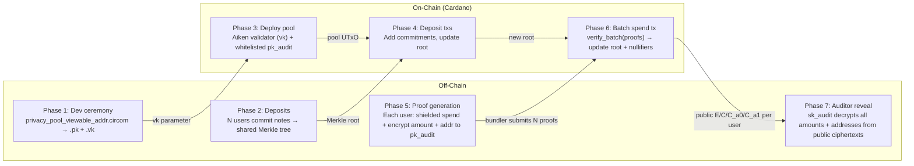

# Step 6 — Multi-User Batch Privacy Pool with Full Auditor Reveal

> **One-line summary:** N users shielded-spend from a shared pool; each spend encrypts amount + recipient address to a designated auditor; all N proofs are verified in **one on-chain batch check** (N+3 pairings). The auditor decrypts every amount and address off-chain.

---

## What Step 6 adds

| | Step 3 (Privacy Pool) | Step 5 (Full Auditor Reveal) | **Step 6 (Batch + Audit)** |
|---|---|---|---|
| **Users** | 1 | 1 | **N (shared pool)** |
| **Proofs per tx** | 1 | 1 | **N → 1 batch check** |
| **Amount hidden** | ✅ | ✅ (auditor decrypts) | ✅ (auditor decrypts all) |
| **Recipient hidden** | ✅ | ✅ (auditor decrypts) | ✅ (auditor decrypts all) |
| **Transaction graph** | hidden | hidden | **hidden across whole batch** |
| **On-chain verify** | 1 pairing (~20% CPU) | 1 pairing (~20% CPU) | **N+3 pairings (~28% CPU at N=8)** |
| **Compliance** | none | per-tx audit | **per-batch audit** |

Step 6 is the **capstone** of the selective-disclosure pipeline: it marries the multi-user scaling of F5 (batch verification) with the regulatory compliance of Step 5 (full auditor reveal). A production deployment gets both privacy *and* oversight at scale.

---

## Architecture



### Per-user flow

Each user's spend is a `privacy_pool_viewable_addr.circom` proof (Step 3 pool + Step 5 multi-message ElGamal):

```
Public inputs  : merkle_root, nullifier_hash, out_commitment_1,
                 out_commitment_2, fee, pk_audit[2], addr_commitment
Public outputs : E[2], C[2], C_a0[2], C_a1[2]

E     = r * G
C     = in_amount   * H + r * pk_audit
C_a0  = addr_limb0  * H + r * pk_audit
C_a1  = addr_limb1  * H + r * pk_audit
```

The auditor, holding `sk_audit` where `pk_audit = sk_audit * G`, recovers:

```
amount     = dlog( C  - sk_audit * E )
addr_limb0 = dlog( C_a0 - sk_audit * E )
addr_limb1 = dlog( C_a1 - sk_audit * E )
recipient_addr = addr_limb0 + 2^16 * addr_limb1
```

Because `E, C, C_a0, C_a1` are **public outputs** of the circuit, they appear on-chain in the redeemer/datum. The auditor scans the chain, extracts the ciphertexts, and runs the decrypt off-chain. No one else can do this without `sk_audit`.

---

## Run

### Groth16 (batch verify)

```bash
./groth16_e2e.sh
```

Overrides: `USERS=`, `DEPTH=`, `SEED=`, `OUT=`.

```bash
USERS=8 DEPTH=6 ./groth16_e2e.sh
```

This runs the full pipeline:
1. Compile `privacy_pool_viewable_addr.circom`
2. Generate multi-user scenario with unique recipient addresses per user
3. Compute witnesses (one per user)
4. Dev ceremony (once, shared)
5. Prove per user
6. Verify individually (baseline)
7. **Batch verify** all proofs in one multi-pairing product
8. Auditor decrypt reveal for all users

### NovaSlim (per-user verify)

```bash
./novaslim_e2e.sh
```

NovaSlim does not yet expose a batched verifier, so each user is folded/compressed/verified independently. The auditor decrypt works the same way from the public IVC state (Poseidon commitment to the ciphertexts).

---

## Prerequisites

Same as Steps 3–5: `circom`, `snarkjs`, Python 3, `--prime bls12381`, and the Rust CLIs from `clis/trusted-setup` + `clis/groth16`. NovaSlim additionally needs the `nova-slim` CLI built as a sibling directory.

---

## On-chain

| Path | On-chain verifier | Datum / redeemer |
|------|-------------------|------------------|
| **Groth16** | `aiken/groth16` gate + `aiken/groth16/lib/groth16/batch.ak` | datum = `vk` + `pk_audit`, redeemer = N `(proof, public_inputs)` arrays |
| **NovaSlim** | `nova-slim/cardano/nova-slim-verifier` | datum = `NifsBundle`, redeemer = `SlimProof` per user (verified individually) |

The Groth16 batch path is the scaling story: N=8 spends verified in one tx with ~28% script budget. The NovaSlim path is trustless (no ceremony) but pays per-user verification cost.

---

## Representative timing (dev machine, 4 users, depth 4)

| Phase | Groth16 | NovaSlim (per user) |
|-------|---------|---------------------|
| witness prep | 0.4 s | 0.4 s |
| compile | 12.5 s | 2.1 s |
| witness | 2.2 s | 1.1 s |
| trusted setup | 35.0 s | — (transparent) |
| prove / fold+compress | 16.0 s | 28.0 + 52.0 s |
| verify individual (N=4) | 0.24 s | 0.04 s |
| **verify batch (N=4)** | **0.08 s** | N/A |
| **proof size** | **192 B** | **758 B** |

> Batch speedup grows with N: ~3.0× at N=4, ~4.3× at N=8.

---

## Comparison with earlier steps

| Step | What it proves | Batch? | Audit? |
|------|---------------|--------|--------|
| 3 | Privacy pool (1 user) | ❌ | ❌ |
| 4 | Pool + amount audit | ❌ | amount only |
| 5 | Pool + amount + address audit | ❌ | ✅ full |
| **6** | **Pool + amount + address audit** | **✅ N→1** | **✅ full** |

Step 6 is the production target: a compliant, scalable, multi-user shielded pool.
