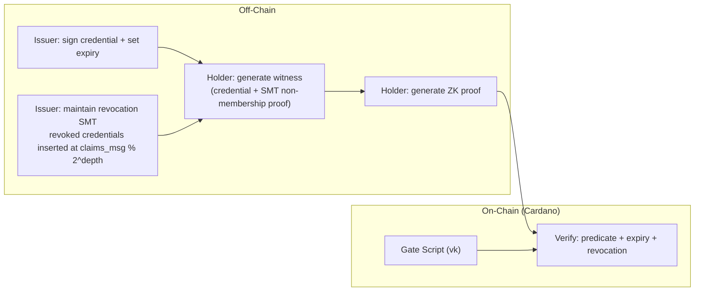

# Step 7 — Revocable Predicate Proofs (Expiry + Revocation)

> **One-line summary:** Credentials now have an **expiry** and can be **revoked** by the issuer. The holder proves both that the credential is still valid (not expired) and that it is **not** in the issuer's revocation tree.

---

## What Step 7 adds

| | Step 1 (Predicate) | **Step 7 (Revocable)** |
|---|---|---|
| **Expiry** | ❌ none | **✅** `expiry_year >= current_year` enforced in-circuit |
| **Revocation** | ❌ none | **✅** Sparse-Merkle-Tree non-membership proof |
| **On-chain check** | predicate only | predicate + expiry + revocation |
| **Proof size** | 192 B | 192 B (same) |

---

## Architecture



### Sparse Merkle Tree non-membership

The issuer maintains a Sparse Merkle Tree (SMT) where:
- Default leaf = `0`
- Revoked credential at position `claims_msg % 2^depth` is set to `Poseidon(claims_msg, 0)`

The holder proves non-revocation by showing the Merkle path from `leaf = 0` at their position to the published `revocation_root`.

```
Public inputs : pku, pkv, current_year, country_root, eligible,
                expiry_year, revocation_root
Private inputs: dob_year, country, Ru, Rv, S,
                sibling[depth], direction[depth],
                revocation_sibling[rev_depth], revocation_direction[rev_depth]
```

---

## Run

### Groth16

```bash
./groth16_e2e.sh
```

Overrides: `DEPTH=`, `REV_DEPTH=`, `SEED=`, `OUT=`.

### NovaSlim

```bash
./novaslim_e2e.sh
```

Each Nova step enforces the full revocable predicate and chains the public state unchanged.

---

## Prerequisites

Same as Step 1: `circom`, `snarkjs`, Python 3, `--prime bls12381`, Rust CLIs. NovaSlim additionally needs the `nova-slim` CLI.

---

## On-chain

| Path | On-chain verifier | Datum / redeemer |
|------|-------------------|------------------|
| **Groth16** | `aiken/groth16` gate (pairing check) | datum = `vk`, redeemer = `proof` + public inputs |
| **NovaSlim** | `nova-slim/cardano/nova-slim-verifier` | datum = `NifsBundle`, redeemer = `SlimProof` |

---

## Representative timing (dev machine)

| Phase | Groth16 | NovaSlim (1 step) |
|-------|---------|-------------------|
| compile | ~9 s | ~2 s |
| witness | ~2 s | ~1 s |
| trusted setup | ~30 s | — (transparent) |
| prove / fold+compress | ~14 s | ~28 + ~53 s |
| verify | ~0.06 s | ~0.01 s |
| **proof size** | **192 B** | **~758 B** |

---

## Security note

The revocation SMT uses the **lower bits** of `claims_msg` as the leaf index. For small `revocation_depth` (e.g., 2), multiple credentials may collide to the same leaf. In production, use `revocation_depth >= 20` (or a proper key-hash mapping) to avoid false positives.
