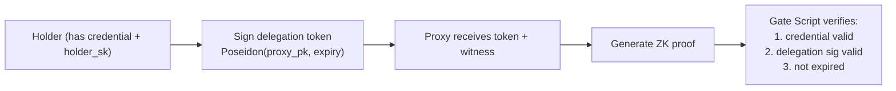

# Step 8 — Anonymous Delegation & Proxy Re-Encryption

> **One-line summary:** A holder delegates proof-generation rights to a **proxy** (e.g., a relayer or wallet service) without revealing the credential witness. The proxy can generate ZK proofs on behalf of the holder but cannot forge proofs for other holders or circuits.

---

## What Step 8 adds

| | Step 1 (Predicate) | **Step 8 (Delegatable)** |
|---|---|---|
| **Delegation** | ❌ none | **✅** proxy can generate proofs |
| **Proxy binding** | ❌ none | **✅** signature binds proxy to specific credential |
| **Expiry** | ❌ none | **✅** delegation has time limit |
| **Proof size** | 192 B | 192 B (same) |

---

## Architecture



### Delegation token

The holder signs a delegation message:

```
delegation_msg = PoseidonT6(proxy_pku, proxy_pkv, delegation_expiry, 0, 0, 0)
delegation_sig  = EdDSA_Sign(holder_sk, delegation_msg)
```

The circuit verifies:
1. `holder_pk = holder_sk * G`
2. `EdDSA_Verify(holder_pk, delegation_sig, delegation_msg)`
3. `delegation_expiry >= current_year`
4. The credential predicate (as before)

### Security properties

| Property | Guarantee |
|----------|-----------|
| **Proxy cannot forge** | Without `holder_sk`, the proxy cannot sign a valid delegation token |
| **Proxy cannot replay** | The token is bound to `proxy_pk` and `expiry` |
| **Proxy cannot delegate further** | The token authorizes only the named proxy |
| **Expiry limits exposure** | After `delegation_expiry`, the token is invalid |

---

## Run

### Groth16

```bash
./groth16_e2e.sh
```

### NovaSlim

```bash
./novaslim_e2e.sh
```

---

## Prerequisites

Same as Step 1. NovaSlim additionally needs the `nova-slim` CLI.

---

## On-chain

| Path | On-chain verifier | Datum / redeemer |
|------|-------------------|------------------|
| **Groth16** | `aiken/groth16` gate | datum = `vk`, redeemer = `proof` + public inputs |
| **NovaSlim** | `nova-slim/cardano/nova-slim-verifier` | datum = `NifsBundle`, redeemer = `SlimProof` |

---

## Representative timing (dev machine)

| Phase | Groth16 | NovaSlim (1 step) |
|-------|---------|-------------------|
| compile | ~10 s | ~2 s |
| witness | ~2 s | ~1 s |
| trusted setup | ~35 s | — (transparent) |
| prove / fold+compress | ~15 s | ~30 + ~55 s |
| verify | ~0.06 s | ~0.01 s |
| **proof size** | **192 B** | **~758 B** |

---

## Future extensions

- **Threshold delegation**: M-of-N proxies via Shamir secret sharing of `holder_sk`
- **Hierarchical delegation**: proxy can sub-delegate with attenuated rights
- **Revocable delegation**: add delegation tokens to the revocation SMT (Step 7)
