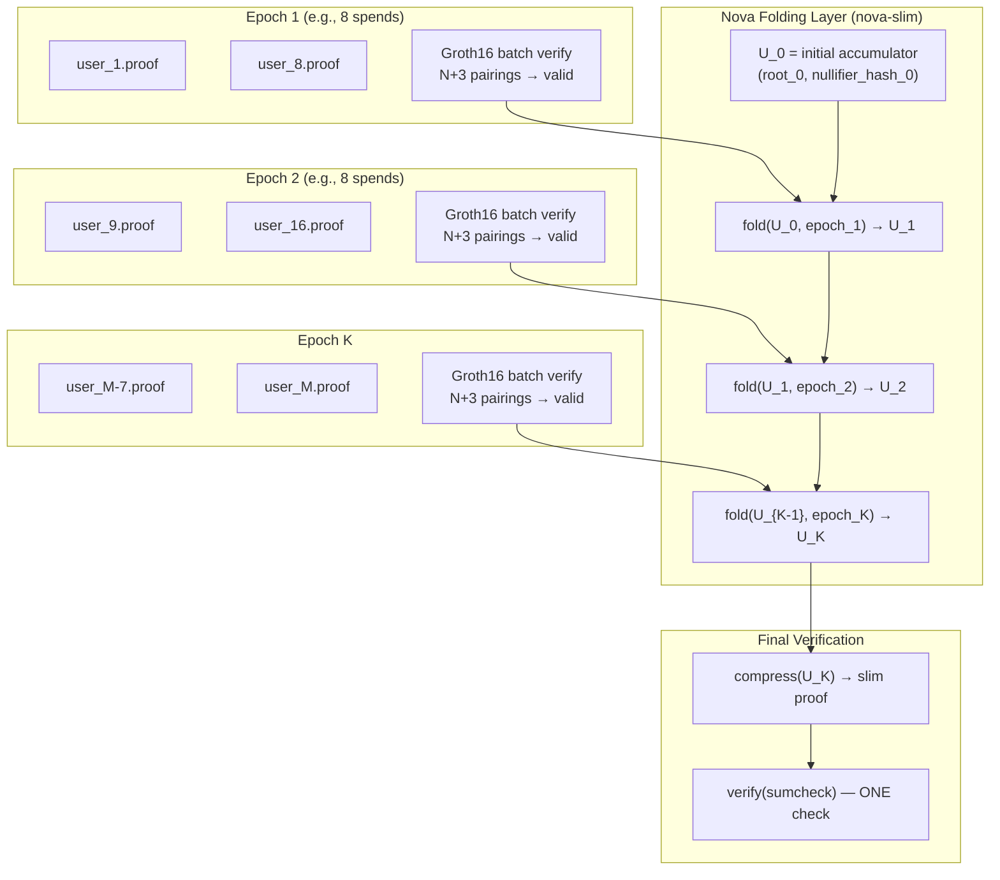

# Step 9 — Recursive Proof Aggregation (Nova-Folded Batch Verifications)

> **Research direction.** Wrap Groth16 batch verifications (Step 6) inside Nova IVC steps, so that many epoch-sized batches fold into one transparent proof. This creates a three-tier hierarchy: individual spend → batch check → recursive batch proof.

---

## The problem Step 9 solves

Step 6 answers "how do I verify N spends in one transaction?" Step 9 answers "what if I have 10,000 spends per day?" You cannot put 10,000 proofs in one batch — the redeemer would exceed Cardano's tx size limit. But you can **fold batch proofs across epochs**:

| Tier | What it does | Proof size | Ceremony? |
|------|-------------|------------|-----------|
| **Tier 1** — Individual spend | Groth16 proof per user | 192 B | per-circuit |
| **Tier 2** — Epoch batch | Groth16 `verify_batch` (N+3 pairings) | implicit (no new proof) | same vk |
| **Tier 9** — Meta-batch | Nova fold over K epoch batches | ~318 KiB (sumcheck) | **none** |

---

## Architecture

### What the Nova step circuit proves

Each Nova step (implemented in `nova-slim/`) takes as public input:
- `prev_root` — the Merkle root before this epoch
- `next_root` — the Merkle root after this epoch's spends
- `batch_nullifier_hash` — Poseidon hash of all nullifiers spent in this epoch
- `vk_hash` — hash of the Groth16 verifying key

And as private input:
- The N Groth16 proofs + public inputs for this epoch
- The Merkle path data for state transition

The step circuit **verifies the Groth16 batch internally** (using the same pairing arithmetic in R1CS). Then it updates the running state.

### Why nova-slim (not nova-prover)

| Aspect | `nova-prover` | `nova-slim` |
|--------|--------------|-------------|
| **Proof size** | ~500 B IVC + 192 B compression | **~318 KiB** slim proof |
| **Verifier** | Pairing check + IVC accumulator | **Sumcheck + hash-PC** (pairing-free) |
| **On-chain cost** | ~20% CPU (pairing) | **Native field arithmetic** |
| **Trusted setup** | Tiny compression SNARK ceremony | **None** |
| **Best for** | Research / prototyping | **Production on Cardano** |

`nova-slim` is the production target because it eliminates the final pairing check — the most expensive Plutus operation — and replaces it with native field arithmetic that fits Cardano's execution model.

---

## Estimated constraint budget

| Component | Constraints |
|-----------|-------------|
| Groth16 batch verify (N=8, embedded pairing) | ~40–60K |
| Merkle root transition (Poseidon) | ~300 |
| Nullifier accumulator update | ~300 |
| Nova step overhead | ~10–15K |
| **Total per step** | **~55–80K** |

At 55K constraints per step, folding 100 epochs is trivial for `nova-slim`.

---

## What exists in the repo

| Component | Status | Where |
|-----------|--------|-------|
| Groth16 batch verifier | ✅ Done | `aiken/groth16/lib/groth16/batch.ak` |
| Nova IVC folding | ✅ Done | `clis/nova/`, `nova-prover/` |
| Transparent sumcheck | ✅ Done | `nova-slim/` |
| Sparse prover | ✅ Done | `clis/groth16` with `--sparse` |

**What remains to be built:**
- A Circom **step circuit** that verifies a Groth16 batch proof internally (~50–100K constraints using embedded pairing arithmetic)
- A small **state machine** tying epoch roots and nullifier accumulators
- The `nova-slim` CLI integration (reusing existing `nova-slim fold` machinery)

---

## Comparison with earlier steps

| Step | What it proves | Scale | Ceremony? |
|------|---------------|-------|-----------|
| 6 | N spends in one batch | N ≤ ~16 per tx | per-circuit |
| **9** | **Unbounded spends folded to one proof** | **10K+ per day** | **none** |

---

## Status

⏳ **Research direction.** The architecture is designed; the missing piece is the Circom step circuit that embeds Groth16 batch verification in R1CS. This is a significant but feasible engineering effort — the pairing arithmetic (Miller loop + final exponentiation) has been written in Circom before (e.g., for recursive SNARKs).
