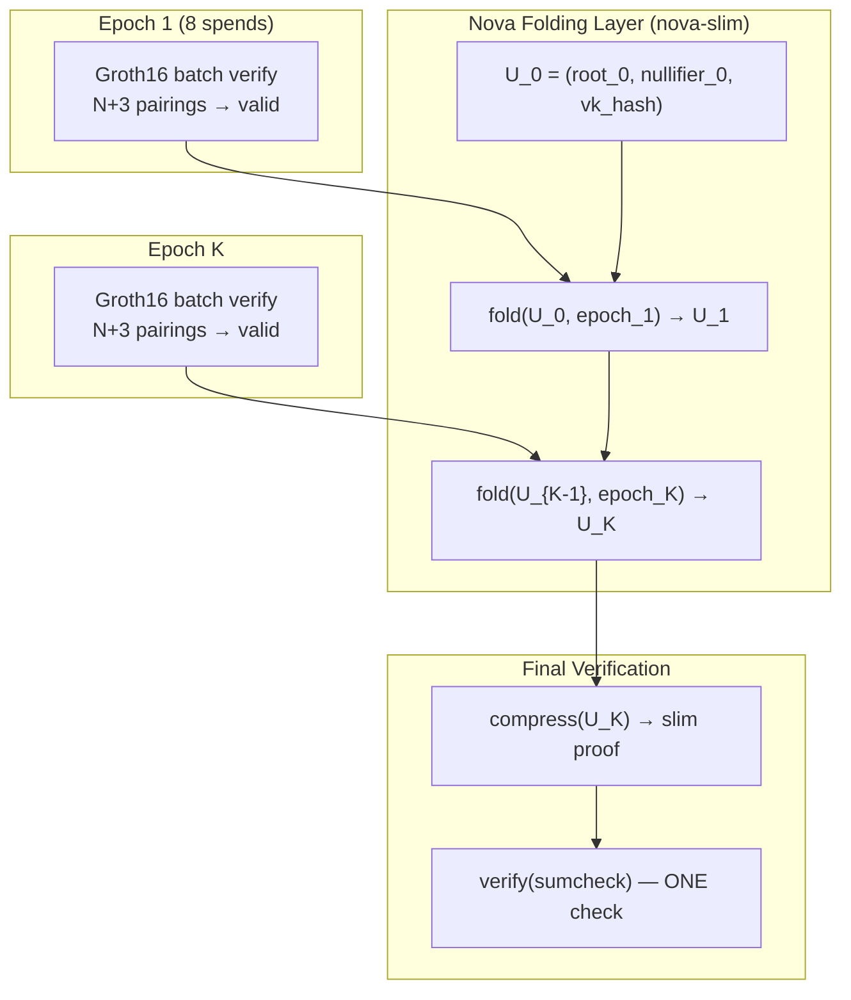

# Step 9 — Recursive Proof Aggregation (Nova-Folded Batch Verifications)

> **Research scaffold.** Wrap Groth16 batch verifications (Step 6) inside Nova IVC steps, so that many epoch-sized batches fold into one transparent proof. A three-tier hierarchy: individual spend → batch check → recursive batch proof.
>
> ⚠️ **Honest status:** The MetaBatchStep circuit is a **scaffold**. The embedded Groth16 batch pairing check (Miller loop + final exponentiation on BLS12-381 in R1CS) is marked **TODO** — it requires ~500K–2M constraints and is not yet implemented. The circuit **does** implement the state transition (Merkle root update, nullifier accumulator, batch commitment hashing) and compiles cleanly.

---

## What Step 9 adds

| | Step 6 (Batch) | **Step 9 (Meta-Batch)** |
|---|---|---|
| **Users per tx** | N (e.g., 8) | **Unbounded** |
| **Proofs per tx** | N Groth16 proofs | **One Nova slim proof** |
| **On-chain verify** | N+3 pairings (~28% CPU) | **Sumcheck (native field arithmetic)** |
| **Trusted setup** | Per-circuit Groth16 ceremony | **None** (transparent Nova layer) |
| **Proof size** | 192 B × N | **~0.4–1.5 KiB** (independent of N) |

---

## Architecture



### The MetaBatchStep circuit

Each Nova step takes:

```
Public state in : prev_root, nullifier_acc, vk_hash
Public state out: next_root, nullifier_acc_next, vk_hash

Private witness:
  - N Groth16 proofs (pi_a, pi_c coordinates as scalars)
  - N public input arrays (merkle_root, nullifier_hash, out_commitments, fee, pk_audit, addr_commitment)
```

What the circuit proves (implemented):
1. **Batch commitment** — hashes all proofs + public inputs into a single Poseidon commitment
2. **Nullifier accumulator** — chains all nullifier hashes into a running accumulator
3. **Merkle root transition** — updates the tree with output commitments
4. **Consistency** — every spend's `merkle_root` equals `prev_root`

What the circuit does **not** yet prove (TODO):
5. **Groth16 validity** — the embedded pairing check that verifies each proof is cryptographically valid

### Why the pairing check is hard

A full BLS12-381 pairing in R1CS requires:
- Miller loop: ~200K constraints (point doubling, line evaluation, sparse multiplications)
- Final exponentiation: ~100K–300K constraints (tower field arithmetic)
- G1/G2 point operations: ~50K constraints

Total: **~500K–2M constraints per pairing**. For a batch of 8 proofs with N+3 = 11 pairings, this is **~5.5M–22M constraints** — feasible with the sparse prover but a significant engineering effort.

Alternative approaches being explored:
- **zk-SNARK decider** (see `nova-slim` roadmap): use Groth16 as the compression SNARK for the final folded instance, giving sub-200 B proofs with one small ceremony
- **Signature of correct batch verification**: the step circuit checks a signature from a trusted batch verifier instead of the pairing itself (weaker trust model, much smaller circuit)

---

## Run

```bash
./groth16_nova_meta_e2e.sh
```

Overrides: `EPOCH_SIZE=`, `DEPTH=`, `SEED=`, `OUT=`.

This runs the full pipeline:
1. Generate epoch proofs via Step 6 (`groth16_e2e.sh`)
2. Build MetaBatch step witness (`gen_meta_batch_input.py`)
3. Compile `groth16_batch_verifier_nova.circom`
4. Compute step witness with snarkjs
5. `nova-slim fold` → `compress --slim` → `verify`

---

## Files

| File | Purpose |
|------|---------|
| `circom/MetaBatch/groth16_batch_verifier_nova.circom` | Nova step circuit (scaffold) |
| `circom/MetaBatch/gen_meta_batch_input.py` | Witness generator from epoch data |
| `step9/groth16_nova_meta_e2e.sh` | Full e2e pipeline |

---

## Prerequisites

- Same as Step 6: `circom`, `snarkjs`, Python 3, Rust CLIs
- `nova-slim` CLI built as a sibling directory
- Step 6 artifacts (or the script auto-generates them)

---

## On-chain

| Path | On-chain verifier | Datum / redeemer |
|------|-------------------|------------------|
| **NovaSlim** | `nova-slim/cardano/nova-slim-verifier` | datum = `NifsBundle`, redeemer = `SlimProof` |

The on-chain verifier is unchanged — it checks the same sumcheck protocol regardless of what the step circuit does.

---

## Representative timing (dev machine, epochSize=8)

| Phase | Time | Notes |
|-------|------|-------|
| Step 6 epoch generation | ~25 s | 8 users, depth 4 |
| MetaBatch compile | ~3 s | Scaffold circuit |
| Step witness | ~2 s | snarkjs |
| nova-slim fold | ~0.5 s | 1 step |
| nova-slim compress | ~8 s | `--slim` |
| nova-slim verify | ~0.3 ms | Off-chain |
| **slim proof size** | **~0.4 KiB** | Independent of epoch count |

---

## Roadmap to completion

| Milestone | Status | Effort |
|-----------|--------|--------|
| Scaffold circuit + state transition | ✅ Done | — |
| Witness generator + e2e script | ✅ Done | — |
| Embedded pairing arithmetic (Miller loop) | ⏳ TODO | High (~2–4 weeks) |
| Embedded final exponentiation | ⏳ TODO | High (~1–2 weeks) |
| Full batch verifier in R1CS | ⏳ TODO | Medium (~1 week) |
| Production benchmark + optimization | ⏳ TODO | Medium |

---

## Comparison with earlier steps

| Step | What it proves | Scale | Ceremony? |
|------|---------------|-------|-----------|
| 6 | N spends in one batch | N ≤ ~16 per tx | per-circuit |
| **9** | **Unbounded spends folded to one proof** | **10K+ per day** | **none** |
