# Verifiable Random Functions

### High level description

A Verifiable Random Function (VRF) is a cryptographic primitive that provides a deterministic, verifiable hash output from an input. It is the public-key version of a keyed hash - only the holder of the secret key can compute the hash, but anyone with the public key can verify the correctness of the hash.

**Key properties:**
- **Uniqueness**: For any fixed public key and input, only one valid proof exists for a given hash output
- **Collision resistance**: It is infeasible to find two different inputs that produce the same hash output
- **Pseudorandomness**: The hash output appears random to anyone who doesn't know the secret key

**Use cases:**
- **[Privacy-protected data structures](#privacy-protected-data-structures)**: Prevent enumeration attacks on hash-based data structures (e.g., private UTXO sets in blockchains)
- **[Leader selection](#leader-selection)**: Randomly select leaders in consensus protocols without revealing the winner until after selection
- **[Proof of prior possession](#proof-of-prior-possession)**: Demonstrate knowledge of a secret without revealing it
- **[Non-interactive randomness](#non-interactive-randomness)**: Generate verifiable randomness for lotteries or gaming applications

**Basic workflow:**

Import the library:
```
use vrf/core as vrf
```

1. **Key Generation**: Generate a secret key (SK) and public key (PK) pair
   ```
   (sk, pk) = vrf.keys_from_secret(secret_keying_material)
   ```

2. **Prove**: Compute the proof for a given input
   ```
   pi = vrf.prove(sk, alpha, salt)
   // alpha is the input, salt is encode_to_curve_salt (e.g., "ECVRF_")
   ```

3. **Proof to Hash**: Extract the hash output from the proof (optional)
   ```
   Some(beta) = vrf.proof_to_hash(pi)
   // Returns Some(beta) if proof is valid, None otherwise
   ```

4. **Verify**: Anyone can verify the proof using the public key
   ```
   Some(beta) = vrf.verify(pk, alpha, pi, salt, validate_key_flag)
   // Returns Some(beta) if valid, None if invalid
   ```

The relationship: `VRF_hash(SK, alpha) = VRF_proof_to_hash(VRF_prove(SK, alpha))`

**Fundamental API flows:**

*Figure 1 — Core VRF data flow (prover side)*

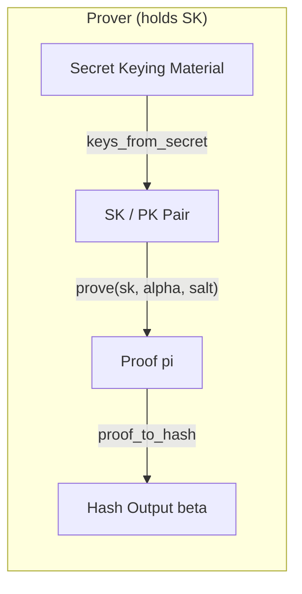
```mermaid
flowchart LR
    subgraph Prover["Prover (holds SK)"]
        A["Secret Keying Material"] -->|"keys_from_secret"| B["SK / PK Pair"]
        B -->|"prove(sk, alpha, salt)"| C["Proof pi"]
        C -->|"proof_to_hash"| D["Hash Output beta"]
    end
```

*Figure 2 — Verification flow (anyone with PK)*

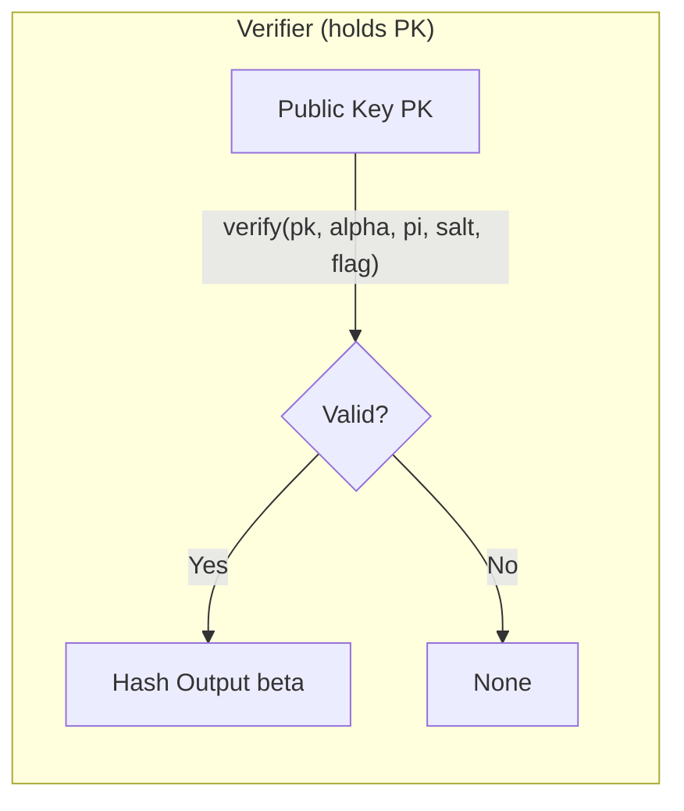
```mermaid
flowchart LR
    subgraph Verifier["Verifier (holds PK)"]
        E["Public Key PK"] -->|"verify(pk, alpha, pi, salt, flag)"| F{"Valid?"}
        F -->|Yes| G["Hash Output beta"]
        F -->|No| H["None"]
    end
```

*Figure 3 — End-to-end non-interactive exchange*

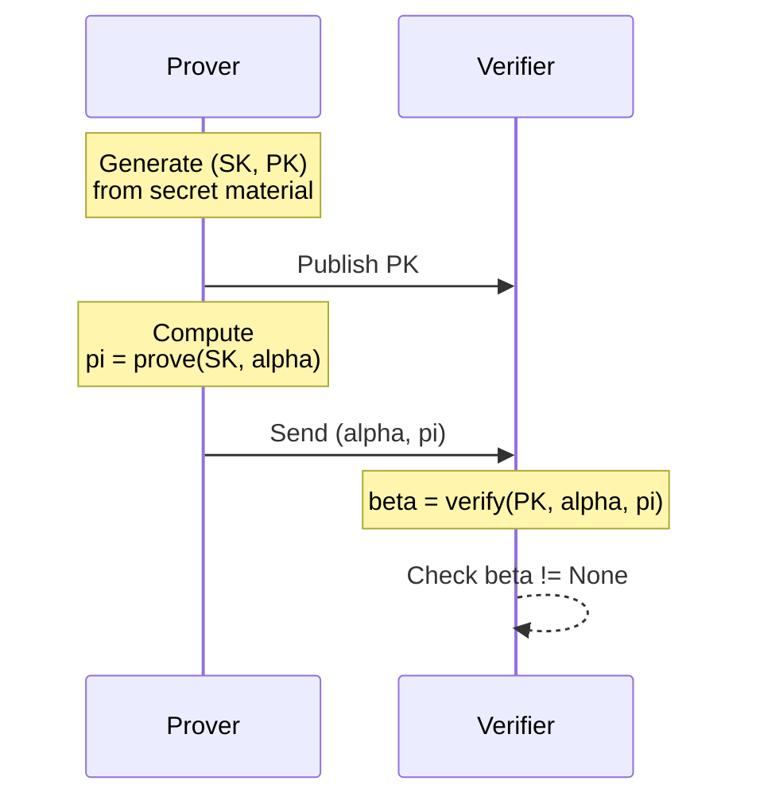
```mermaid
sequenceDiagram
    participant Prover
    participant Verifier

    Note over Prover: Generate (SK, PK)<br/>from secret material
    Prover->>Verifier: Publish PK

    Note over Prover: Compute<br/>pi = prove(SK, alpha)
    Prover->>Verifier: Send (alpha, pi)

    Note over Verifier: beta = verify(PK, alpha, pi)
    Verifier-->>Verifier: Check beta != None
```

*Figure 4 — Relationship between the two paths*

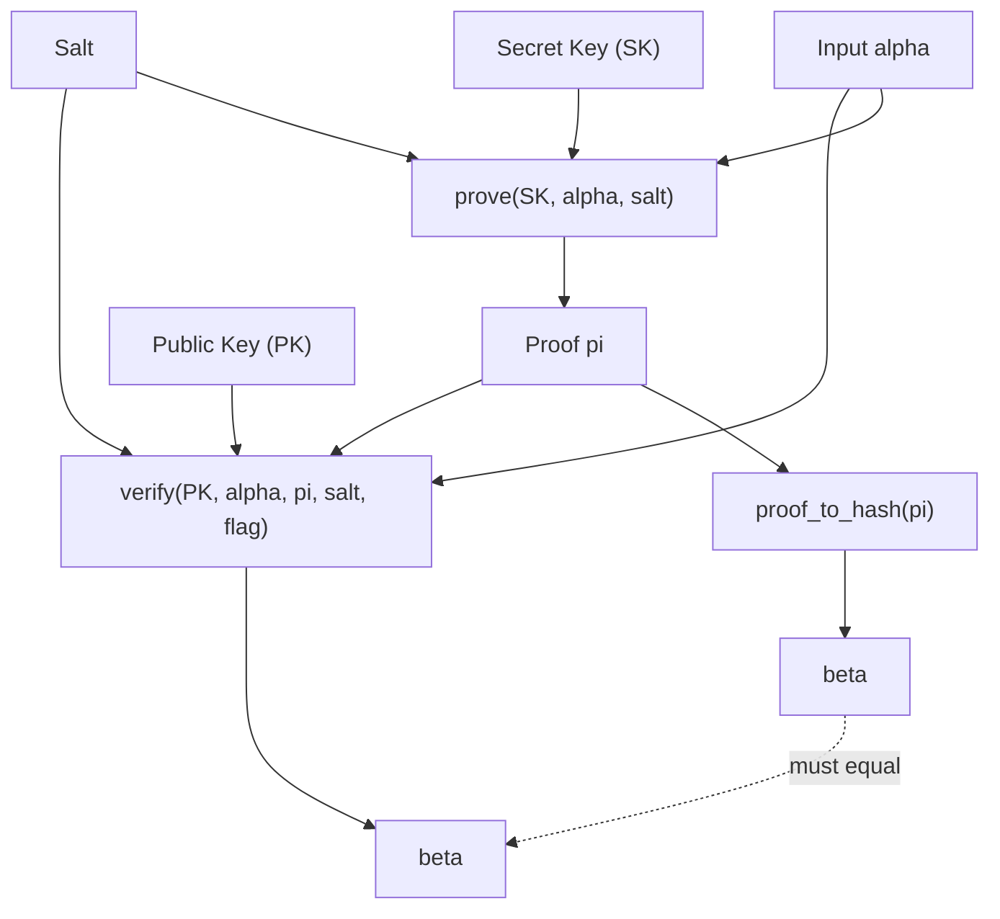
```mermaid
flowchart TD
    SK["Secret Key (SK)"]
    Alpha["Input alpha"]
    Salt["Salt"]

    SK --> Prove["prove(SK, alpha, salt)"]
    Alpha --> Prove
    Salt --> Prove
    Prove --> Pi["Proof pi"]

    Pi --> P2H["proof_to_hash(pi)"]
    P2H --> Beta1["beta"]

    PK["Public Key (PK)"] --> Verify["verify(PK, alpha, pi, salt, flag)"]
    Alpha --> Verify
    Salt --> Verify
    Pi --> Verify
    Verify --> Beta2["beta"]

    Beta1 -.->|"must equal"| Beta2
```

## Proof of Prior Possession

**The problem**: Alice wants to prove to Bob that she knows a secret X (e.g., a password or BLS secret key) without revealing X to Bob, and she wants Bob to be cryptographically certain that Alice possessed X *at the time the proof was created*.

This is harder than it sounds. Several naive approaches fail:

- **Digital signatures**: Alice signs a message with her key. But this only proves she has a signing key, not necessarily that she knows the secret X itself. Malicious signers may use extracted or delegated keys.
- **Password hashes**: Alice sends `hash(X)`. But Bob needs a pre-shared or stored hash to compare against, and the hash itself can be brute-forced or replayed.
- **Challenge-response**: Bob sends a random challenge; Alice responds with `sign(challenge, sk)`. This is interactive (requires a round trip) and still only proves signing capability, not direct possession of X.

**The VRF solution**:
1. Alice derives her VRF key pair directly from the secret: `(sk, pk) = vrf.keys_from_secret(X)`
2. Alice uses the secret itself as the VRF input: `pi = vrf.prove(sk, X, ...)`
3. Alice sends `(pk, pi)` to Bob
4. Bob verifies: `vrf.verify(pk, X, pi, ...)` — if it returns `Some(beta)`, Alice knew X; if `None`, she did not

**How it works**:

| Step | Alice (prover, knows X) | Bob (verifier) |
|------|------------------------|----------------|
| 1 | Derive `(sk, pk)` from secret X | — |
| 2 | Compute `pi = prove(sk, X)` using X as both key and input | — |
| 3 | Send `(pk, pi)` to Bob | Receives `(pk, pi)` |
| 4 | — | Run `verify(pk, X, pi)` |
| 5 | — | If `Some(beta)`, Alice possessed X at proof time |

**Proof of possession flows:**

*Figure 14 — Self-binding: the secret is both key and input*

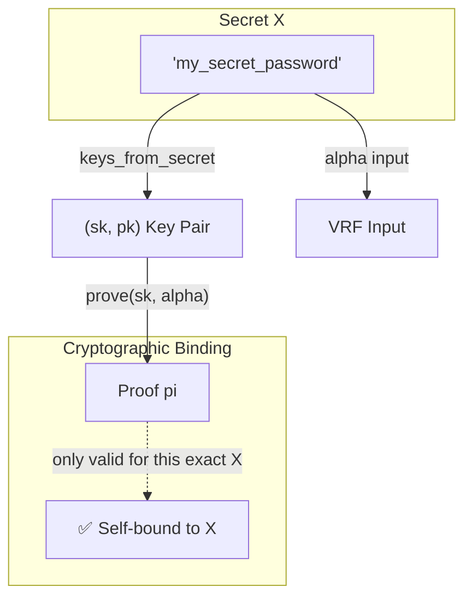
```mermaid
flowchart TD
    subgraph Secret["Secret X"]
        X["'my_secret_password'"]
    end

    X -->|"keys_from_secret"| KP["(sk, pk) Key Pair"]
    X -->|"alpha input"| Alpha["VRF Input"]
    KP -->|"prove(sk, alpha)"| Pi["Proof pi"]

    subgraph Binding["Cryptographic Binding"]
        Pi -.->|"only valid for this exact X"| Valid["✅ Self-bound to X"]
    end
```

*Figure 15 — Non-interactive proof exchange*

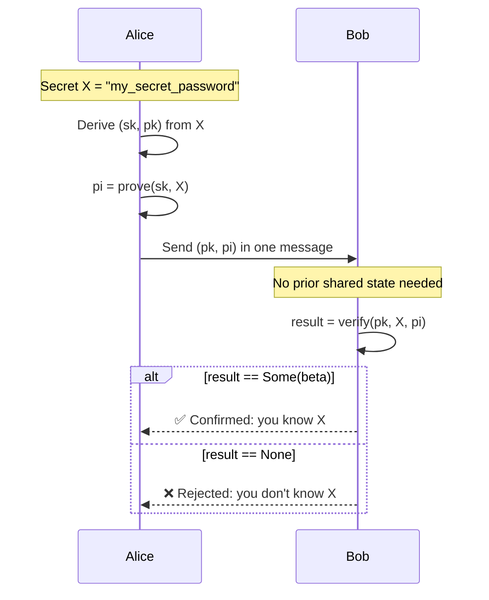
```mermaid
sequenceDiagram
    participant Alice
    participant Bob

    Note over Alice: Secret X = "my_secret_password"
    Alice->>Alice: Derive (sk, pk) from X
    Alice->>Alice: pi = prove(sk, X)

    Alice->>Bob: Send (pk, pi) in one message

    Note over Bob: No prior shared state needed
    Bob->>Bob: result = verify(pk, X, pi)

    alt result == Some(beta)
        Bob-->>Alice: ✅ Confirmed: you know X
    else result == None
        Bob-->>Alice: ❌ Rejected: you don't know X
    end
```

*Figure 16 — Why other approaches fail and VRF succeeds*

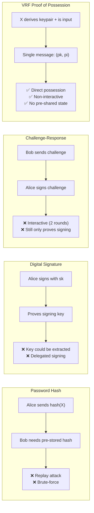
```mermaid
flowchart LR
    subgraph PasswordHash["Password Hash"]
        A1["Alice sends hash(X)"] --> B1["Bob needs pre-stored hash"]
        B1 --> C1["❌ Replay attack<br/>❌ Brute-force"]
    end

    subgraph DigitalSig["Digital Signature"]
        A2["Alice signs with sk"] --> B2["Proves signing key"]
        B2 --> C2["❌ Key could be extracted<br/>❌ Delegated signing"]
    end

    subgraph ChallengeResp["Challenge-Response"]
        A3["Bob sends challenge"] --> B3["Alice signs challenge"]
        B3 --> C3["❌ Interactive (2 rounds)<br/>❌ Still only proves signing"]
    end

    subgraph VRF["VRF Proof of Possession"]
        A4["X derives keypair + is input"] --> B4["Single message: (pk, pi)"]
        B4 --> C4["✅ Direct possession<br/>✅ Non-interactive<br/>✅ No pre-shared state"]
    end
```

**Why it works**:
- **Self-binding**: Because the secret X is used both to derive the keypair *and* as the VRF input, the resulting proof is cryptographically bound to that exact secret. A proof computed for `X` cannot verify against a different secret `Y`.
- **Non-extractability**: The proof `pi` does not leak information about `sk` or `X`. Eve can observe `pi` and `pk` but cannot recover the secret.
- **Non-interactivity**: Alice produces the proof in a single message. No challenge round-trip is needed.
- **Time-binding**: The proof demonstrates possession *at creation time*, not just any time. It cannot be forged retroactively.

**Comparison with other approaches**:

| Approach | Reveals secret? | Interactive? | Proves possession of X? | Forgeable without X? |
|----------|-----------------|--------------|------------------------|----------------------|
| Password hash | Partial (leak risk) | No | Yes | If hash is stolen |
| Digital signature | No | No | Indirectly | If key is extracted |
| Challenge-response | No | Yes | Indirectly | If key is extracted |
| **VRF PoPP** | **No** | **No** | **Yes (direct)** | **No** |

**Use cases**:
- **BLS rogue-key prevention**: In multi-signatures, an attacker might forge a public key that cancels out honest signers. Proof of Possession (PoP) — a special case of PoPP — proves the prover knows the secret corresponding to their public key, defeating rogue-key attacks.
- **Passwordless authentication**: A server stores `(pk, last_beta)`. The client proves knowledge of their password-derived key without ever sending the password.
- **Validator key registration**: A blockchain validator registers `pk` on-chain and attaches a PoPP so the protocol knows they actually control the secret key.
- **Credential issuance**: An authority issues a credential only after receiving a PoPP tied to a user-chosen secret, ensuring the user truly knows the secret.

**Example: legitimate prover succeeds**

```aiken
// Alice (prover):
let secret = "my_secret_password"
let (sk, pk) = vrf.keys_from_secret(secret)

// Alice uses the secret itself as the VRF input
let pi = vrf.prove(sk, "my_secret_password", "ECVRF_")

// Alice sends (pk, pi) to Bob
```

**Example: verifier checks the proof**

```aiken
// Bob (verifier):
let pk_from_alice = pk
let pi_from_alice = pi

let result = vrf.verify(pk_from_alice, "my_secret_password", pi_from_alice, "ECVRF_", False)

// result == Some(beta)  -> Alice knew the secret
// result == None        -> Alice did NOT know the secret
```

**Example: adversary with wrong secret fails**

```aiken
// Eve tries to impersonate Alice using the wrong secret
let (sk_eve, pk_eve) = vrf.keys_from_secret("wrong_password")
let pi_eve = vrf.prove(sk_eve, "wrong_password", "ECVRF_")

// Bob verifies using Alice's expected secret
let result = vrf.verify(pk_eve, "my_secret_password", pi_eve, "ECVRF_", False)
// result == None  -> Eve is rejected because the proof was computed
//                    for "wrong_password", not "my_secret_password"
```

**Security properties**:
- **Binding**: The proof is bound to the specific secret used as input. A proof for `X` will not verify against `Y`.
- **Non-extractability**: Observing `(pk, pi)` does not reveal the secret key or the input secret.
- **Non-interactivity**: No challenge-response round trip is required.
- **Unforgeability**: Without knowing `sk` (derived from X), it is computationally infeasible to produce a valid proof that verifies against X.
- **Time-binding**: The proof attests to possession at the moment it was created, preventing retroactive forgery.

See [validators/placeholder.ak](./validators/placeholder.ak) for a working test: `test_proof_of_prior_possession`

## Non-interactive Randomness

**The problem**: Many applications — from online lotteries to blockchain gaming to committee selection — need a source of randomness that is simultaneously:
- **Unpredictable**: Nobody can guess the output in advance
- **Publicly verifiable**: Anyone can confirm the output was generated correctly
- **Non-interactive**: No back-and-forth communication between prover and verifier is needed
- **Deterministic**: The same input always yields the same output, preventing manipulation after the fact

Centralized solutions like the [NIST randomness beacon](https://beacon.nist.gov/home) or the [University of Chile beacon](https://random.uchile.cl/en/about/) provide public randomness, but they are not cryptographically verifiable in a decentralized way and require trusting a single operator. Commit-reveal schemes are interactive and complex. Hashing a secret value (`hash(secret || input)`) is not verifiable because nobody can check the prover actually used the claimed secret.

**The VRF solution**:
1. A trusted operator (or oracle) publishes their public VRF key `pk` in advance
2. For each round, the operator uses a *publicly known input* (e.g., a block hash, round number, or timestamp) as the VRF alpha
3. The operator computes: `beta = vrf.proof_to_hash(vrf.prove(sk, input))`
4. The operator publishes `(input, beta, pi)` — anyone can verify the randomness with just `pk`

**How it works**:

| Step | Operator (knows `sk`) | Verifiers / Public |
|------|----------------------|-------------------|
| 1 | Publish `pk` in advance | Everyone sees `pk` |
| 2 | Wait for a public input (e.g., block hash) | Input becomes known |
| 3 | Compute `beta = proof_to_hash(prove(sk, input))` | — |
| 4 | Publish `(input, beta, pi)` | Everyone receives the triple |
| 5 | — | Run `verify(pk, input, pi)` to confirm `beta` is valid |

**Randomness beacon flows:**

*Figure 17 — Deterministic yet unpredictable: one shot per input*

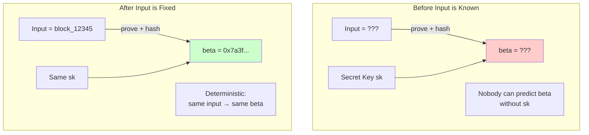
```mermaid
flowchart TD
    subgraph Before["Before Input is Known"]
        I1["Input = ???"]
        SK["Secret Key sk"]
        I1 -->|"prove + hash"| Q["beta = ???"]
        SK --> Q
        style Q fill:#ffcccc
        Note1["Nobody can predict beta<br/>without sk"]
    end

    subgraph After["After Input is Fixed"]
        I2["Input = block_12345"]
        SK2["Same sk"]
        I2 -->|"prove + hash"| B["beta = 0x7a3f..."]
        SK2 --> B
        style B fill:#ccffcc
        Note2["Deterministic:<br/>same input → same beta"]
    end
```

*Figure 18 — Non-interactive randomness publication and verification*

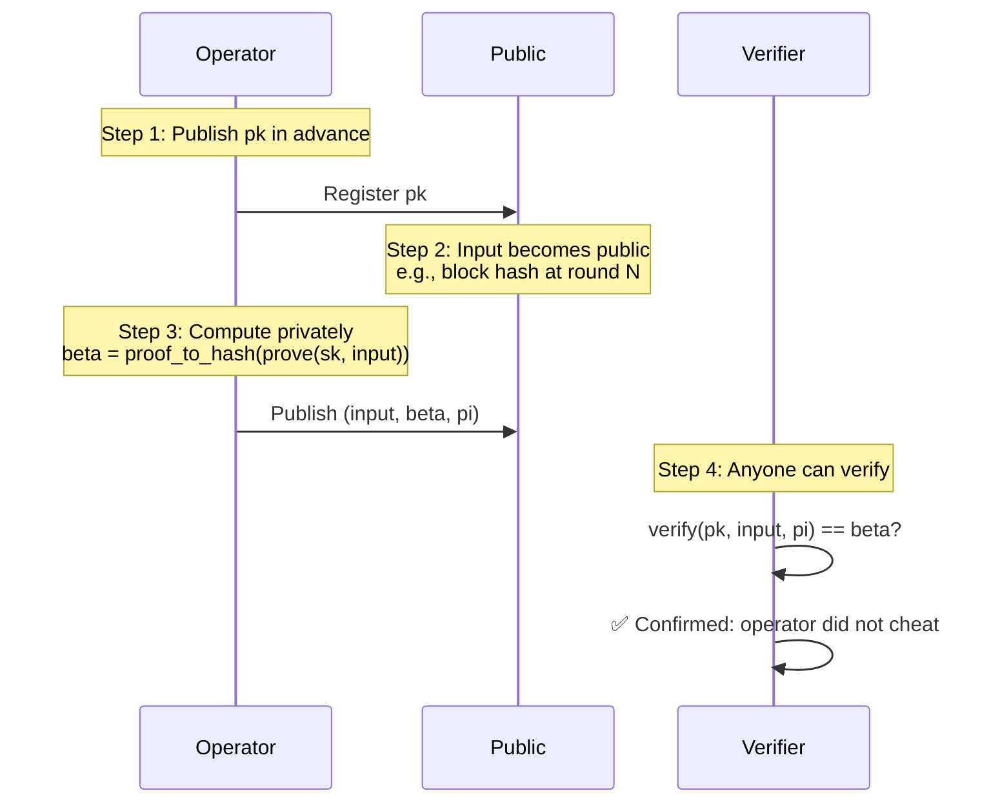
```mermaid
sequenceDiagram
    participant Operator
    participant Public
    participant Verifier

    Note over Operator: Step 1: Publish pk in advance
    Operator->>Public: Register pk

    Note over Public: Step 2: Input becomes public<br/>e.g., block hash at round N

    Note over Operator: Step 3: Compute privately<br/>beta = proof_to_hash(prove(sk, input))
    Operator->>Public: Publish (input, beta, pi)

    Note over Verifier: Step 4: Anyone can verify
    Verifier->>Verifier: verify(pk, input, pi) == beta?
    Verifier->>Verifier: ✅ Confirmed: operator did not cheat
```

*Figure 19 — Why centralized beacons and commit-reveal fail*

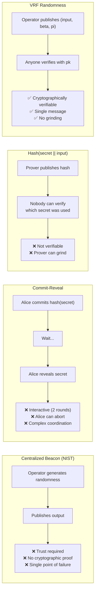
```mermaid
flowchart LR
    subgraph Centralized["Centralized Beacon (NIST)"]
        A1["Operator generates randomness"] --> B1["Publishes output"]
        B1 --> C1["❌ Trust required<br/>❌ No cryptographic proof<br/>❌ Single point of failure"]
    end

    subgraph CommitReveal["Commit-Reveal"]
        A2["Alice commits hash(secret)"] --> B2["Wait..."]
        B2 --> C2["Alice reveals secret"]
        C2 --> D2["❌ Interactive (2 rounds)<br/>❌ Alice can abort<br/>❌ Complex coordination"]
    end

    subgraph HashOnly["Hash(secret || input)"]
        A3["Prover publishes hash"] --> B3["Nobody can verify<br/>which secret was used"]
        B3 --> C3["❌ Not verifiable<br/>❌ Prover can grind"]
    end

    subgraph VRF["VRF Randomness"]
        A4["Operator publishes (input, beta, pi)"] --> B4["Anyone verifies with pk"]
        B4 --> C4["✅ Cryptographically verifiable<br/>✅ Single message<br/>✅ No grinding"]
    end
```

*Figure 20 — Multi-round beacon: each round is independently verifiable*

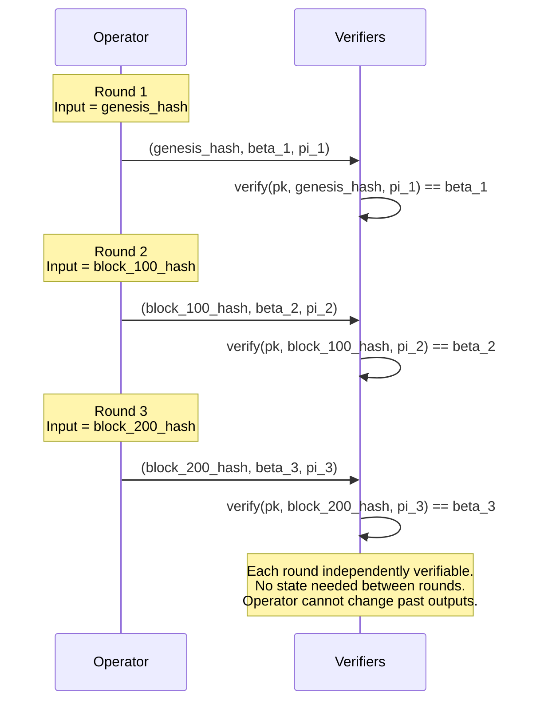
```mermaid
sequenceDiagram
    participant Operator
    participant Verifiers

    Note over Operator: Round 1<br/>Input = genesis_hash
    Operator->>Verifiers: (genesis_hash, beta_1, pi_1)
    Verifiers->>Verifiers: verify(pk, genesis_hash, pi_1) == beta_1

    Note over Operator: Round 2<br/>Input = block_100_hash
    Operator->>Verifiers: (block_100_hash, beta_2, pi_2)
    Verifiers->>Verifiers: verify(pk, block_100_hash, pi_2) == beta_2

    Note over Operator: Round 3<br/>Input = block_200_hash
    Operator->>Verifiers: (block_200_hash, beta_3, pi_3)
    Verifiers->>Verifiers: verify(pk, block_200_hash, pi_3) == beta_3

    Note over Verifiers: Each round independently verifiable.<br/>No state needed between rounds.<br/>Operator cannot change past outputs.
```

**Why it works**:
- **Deterministic yet unpredictable**: Before the public input is known, `beta` is indistinguishable from random to anyone without `sk`. Once the input is fixed, the output is uniquely determined and cannot be changed.
- **Verifiable**: The proof `pi` cryptographically binds the operator's public key to the specific input and output. Anyone can verify this binding without trusting the operator.
- **Non-interactive**: The operator publishes a single message. No challenge-response or multi-round protocol is required.
- **Unbiasable**: Because the input is public and the output is deterministic, the operator cannot grind on inputs to produce a favorable `beta`. They get one shot per input.

**Comparison with other approaches**:

| Approach | Predictable? | Verifiable? | Interactive? | Decentralized? |
|----------|--------------|-------------|--------------|----------------|
| Centralized beacon (NIST) | No | No (trust-based) | No | No |
| Hash of secret + input | No | No | No | No |
| Commit-reveal | No | Yes | Yes (2 rounds) | Partial |
| **VRF randomness** | **No** | **Yes** | **No** | **Can be** |

**Real-world VRF-based randomness beacons**:

- **drand (League of Entropy)**: A distributed randomness beacon originally developed at EPFL's DEDIS lab and now stewarded by Randamu. It uses threshold cryptography and bilinear pairings (BLS12-381) to produce collective, publicly verifiable, unbiased random values at fixed intervals. The League of Entropy includes organizations such as Cloudflare, Protocol Labs, and NIST. Clients can verify each beacon output cryptographically without trusting any single node. Since 2024, drand operates three mainnet networks: a default chained network (30s period), a quicknet unchained network (3s period, compatible with timelock encryption), and an EVM-compatible network using BN254.
- **Chainlink VRF**: A decentralized oracle network that uses VRF to provide on-chain verifiable randomness for smart contracts. Smart contracts request randomness; Chainlink nodes compute the VRF output off-chain and deliver the proof on-chain, where the smart contract verifies it before using the random number.
- **Cardano's Ouroboros Praos**: The protocol uses VRF-based randomness to determine slot leadership unpredictably. While this is a form of leader selection, it is fundamentally a randomness beacon whose outputs are consumed by the consensus protocol itself.

**Use cases**:
- **Lottery draws and gaming**: Use a future block hash as the input so the operator cannot manipulate the outcome. Players can verify the winning numbers after the draw.
- **Card shuffling and dice rolling**: Online casinos can prove each shuffle or roll was fair.
- **Smart contract randomness**: DeFi protocols, NFT mints, and on-chain games can request VRF outputs to assign rarities, select winners, or randomize game states.
- **Committee selection and sortition**: Randomly select a jury, audit committee, or validator set with cryptographically provable fairness.
- **Timelock encryption and e-cash**: VRF outputs can serve as decryption-time oracles or as the basis for unlinkable electronic cash schemes.

**Example: single-round randomness generation**

```aiken
// Operator generates randomness for round 42:
let round_input = "block_12345_hash"
let (sk, pk) = vrf.keys_from_secret(operator_secret)
let pi = vrf.prove(sk, round_input, "ECVRF_")
let Some(beta) = vrf.proof_to_hash(pi)
// beta is a deterministic 32-byte pseudorandom value for this round

// Operator publishes (pk, round_input, beta, pi)

// Anyone can verify:
let Some(beta_verified) = vrf.verify(pk, round_input, pi, "ECVRF_", False)
// beta_verified == beta confirms the operator did not cheat
```

**Example: extracting a fair random number in range [0, N)**

```aiken
// Given a verified beta (32 bytes), convert to an integer and reduce modulo N
let N = 100  // e.g., a 100-sided die
let random_number = bytearray_to_integer(True, beta) % N
// random_number is now in [0, 99]
```

**Example: adversarial operator cannot forge or predict**

```aiken
// Even if the operator is malicious, they cannot:
// 1. Predict beta before the input is known (pseudorandomness)
// 2. Forge a proof for a different beta (uniqueness)
// 3. Change beta after the input is fixed (determinism)

// If an operator tries to publish a tampered proof:
let tampered_pi = tamper_with_proof(pi)
let result = vrf.verify(pk, round_input, tampered_pi, "ECVRF_", False)
// result == None  -> tampered proof is rejected
```

**Security properties**:
- **Unpredictability**: Before the public input is known, `beta` is indistinguishable from random to anyone without `sk`.
- **Verifiability**: Anyone can check `verify(pk, input, pi)` to confirm the output was computed correctly.
- **Determinism**: The same `(sk, input)` always yields the same `beta`, preventing post-hoc manipulation.
- **Uniqueness**: Only one valid `beta` exists per `(pk, input)`, preventing the operator from cherry-picking outcomes.
- **Unbiasability**: The operator cannot grind on inputs because the input is publicly fixed before the VRF is evaluated.

See [validators/placeholder.ak](./validators/placeholder.ak) for a working test: `test_non_interactive_randomness`

## Privacy-Protected Data Structures

**The problem**: When you store data in a hash-based structure (e.g., a Merkle tree or a hash map), using regular hashes like `sha2_256(data)` leaks information. An attacker can enumerate common or expected data inputs, compute their hashes, and check if those positions exist in the public structure. This is called an **enumeration attack** and it compromises the confidentiality of the stored dataset.

**The VRF solution**: Replace regular hashes with VRF hash outputs. Since `beta = VRF_hash(sk, data)` is pseudorandom and unpredictable to anyone without the secret key `sk`, an attacker cannot enumerate or link positions to specific data items. Only the prover (who holds `sk`) can compute the address of a given record. Yet anyone can verify, using the public key, that a claimed `(data, beta)` pair is valid.

**How it works**:

| Step | Prover (knows `sk`) | Verifier (knows `pk`) |
|------|---------------------|-----------------------|
| 1 | Derive `beta = proof_to_hash(prove(sk, data))` | — |
| 2 | Store `(beta, encrypted_payload)` in public structure | Sees the structure but cannot link `beta` to `data` |
| 3 | To reveal membership later, send `(data, proof)` | Run `verify(pk, data, proof)` to get `beta`, then check `beta` is in the structure |

**Data structure flows:**

*Figure 5 — Private storage: mapping records to unpredictable addresses*

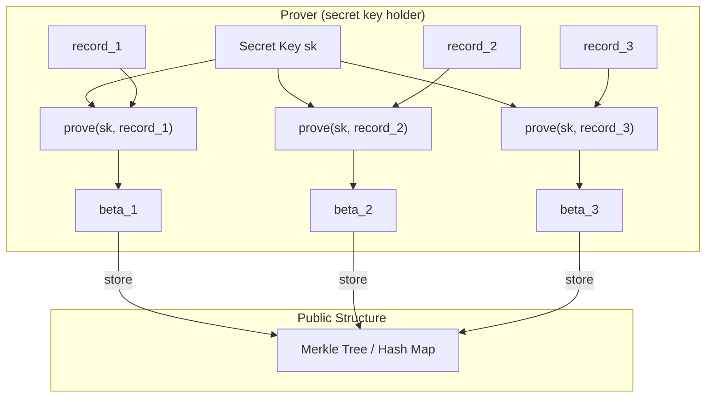
```mermaid
flowchart TD
    subgraph Prover["Prover (secret key holder)"]
        SK["Secret Key sk"]
        R1["record_1"]
        R2["record_2"]
        R3["record_3"]

        SK --> P1["prove(sk, record_1)"]
        R1 --> P1
        SK --> P2["prove(sk, record_2)"]
        R2 --> P2
        SK --> P3["prove(sk, record_3)"]
        R3 --> P3

        P1 --> B1["beta_1"]
        P2 --> B2["beta_2"]
        P3 --> B3["beta_3"]
    end

    subgraph Public["Public Structure"]
        MT["Merkle Tree / Hash Map"]
        B1 -->|"store"| MT
        B2 -->|"store"| MT
        B3 -->|"store"| MT
    end
```

*Figure 6 — Membership proof: revealing one record without leaking the rest*

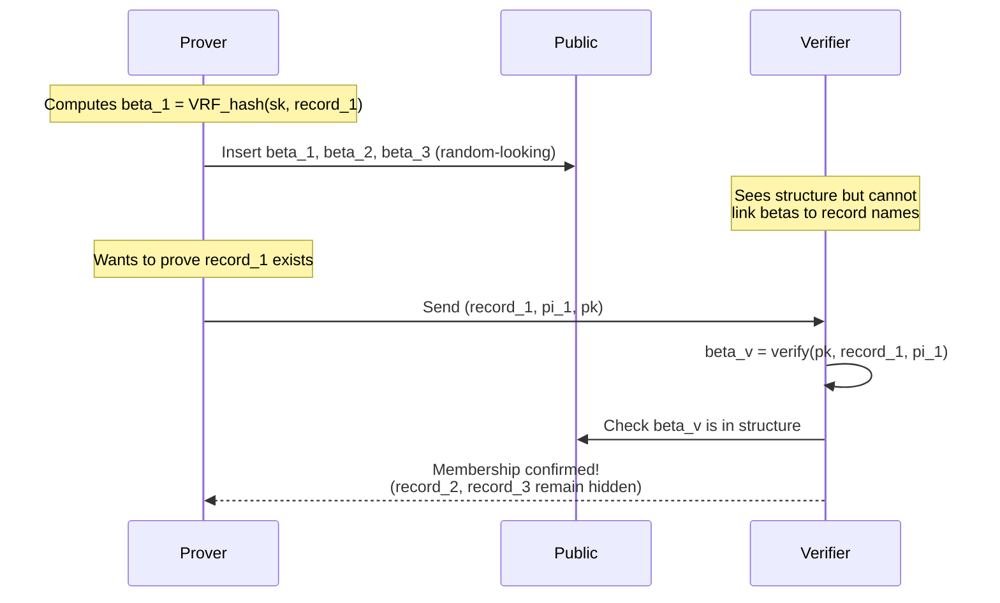
```mermaid
sequenceDiagram
    participant Prover
    participant Public
    participant Verifier

    Note over Prover: Computes beta_1 = VRF_hash(sk, record_1)
    Prover->>Public: Insert beta_1, beta_2, beta_3 (random-looking)

    Note over Verifier: Sees structure but cannot<br/>link betas to record names

    Note over Prover: Wants to prove record_1 exists
    Prover->>Verifier: Send (record_1, pi_1, pk)

    Verifier->>Verifier: beta_v = verify(pk, record_1, pi_1)
    Verifier->>Public: Check beta_v is in structure

    Verifier-->>Prover: Membership confirmed!<br/>(record_2, record_3 remain hidden)
```

*Figure 7 — Why regular hashing fails and VRF wins*

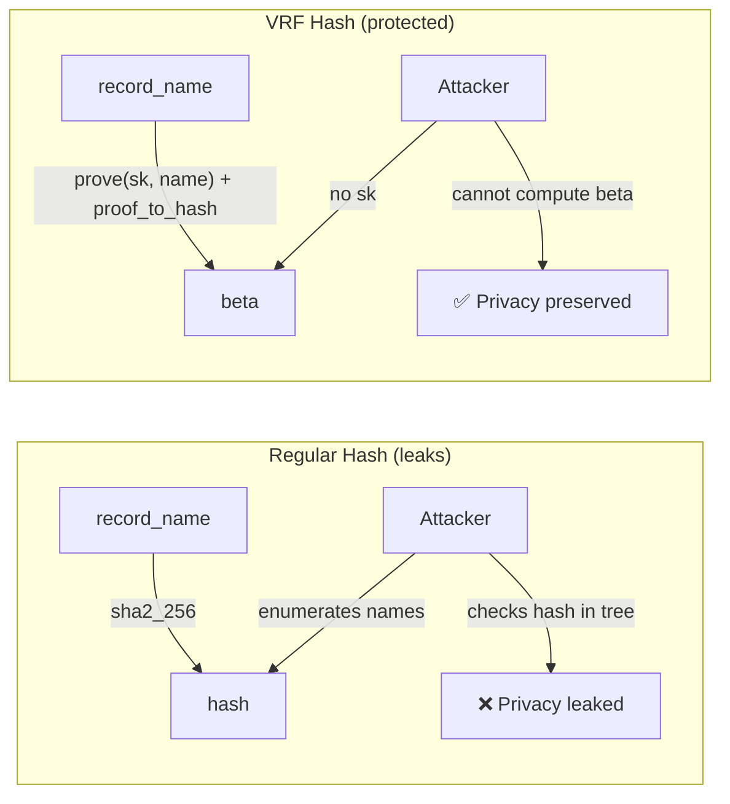
```mermaid
flowchart LR
    subgraph Regular["Regular Hash (leaks)"]
        D1["record_name"] -->|sha2_256| H1["hash"]
        A1["Attacker"] -->|"enumerates names"| H1
        A1 -->|"checks hash in tree"| LEAK["❌ Privacy leaked"]
    end

    subgraph VRF["VRF Hash (protected)"]
        D2["record_name"] -->|"prove(sk, name) + proof_to_hash"| H2["beta"]
        A2["Attacker"] -->|"no sk"| H2
        A2 -->|"cannot compute beta"| SAFE["✅ Privacy preserved"]
    end
```

**Why it works**: The VRF output appears random to anyone without the secret key. Without `sk`, an attacker cannot determine which `beta` corresponds to which `data`. Even if the attacker knows the plaintext `data`, they cannot compute its `beta` to test for presence in the structure.

**Use cases**:
- **Private UTXO sets** (blockchains like Cardano): Hide which UTXOs exist on-chain while allowing the owner to spend them by proving membership.
- **Stealth addresses**: A recipient can scan the blockchain for their payments by computing the expected VRF-derived positions, without revealing their viewing key.
- **Confidential databases**: Store records in a public Merkle tree where only authorized parties know which branches contain which data.
- **Privacy-preserving membership proofs**: Prove that a user is on an allow-list without revealing the entire list or the user's exact position.

---

### Deep dive: Private UTXO Sets

In UTXO-based blockchains (Bitcoin, Cardano), every unspent transaction output is stored on-chain in plain sight. Anyone can enumerate the entire UTXO set, see which addresses hold funds, and trace the flow of coins. This is a major privacy limitation.

**The goal**: Allow a wallet owner to hide *which* UTXOs they control, while still being able to spend them and convince the network the spend is valid.

**How VRF enables private UTXO sets**:
1. Instead of publishing a UTXO at a predictable address (e.g., `hash(public_key || nonce)`), the owner publishes it at a VRF-derived position: `beta = VRF_hash(sk, utxo_data)`
2. The UTXO's commitment `(beta, encrypted_amount, encrypted_script)` is inserted into a public Merkle tree or accumulator
3. Only the owner (who knows `sk`) can compute `beta` for a given UTXO and find it in the tree
4. To spend, the owner reveals the UTXO data, provides the VRF proof, and a Merkle path showing the commitment exists
5. The network verifies: (a) the VRF proof is valid, (b) the Merkle path is correct, (c) the UTXO has not been spent before

*Figure 8 — Standard UTXO model (public and enumerable)*

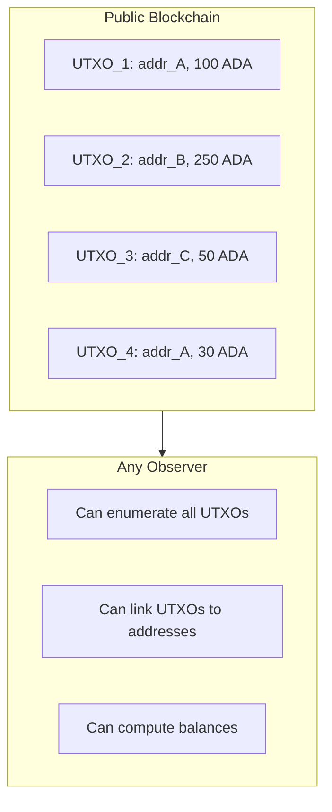
```mermaid
flowchart TD
    subgraph Blockchain["Public Blockchain"]
        U1["UTXO_1: addr_A, 100 ADA"]
        U2["UTXO_2: addr_B, 250 ADA"]
        U3["UTXO_3: addr_C, 50 ADA"]
        U4["UTXO_4: addr_A, 30 ADA"]
    end

    subgraph Attacker["Any Observer"]
        A1["Can enumerate all UTXOs"]
        A2["Can link UTXOs to addresses"]
        A3["Can compute balances"]
    end

    Blockchain --> Attacker
```

*Figure 9 — Private UTXO model using VRF (hidden but verifiable)*

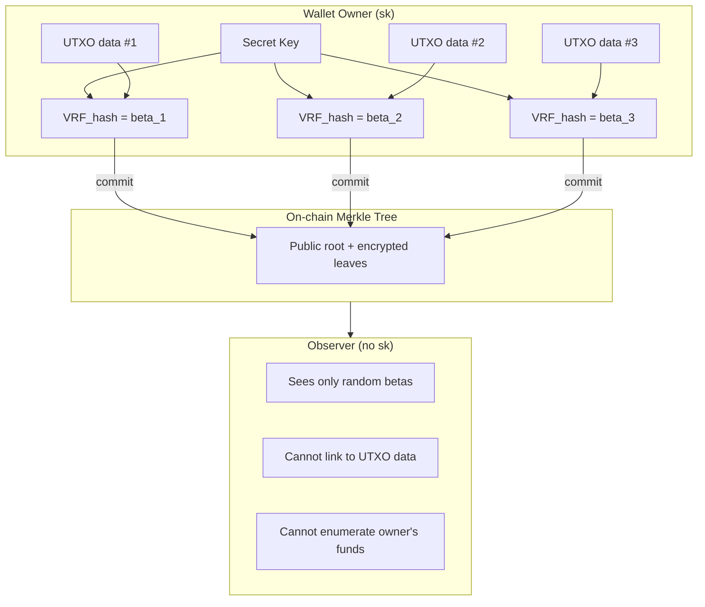
```mermaid
flowchart TD
    subgraph Owner["Wallet Owner (sk)"]
        SK["Secret Key"]
        UX1["UTXO data #1"]
        UX2["UTXO data #2"]
        UX3["UTXO data #3"]

        SK --> V1["VRF_hash = beta_1"]
        UX1 --> V1
        SK --> V2["VRF_hash = beta_2"]
        UX2 --> V2
        SK --> V3["VRF_hash = beta_3"]
        UX3 --> V3
    end

    subgraph Chain["On-chain Merkle Tree"]
        MT["Public root + encrypted leaves"]
        V1 -->|"commit"| MT
        V2 -->|"commit"| MT
        V3 -->|"commit"| MT
    end

    subgraph Observer["Observer (no sk)"]
        O1["Sees only random betas"]
        O2["Cannot link to UTXO data"]
        O3["Cannot enumerate owner's funds"]
    end

    Chain --> Observer
```

*Figure 10 — Spending a private UTXO (proving existence without revealing the set)*

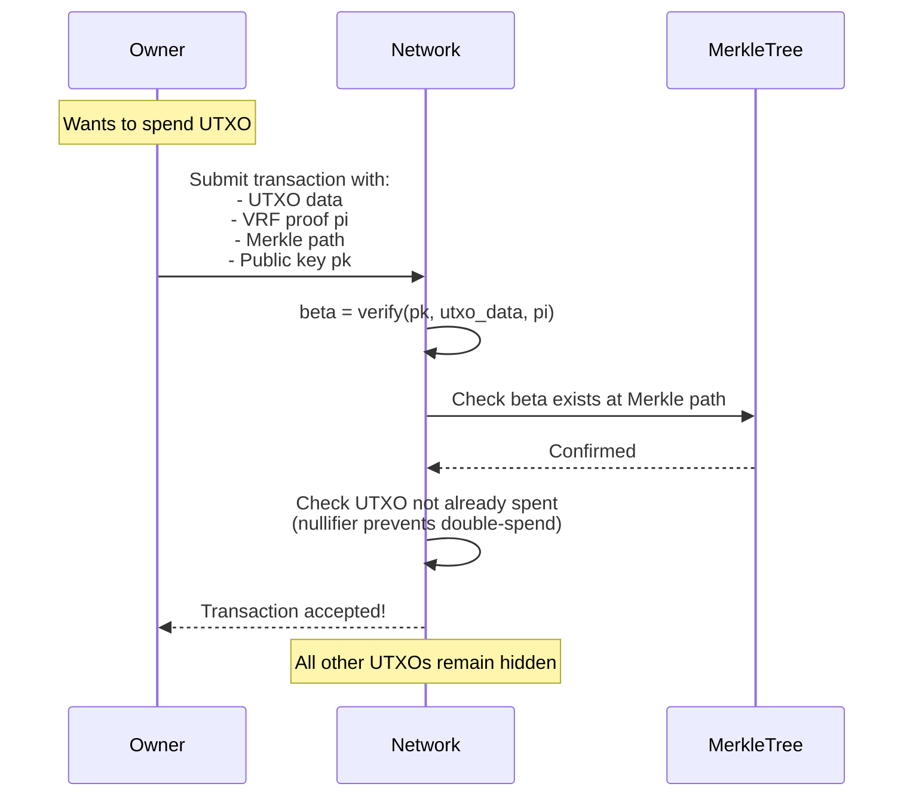
```mermaid
sequenceDiagram
    participant Owner
    participant Network
    participant MerkleTree

    Note over Owner: Wants to spend UTXO #1
    Owner->>Network: Submit transaction with:<br/>- UTXO data<br/>- VRF proof pi<br/>- Merkle path<br/>- Public key pk

    Network->>Network: beta = verify(pk, utxo_data, pi)
    Network->>MerkleTree: Check beta exists at Merkle path
    MerkleTree-->>Network: Confirmed

    Network->>Network: Check UTXO not already spent<br/>(nullifier prevents double-spend)

    Network-->>Owner: Transaction accepted!

    Note over Network: All other UTXOs remain hidden
```

**Why this is powerful**:
- **Hiding**: An observer looking at the Merkle tree sees only random-looking `beta` values. They cannot tell which UTXOs belong to which owner, or even how many UTXOs an owner has.
- **Selective disclosure**: When spending, the owner reveals *only* the specific UTXO being spent, plus proof that it is in the tree. All other UTXOs stay hidden.
- **No trusted setup**: Unlike zk-SNARK-based privacy (Zcash), VRF-based private UTXOs do not require a trusted ceremony. The security reduces directly to the VRF and the hash function.
- **Lightweight verification**: Verifying a VRF proof + Merkle path is computationally cheap enough to do on-chain.

**Comparison with other privacy approaches**:

| Approach | Hides UTXO set? | Trusted setup? | On-chain cost | Linkability |
|----------|-----------------|----------------|---------------|-------------|
| Plain UTXO (Bitcoin/Cardano today) | No | No | Low | Full |
| Stealth addresses | Partial | No | Low | Per tx |
| zk-SNARKs (Zcash) | Yes | Yes | High | Broken per tx |
| Ring signatures (Monero) | Partial | No | Medium | Ring size |
| **VRF-based private UTXO** | **Yes** | **No** | **Medium** | **Per-UTXO** |

**Example: private UTXO storage and spend**

```aiken
// Wallet owner generates their UTXO keys
let secret = "wallet_master_secret"
let (sk, pk) = vrf.keys_from_secret(secret)

// Owner creates three UTXOs (in practice, these contain amount + script)
let utxo_1 = "utxo:100ada:script_v1:nonce_42"
let utxo_2 = "utxo:250ada:script_v1:nonce_43"
let utxo_3 = "utxo:50ada:script_v1:nonce_44"

// Compute private "addresses" (betas) for each UTXO
let pi_1 = vrf.prove(sk, utxo_1, "ECVRF_")
let Some(beta_1) = vrf.proof_to_hash(pi_1)

let pi_2 = vrf.prove(sk, utxo_2, "ECVRF_")
let Some(beta_2) = vrf.proof_to_hash(pi_2)

let pi_3 = vrf.prove(sk, utxo_3, "ECVRF_")
let Some(beta_3) = vrf.proof_to_hash(pi_3)

// On-chain: store (beta_i, encrypted_utxo_i) in a Merkle tree
// Only the owner knows which betas correspond to which UTXOs

// Later: spending utxo_1
// Owner submits: utxo_1, pi_1, Merkle_path_to_beta_1, pk
// Network verifies:
let Some(beta_verified) = vrf.verify(pk, utxo_1, pi_1, "ECVRF_", False)
// Then checks beta_verified is in the Merkle tree and not yet spent
```

**Key design considerations**:
- **Nullifiers**: To prevent double-spending the same UTXO, a *nullifier* (a deterministic unique identifier derived from the UTXO and secret) must be published when spending. This is separate from the VRF proof but essential for soundness.
- **Merkle tree vs. accumulator**: A Merkle tree is simple and efficient for inclusion proofs. An RSA or bilinear accumulator can offer smaller proof sizes but is more complex.
- **Encrypted payloads**: The actual UTXO data (amount, script) can be encrypted with a key derived from the VRF output, ensuring only the owner can read it.

---

**Example: storing multiple private records**

```aiken
// Prover (owner of the secret key):
let secret = "prover_secret_key"
let (sk, pk) = vrf.keys_from_secret(secret)

// Private records to store
let record_1 = "alice_payment_100"
let record_2 = "bob_escrow_250"
let record_3 = "charlie_refund_50"

// Only the prover can compute the "address" for each record
let pi_1 = vrf.prove(sk, record_1, "ECVRF_")
let Some(beta_1) = vrf.proof_to_hash(pi_1)
// beta_1 is a 32-byte pseudorandom "address"

let pi_2 = vrf.prove(sk, record_2, "ECVRF_")
let Some(beta_2) = vrf.proof_to_hash(pi_2)

let pi_3 = vrf.prove(sk, record_3, "ECVRF_")
let Some(beta_3) = vrf.proof_to_hash(pi_3)

// Store (beta_i, encrypted_payload_i) in a public Merkle tree or map.
// Outsiders cannot enumerate which records exist because they
// cannot compute beta_i from the record names.
```

**Example: membership proof**

```aiken
// Later, the prover wants to prove that "alice_payment_100" exists.
// The prover sends the verifier:
//   - the original data: "alice_payment_100"
//   - the VRF proof: pi_1
//   - the public key: pk
//   - a Merkle path showing beta_1 is in the tree (omitted here for brevity)

// Verifier checks:
let Some(beta_verified) = vrf.verify(pk, "alice_payment_100", pi_1, "ECVRF_", False)
// beta_verified == beta_1
// Verifier then checks that beta_verified is present in the public structure.
// If both checks pass, the record is proven to exist without ever
// revealing the other records (record_2, record_3) or their positions.
```

**Security properties**:
- **Confidentiality**: Without `sk`, `beta` is indistinguishable from random. An attacker cannot enumerate or link entries.
- **Verifiability**: Anyone with `pk` can verify that a `(data, beta, proof)` triple is valid.
- **Uniqueness**: For a given `pk` and `data`, there is exactly one valid `beta`. This prevents collisions and ensures deterministic addressing.
- **Integrity**: Because the proof binds `data` to `beta`, a malicious prover cannot forge a fake membership proof for arbitrary data.

See [validators/placeholder.ak](./validators/placeholder.ak) for a working test: `test_privacy_protected_data`

## Leader Selection

**The problem**: In Proof-of-Stake blockchains and distributed consensus protocols, a random leader (or set of leaders) must be selected for each round or slot. The selection mechanism must satisfy several critical properties:

- **Unpredictability**: Nobody should be able to predict the next leader in advance
- **Individual secrecy**: Only the selected stakeholder should know they won *before* broadcasting, preventing targeted DDoS or bribery attacks
- **Public verifiability**: Anyone must be able to verify the selection was fair and correct
- **Proportional fairness**: Selection probability should be proportional to each participant's stake or weight

Naive approaches fail:
- Public hash of `hash(stakeholder_id || epoch)` reveals the leader immediately, enabling attacks
- Commit-reveal schemes are interactive, complex, and can be aborted by malicious participants

**The VRF solution**:
1. Each stakeholder registers a public VRF key with the protocol
2. For each epoch/slot, all stakeholders use the *same* public epoch identifier as input
3. Each stakeholder *privately* computes: `beta = vrf.proof_to_hash(vrf.prove(sk, epoch))`
4. If `beta < threshold(stake)`, that stakeholder is selected as leader for that slot
5. Only after producing a block does the stakeholder reveal their proof `(epoch, pi)`
6. The network verifies both the VRF proof validity and the threshold check

**How it works**:

| Step | Stakeholder (knows secret `sk`) | Network / Verifiers |
|------|--------------------------------|---------------------|
| 1 | Compute `beta = proof_to_hash(prove(sk, epoch))` | — |
| 2 | Check if `beta < threshold` (proportional to stake) | — |
| 3 | If selected, privately prepare the next block | — |
| 4 | Broadcast the block together with `(epoch, pi, pk)` | — |
| 5 | — | Verify `vrf.verify(pk, epoch, pi)` returns valid `beta` |
| 6 | — | Confirm `beta < threshold` to confirm leadership |

**Leader selection flows:**

*Figure 11 — The DDoS problem: public-hash leader selection reveals the winner early*

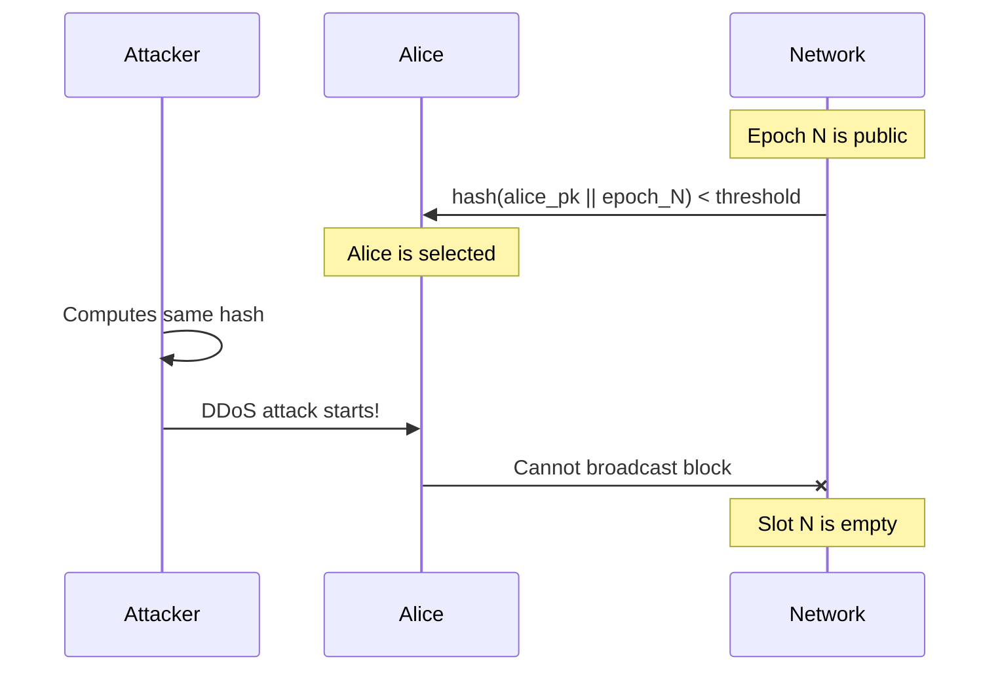
```mermaid
sequenceDiagram
    participant Attacker
    participant Alice
    participant Network

    Note over Network: Epoch N is public
    Network->>Alice: hash(alice_pk || epoch_N) < threshold
    Note over Alice: Alice is selected

    Attacker->>Attacker: Computes same hash
    Attacker->>Alice: DDoS attack starts!

    Alice-xNetwork: Cannot broadcast block
    Note over Network: Slot N is empty
```

*Figure 12 — VRF leader selection: each stakeholder checks privately, only the winner reveals*

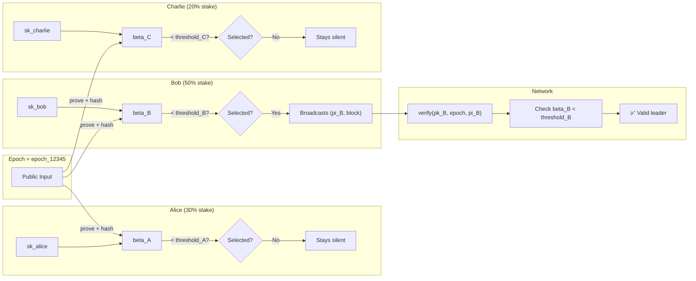
```mermaid
flowchart LR
    subgraph Epoch["Epoch = epoch_12345"]
        E["Public Input"]
    end

    subgraph Alice["Alice (30% stake)"]
        SK_A["sk_alice"]
        E -->|"prove + hash"| B_A["beta_A"]
        SK_A --> B_A
        B_A -->|"< threshold_A?"| R_A{"Selected?"}
        R_A -->|No| Hidden_A["Stays silent"]
    end

    subgraph Bob["Bob (50% stake)"]
        SK_B["sk_bob"]
        E -->|"prove + hash"| B_B["beta_B"]
        SK_B --> B_B
        B_B -->|"< threshold_B?"| R_B{"Selected?"}
        R_B -->|Yes| Reveal_B["Broadcasts (pi_B, block)"]
    end

    subgraph Charlie["Charlie (20% stake)"]
        SK_C["sk_charlie"]
        E -->|"prove + hash"| B_C["beta_C"]
        SK_C --> B_C
        B_C -->|"< threshold_C?"| R_C{"Selected?"}
        R_C -->|No| Hidden_C["Stays silent"]
    end

    subgraph Network["Network"]
        V["verify(pk_B, epoch, pi_B)"]
        T["Check beta_B < threshold_B"]
        Reveal_B --> V --> T --> OK["✅ Valid leader"]
    end
```

*Figure 13 — Timeline: secret leadership across multiple slots*

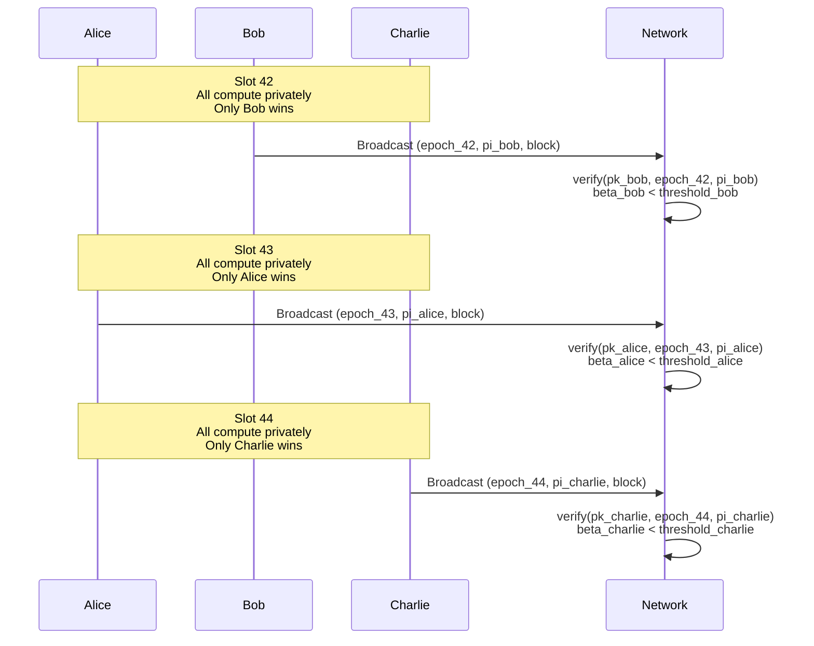
```mermaid
sequenceDiagram
    participant Alice
    participant Bob
    participant Charlie
    participant Network

    Note over Alice,Charlie: Slot 42<br/>All compute privately<br/>Only Bob wins
    Bob->>Network: Broadcast (epoch_42, pi_bob, block)
    Network->>Network: verify(pk_bob, epoch_42, pi_bob)<br/>beta_bob < threshold_bob

    Note over Alice,Charlie: Slot 43<br/>All compute privately<br/>Only Alice wins
    Alice->>Network: Broadcast (epoch_43, pi_alice, block)
    Network->>Network: verify(pk_alice, epoch_43, pi_alice)<br/>beta_alice < threshold_alice

    Note over Alice,Charlie: Slot 44<br/>All compute privately<br/>Only Charlie wins
    Charlie->>Network: Broadcast (epoch_44, pi_charlie, block)
    Network->>Network: verify(pk_charlie, epoch_44, pi_charlie)<br/>beta_charlie < threshold_charlie
```

**Why it works**:
- **Unpredictability**: The VRF output is pseudorandom. Before the epoch number is fixed, `beta` is indistinguishable from random for all stakeholders.
- **Individual secrecy**: Each stakeholder privately computes their own `beta`. No one else can learn whether Alice, Bob, or Charlie was selected until they voluntarily broadcast their proof.
- **Public verifiability**: Once revealed, anyone can run `vrf.verify(pk, epoch, pi)` to confirm the leader legitimately won the slot.
- **Unbiasability**: The epoch input binds the randomness to a specific round. Changing the epoch changes all outputs, preventing grinding attacks.
- **Proportional fairness**: By calibrating thresholds to stake share, a stakeholder with 30% of total stake has roughly a 30% chance of being selected in any given slot.

**Comparison with other approaches**:

| Approach | Predictable? | Secret? | Verifiable? | Interactive? |
|----------|--------------|---------|-------------|--------------|
| Public hash | Yes (everyone knows) | No | Yes | No |
| Commit-reveal | No | Yes | Yes | Yes (2 rounds) |
| **VRF** | No | Yes | Yes | **No** |

**Use cases**:
- **Blockchain consensus** (e.g., Ouroboros Praos in Cardano, Algorand): Slot leaders propose blocks without revealing identity ahead of time
- **Distributed systems leader election**: Randomly pick a coordinator for consensus rounds
- **Proof-of-Stake validation**: Weighted random sampling of validators for committee selection

**Example: multi-stakeholder election**

Consider three stakeholders with different stake weights competing for the same slot:

```aiken
// Shared public input for this consensus slot
let epoch = "epoch_12345_slot_42"

// Alice (30% stake, threshold = max_beta * 0.30)
let (sk_alice, pk_alice) = vrf.keys_from_secret("alice_stake_secret")
let pi_alice = vrf.prove(sk_alice, epoch, "ECVRF_")
let Some(beta_alice) = vrf.proof_to_hash(pi_alice)
let threshold_alice = 3000  // 30% of range

// Bob (50% stake, threshold = max_beta * 0.50)
let (sk_bob, pk_bob) = vrf.keys_from_secret("bob_stake_secret")
let pi_bob = vrf.prove(sk_bob, epoch, "ECVRF_")
let Some(beta_bob) = vrf.proof_to_hash(pi_bob)
let threshold_bob = 5000  // 50% of range

// Charlie (20% stake, threshold = max_beta * 0.20)
let (sk_charlie, pk_charlie) = vrf.keys_from_secret("charlie_stake_secret")
let pi_charlie = vrf.prove(sk_charlie, epoch, "ECVRF_")
let Some(beta_charlie) = vrf.proof_to_hash(pi_charlie)
let threshold_charlie = 2000  // 20% of range

// Each stakeholder privately checks their own result
let is_alice_leader = bytearray_to_integer(True, beta_alice) < threshold_alice
let is_bob_leader = bytearray_to_integer(True, beta_bob) < threshold_bob
let is_charlie_leader = bytearray_to_integer(True, beta_charlie) < threshold_charlie
```

**Example: verifying a claimed leader**

```aiken
// The network receives Bob's claim that he is the slot leader.
// Bob broadcasts: (pk_bob, epoch, pi_bob)

// Any validator on the network can verify:
let Some(beta_verified) = vrf.verify(pk_bob, epoch, pi_bob, "ECVRF_", False)

// Confirm the threshold check
let is_valid_leader = bytearray_to_integer(True, beta_verified) < threshold_bob

// If is_valid_leader is True, Bob legitimately won the slot.
// If False, Bob's claim is rejected.
```

**Security properties**:
- **Unpredictability**: Nobody can predict who wins a future slot because the VRF output is pseudorandom until the epoch is known.
- **Individual secrecy**: Only Bob knows he is the leader until he broadcasts. This protects against pre-slot DDoS and bribery.
- **Public verifiability**: Once Bob reveals `pi_bob`, anyone can verify his leadership claim cryptographically.
- **Unbiasability**: The epoch binds all outputs to a specific slot. An attacker cannot grind on inputs to manipulate selection.
- **Proportional fairness**: Thresholds are set in proportion to stake, ensuring no minority stakeholder can dominate.

See [validators/placeholder.ak](./validators/placeholder.ak) for a working test: `test_leader_selection`

## Design choice: G2 versus G1 for VRF on BLS12-381

This implementation uses **G2** (the larger subgroup of BLS12-381) for all VRF group operations: public keys live in G2, `encode_to_curve` maps inputs to G2 points, and the proof embeds a G2 point (`Gamma`). We could equally have built the same scheme over **G1** (the smaller, faster subgroup). Below is the analysis of the trade-offs and the rationale for the current choice.

### What G2 gives us in this code

| Component | Current (G2) | Hypothetical (G1) |
|-----------|-------------|-------------------|
| Compressed public key size | 96 bytes | 48 bytes |
| `Gamma` point in proof | 96 bytes | 48 bytes |
| Total proof size | 144 bytes (`96 + 16 + 32`) | 96 bytes (`48 + 16 + 32`) |
| `hash_to_group` target | G2 | G1 |
| Scalar field | Same 32-byte scalar for both | Same 32-byte scalar for both |

The 48-byte difference in proof size is not merely a constant overhead: every transaction, every on-chain datum, and every network message that carries a VRF proof pays for those extra bytes. In a blockchain context, proof size translates directly to fees and block-space consumption.

### Trade-off matrix

| Criterion | G2 | G1 | Winner |
|-----------|----|----|--------|
| **Proof size** | 144 bytes | 96 bytes | G1 (-33%) |
| **Public key size** | 96 bytes | 48 bytes | G1 (-50%) |
| **Point multiplication cost** | Slower (~2–3×) | Faster | G1 |
| **Hash-to-curve cost** | Slower | Faster | G1 |
| **BLS signature compatibility** | Natural fit for BLS12-381 PK-in-G2, sig-in-G1 | Inverted (PK-in-G1, sig-in-G2) | G2 |
| **Embedding degree / security margin** | G2 sits in extension field 𝔽_p²; larger ambient space | G1 sits in base field 𝔽_p | Tie (both secure at 128-bit) |
| **Implementation availability in Aiken** | `bls12_381/g2` primitives present | `bls12_381/g1` primitives present | Tie |

### Why G2 was chosen for this implementation

1. **Compatibility with BLS signature key infrastructure**
   Cardano sidechains and many BLS12-381 deployments place *public keys in G2* and *signatures in G1*. By deriving VRF keys from the same G2 public-key format, a single secret can serve both BLS signing and VRF proving without converting between groups. The `ilap/bls` library used for key generation already produces G2 public keys; reusing that path avoids extra encoding logic and keeps the secret-scalar derivation identical.

2. **Alignment with ECVRF over BLS12-381 conventions**
   While RFC 9381 does not mandate BLS12-381, the broader ecosystem (drand, threshold BLS gadgets, etc.) has converged on G2 as the "public-key group" for this curve. Choosing G2 makes cross-protocol verification easier: the same `pk` bytes can be fed into a BLS aggregate verifier and into this VRF verifier without reinterpretation.

3. **No pairing operations in ECVRF**
   The ECVRF proving and verifying equations (Schnorr-style challenge, `U = s*G - c*Y`, etc.) do **not** use pairings. Therefore the pairing-friendly property of BLS12-381 is irrelevant here; we are simply using the curve as a plain elliptic-curve group. The choice of G2 is not driven by pairing efficiency but by the above compatibility reasons.

### When G1 would be preferable

- **On-chain cost is paramount**: If every byte of proof matters (e.g., Layer-1 scripts with tight execution-unit budgets), a G1-based VRF saves ~48 bytes per proof and reduces point-scaling CPU cost by a factor of 2–3. For high-frequency use (lottery draws every block, gaming rolls), these savings compound.
- **Network bandwidth is constrained**: Light clients or P2P gossip protocols that must relay many proofs benefit from the smaller size.
- **No BLS interoperability needed**: If the VRF keys are standalone and never mixed with BLS signing keys, the compatibility argument for G2 disappears.

### Could we switch?

Yes. The VRF scheme is *group-agnostic*: replace `g2` imports with `g1`, change `ptLen` from 96 to 48, and the same `prove` / `verify` / `proof_to_hash` logic holds unchanged. The scalar arithmetic, nonce generation, and challenge hashing are identical. A G1 variant would be a drop-in mechanical refactor, not a cryptographic redesign.

### Recommendation

- **Use the current G2 variant** when your VRF public keys must interoperate with BLS12-381 public keys from existing libraries (e.g., `ilap/bls`, Cardano sidechains, drand nodes).
- **Consider a G1 variant** if you need maximal on-chain efficiency and can afford a separate key derivation path, or if you are building a new protocol with no legacy BLS key baggage.

---

## Notes on lib/core.ak implementation

VRF is standarized in [standard](https://www.rfc-editor.org/rfc/rfc9381.html#name-vrf-algorithms).

What is important we have standarized for [RSA](https://www.rfc-editor.org/rfc/rfc9381.html#name-rsa-full-domain-hash-vrf-rs) and [elliptic curves](https://www.rfc-editor.org/rfc/rfc9381.html#name-elliptic-curve-vrf-ecvrf).
In elliptic curves BLS12-381 is not present. Here we show that **we CAN implement VRF using aiken bls12-381 primitives** and how it could be implemented.

### Point compression

All G2 points in this implementation are stored and transmitted in **compressed form** (96 bytes per point). This includes:

- **Public keys**: `pk = compress(scale(generator, sk))`
- **Proofs**: `pi_string = compress(Gamma) || c || s` → 144 bytes total (`96 + 16 + 32`)
- **Challenge hashing**: all five G2 points (Y, H, Gamma, U, V) are compressed before being fed into SHA2-256

Decompression (`bls12_381_g2_uncompress`) happens only at verification time when the proof is decoded and the public key is loaded. This keeps wire format and on-chain datums compact at the cost of a small computational overhead at the verifier. No uncompressed points are ever serialized.

## Building and testing

```sh
aiken check
```

## Resources on Aiken

Find more on the [Aiken's user manual](https://aiken-lang.org).

