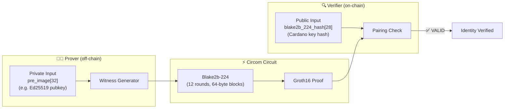

# Blake2b-224 Hash Pre-image (Cardano Key Hash)

> **In one sentence:** Prove you know the public key behind a Cardano address — without revealing the public key itself.
>
> **Business angle:** Cardano addresses are derived from Ed25519 public keys via Blake2b-224 hashing. This circuit lets a user prove "I control the key that hashes to this address" without exposing the key, enabling anonymous identity verification, privacy-preserving KYC, and cross-chain address ownership proofs. A dApp could verify a user's Cardano identity inside a zk-SNARK without ever seeing their wallet public key.

Prove knowledge of a 32-byte pre-image whose Blake2b-224 hash equals a publicly known Cardano key hash — without revealing the pre-image.

---

## System overview



**What happens:**
1. **Prover** knows a 32-byte pre-image (e.g., an Ed25519 public key) and wants to prove it hashes to a known Cardano address key hash.
2. **Witness generator** runs the Blake2b-224 compression function across the 12 internal rounds and produces the 28-byte digest.
3. **Circuit** (79K constraints) constrains every bitwise XOR, rotation, and mixing step, producing a zk-SNARK proof that `Blake2b-224(pre_image) == hash`.
4. **Verifier** (Aiken smart contract) receives the proof and the public 28-byte key hash, confirms validity via pairing check — the prover's public key remains completely secret.


> **Status:** Circuit validated (compiles, witness generates, hash output verified against Python reference). End-to-end proving **not yet executed** due to memory constraints (see [Scaling Notes](#scaling-notes)).

---

## What it proves

```
Public:  blake2b_224_hash[28]  — the 28-byte Cardano key hash
Secret:  pre_image[32]         — the 32-byte pre-image (e.g. an Ed25519 public key)

Constraint: Blake2b-224(pre_image) == blake2b_224_hash
```

Cardano uses Blake2b-224 for address and key hashing, so an in-circuit gadget is essential for any zk-proof that needs to reason about Cardano keys or addresses without revealing them.

---

## Circuit structure

| File | Purpose | Source |
|------|---------|--------|
| `blake2b_common.circom` | Helper templates: `ToBits`, `XorWord3`, `Sigma`, `Bits65/66`, etc. | [bkomuves/hash-circuits](https://github.com/bkomuves/hash-circuits) (MIT License) |
| `blake2b.circom` | Blake2b-512 primitives: `CompressionF`, `MixFunG`, `SingleRound`, `IV` | [bkomuves/hash-circuits](https://github.com/bkomuves/hash-circuits) (MIT License) |
| `blake2b224.circom` | **New** — `Blake2b224_bytes` template with `nn = 28` (Blake2b-224 output length) | Derived from `blake2b.circom` |
| `blake2b224_preimage.circom` | **Top-level circuit** — wires public hash input to the hasher and enforces equality | This project |

### Key change from upstream

The upstream `hash-circuits` repo only provides `Blake2b_bytes` with `nn = 32` (Blake2b-256). We created a new `Blake2b224_bytes` template that sets:
- `nn = 28` (output length in bytes)
- `nw = (nn + 7) \ 8 = 4` (output qwords)
- `p0 = 0x01010000 ^ (kk << 8) ^ nn` (parameter block, using `nn = 28`)

Everything else (the `CompressionF` function, the 12 rounds, the IV, the sigma permutation) is unchanged.

---

## Compilation results

```bash
cd groth16-prover/circom/Blake2b224Preimage
circom blake2b224_preimage.circom --r1cs --wasm --sym --prime bls12381
```

| Metric | Value |
|--------|-------|
| **Non-linear constraints** | 77,312 |
| **Linear constraints** | 2,059 |
| **Total constraints** | ~79,371 |
| **Public inputs** | 28 (`blake2b_224_hash` bytes) |
| **Private inputs** | 32 (`pre_image` bytes) |
| **Wires** | 78,605 |
| **Labels** | 217,394 |
| **Template instances** | 56 |

The circuit compiles successfully and the WebAssembly witness generator is produced.

---

## Witness generation

```bash
snarkjs wtns calculate blake2b224_preimage_js/blake2b224_preimage.wasm input.json witness.wtns
```

The witness was generated successfully. The output hash bytes were cross-checked against Python's `hashlib.blake2b(pre_image, digest_size=28)` and match exactly:

```
pre_image  = [0, 1, 2, ..., 31]   (32 bytes)
hash       = [73, 17, 18, 221, 1, 21, 92, 7, 218, 180, 133, 247,
              27, 87, 46, 12, 174, 117, 158, 44, 211, 139, 28, 14,
              151, 85, 66, 151]    (28 bytes)
hash hex   = 491112dd01155c07dab485f71b572e0cae759e2cd38b1c0e97554297
```

---

## End-to-end pipeline (not yet executed)

The standard 6-step pipeline is blocked at Step 3 (ceremony) due to memory constraints:

1. ✅ **Compile** — `circom blake2b224_preimage.circom --r1cs --wasm --prime bls12381`
2. ✅ **Generate witness** — `snarkjs wtns calculate ... input.json witness.wtns`
3. ⏳ **Dev ceremony** — `groth16-prover ceremony-dev --circuit ... --proving-key ... --verifying-key ...`
4. ⏳ **Generate proof** — `groth16-prover prove --circuit ... --witness ... --proving-key ...`
5. ⏳ **Export VK** — `groth16-prover export-vk --verifying-key ... --out ...`
6. ⏳ **Verify in Aiken** — paste VK + proof into `aiken/groth16` test

Steps 3–6 require a machine with substantially more RAM than the one used for development (see [Scaling Notes](#scaling-notes)).

---

## Scaling Notes

### Why the ceremony fails on 32 GB RAM

The `circom_adapter` module expands the sparse Circom R1CS matrices into **dense** `Vec<Vec<Fr>>` representations:

```rust
let mut l = vec![vec![Fr::zero(); n_wires]; n_constraints];
```

For this circuit:
- Dense matrix entries: 79,312 constraints × 78,605 wires ≈ **6.2 billion entries**
- Each `Fr` (BLS12-381 scalar) = 32 bytes
- Total RAM needed: **~200 GB**

The ceremony also constructs an FFT-based QAP over a domain of size 131,072 (2¹⁷), which allocates additional large vectors. The process is OOM-killed during matrix expansion before any actual proving begins.

### Four approaches to make this feasible

> **Why SNARKs prefer Poseidon over Blake2b.** This exercise illustrates a fundamental design tension in zk-SNARKs: arithmetization-friendly hash functions (Poseidon, MiMC) are preferred over traditional ones (Blake2b, SHA-256) because their R1CS constraint count is orders of magnitude smaller. Poseidon on BLS12-381 costs ~250 constraints per permutation (~8 constraints per byte), while Blake2b costs ~77,000 constraints for a single 32-byte block — a **300× difference**. The on-chain verifier cost is constant regardless of circuit size, but the prover's memory and time grow with the number of constraints. This is why every production zk-SNARK system that needs hashing inside the circuit uses Poseidon or a similarly SNARK-friendly construction.

| Approach | Description | Complexity | Hardness |
|----------|-------------|------------|----------|
| **1. Sparse matrices** | Keep `l`, `r`, `o` in sparse CSR/CSC format. Rewrite `circom_adapter` + `QapEngine` to use sparse matrix-vector products for column extraction and QAP construction. | High — touches `circom_adapter.rs`, `engine.rs`, `ceremony.rs`, `prover.rs` | Hard — significant refactor of the core QAP engine |
| **2. Memory-mapped dense matrices** | Store the dense matrices on disk (via `mmap`) and page chunks into RAM on demand. The FFT QAP construction is mostly sequential over columns, so this is I/O-bound but feasible with fast NVMe. | Medium — add a `MmappedMatrix` wrapper and adjust `QapEngine` to read columns from mmap | Significant — requires new matrix abstraction and I/O-aware engine |
| **3. Accept the hardware limit** | Document that circuits > ~5K constraints need a machine with RAM ≈ `constraints × wires × 32 bytes`. Run the ceremony on a machine with 256+ GB RAM (or add swap). | None — just documentation | Low hanging — no code changes |
| **4. Decomposition / streaming (research)** | Split the dense matrix into row or column chunks, compute QAP polynomials for each chunk independently, then merge the results. For example: process 10K-constraint blocks sequentially, accumulate the QAP coefficient vectors incrementally. The public-input commitment (`ic` / `l_query`) and the quotient polynomial `h(x)` can be built incrementally if the SRS is pre-generated. | High — requires redesigning the ceremony to avoid holding the full dense matrix in memory at once; may need a custom MSM accumulator | Hard — research-grade; no off-the-shelf recipe |

### For comparison: other circuits in this repo

| Circuit | Constraints | Wires | Dense matrix RAM | Status |
|---------|-------------|-------|-----------------|--------|
| SimpleExample Multiplier | 3 | 8 | ~768 B | ✅ Working e2e |
| Privacy / Spend(depth=2) | 1,107 | 1,110 | ~39 MB | ✅ Working e2e |
| **Blake2b-224 Pre-image** | **79,312** | **78,605** | **~200 GB** | ⏳ Circuit only |
| Poseidon Pre-image | ~300 | ~400 | ~5 MB | ✅ Working e2e |

---

## Use case

**Proving ownership of a Cardano address without revealing the public key.**

Cardano addresses are derived from Ed25519 public keys via Blake2b-224 hashing. A user can prove:
- "I know the public key that hashes to this address"
- Without revealing the public key itself

This enables:
- Anonymous identity verification tied to on-chain addresses
- Cross-chain identity linking (prove you control a Cardano address from another chain)
- Privacy-preserving KYC (prove address ownership without doxing the pubkey)

---

## Files

```
Blake2b224Preimage/
├── blake2b_common.circom     # From bkomuves/hash-circuits (MIT)
├── blake2b.circom            # From bkomuves/hash-circuits (MIT)
├── blake2b224.circom         # Blake2b-224 variant (nn = 28)
├── blake2b224_preimage.circom # Top-level circuit
├── input.json                # Test vector: pre_image = [0..31], hash = [73, 17, ...]
├── witness.wtns              # Generated witness (valid, cross-checked)
├── blake2b224_preimage.r1cs  # Compiled R1CS
└── README.md                 # This file
```

---

## References

- [bkomuves/hash-circuits](https://github.com/bkomuves/hash-circuits) — Blake2b Circom circuits (MIT License)
- [RFC 7693](https://tools.ietf.org/html/rfc7693) — The BLAKE2 Cryptographic Hash and Message Authentication Code (MAC)
- [Cardano crypto specs](https://github.com/IntersectMBO/cardano-crypto) — Key derivation and Blake2b-224 usage in Cardano wallets
- [`groth16-prover/circom/README.md`](../../circom/README.md) — Parent directory with full pipeline documentation
