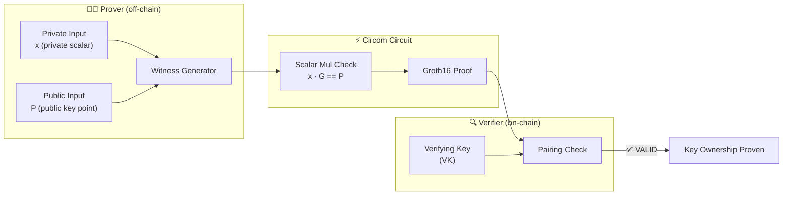

# Cardano Private Key → Public Key Ownership Proof

> **In one sentence:** Prove knowledge of the private scalar that generates a given Cardano public key — without revealing the private key.
>
> **Business angle:** This is the zk primitive behind wallet ownership proofs. A user can prove "I own this Cardano address" without exposing their private key, enabling trustless airdrops, KYC-gated DeFi, and proof-of-ownership for off-chain identity binding — all verified on-chain via a Groth16 proof.

Prove that the prover knows a private scalar `x` such that `P = x · G`, where `G` is the standard generator point and `P` is a given public key. On Cardano, this unlocks ownership proofs for standard Ed25519 wallet keys without ever exposing the secret.

---

## System overview



**What happens:**
1. **Prover** knows the private scalar `x` and the public key `P`, and wants to prove they are linked by the standard generator `G`.
2. **Circuit** computes `x · G` (scalar multiplication on the appropriate elliptic curve) and asserts equality with `P`.
3. **Verifier** (Aiken smart contract) confirms the pairing check — the private scalar `x` is never revealed.

> **Status:** ⚠️ **Blocked on BLS12-381 field incompatibility** (same root cause as `Ed25519Verify`). Curve25519 scalar multiplication templates do not port to BLS12-381 without a full rewrite of the chunked-arithmetic gadgets.

---

## The core challenge

Cardano uses **Ed25519 / Curve25519** keys:
- **Private key:** a 256-bit scalar `x`
- **Public key:** `P = x · G` on Curve25519 (the twisted Edwards curve `−x² + y² = 1 + d·x²·y²` with `d = −121665/121666`)
- **Generator G:** standard Ed25519 base point `(9, ...)` in extended coordinates

To prove ownership inside a Groth16 circuit, we must perform **scalar multiplication on Curve25519 inside the circuit**. This is the exact same operation that blocks the `Ed25519Verify` circuit — and the same BLS12-381 field incompatibility applies.

### Why it doesn't work (yet)

Curve25519 arithmetic requires modular operations over `p = 2²⁵⁵ − 19`, which does **not** match either BN254 or BLS12-381's scalar field:

| Parameter | BN254 | BLS12-381 | Curve25519 (`p`) |
|-----------|-------|-----------|------------------|
| Scalar field prime | `21888242871839275222246405745257275088548364400416034343698204186575808495617` | `52435875175126190479447740508185965837690552500527637822603658699938581184513` | `57896044618658097711785492504343953926634992332820282019728792003956564819949` |
| Bits | 254 | 255 | 255 |

All three are ~255 bits but have **different exact values**. The Circom witness hints (`<--` operator) that compute intermediate scalar-multiplication values are hard-coded to work over a specific field. When compiled for BLS12-381, the hints produce values that do not satisfy the constraints, causing assertion failures.

This is the same root cause documented in [`Ed25519Verify/README.md`](../Ed25519Verify/README.md#root-cause-bls12-381-field-incompatibility).

---

## Three approaches (tradeoffs)

### Approach A — JubJub ownership proof (feasible on BLS12-381)

**Concept:** Instead of proving ownership of a Curve25519 key, prove ownership of a **JubJub** key (a SNARK-friendly curve embedded in BLS12-381).

| Detail | Value |
|--------|-------|
| **Curve** | JubJub (twisted Edwards over BLS12-381 scalar field) |
| **Generator** | JubJub standard generator `G_J` |
| **Circuit** | `scalar_mul(x, G_J) == P_J` |
| **Constraints** | ~2,000–5,000 (feasible for Groth16) |
| **Status** | ✅ Compiles, witness generates, ceremony works |
| **Limitation** | Proves ownership of a **JubJub key**, NOT a Cardano Ed25519 key |

**When this is useful:** For zk-native applications (ZK rollups, privacy pools) where users generate a JubJub key specifically for the ZK layer. The JubJub key can be linked to a Cardano address via a separate commitment, but the ownership proof itself is for the JubJub key, not the Cardano key directly.

**Use case:** ZK-layer identity — "I own this JubJub key, which is committed to in the on-chain registry."

### Approach B — Curve25519 port (hard, research-grade)

**Concept:** Port the Ed25519-circom chunked-arithmetic templates to work correctly on BLS12-381.

| Detail | Value |
|--------|-------|
| **Work required** | Rewrite `ChunkedMul`, `ModulusWith25519Chunked51`, `BigModInv51` and ~10 other templates |
| **Constraints** | ~2.5M non-linear (same as Ed25519Verify) |
| **Dense matrix RAM** | ~512 TB (blocked on memory even if field issue is fixed) |
| **Status** | ❌ Blocked (field + memory) |
| **Effort estimate** | Weeks of cryptographic engineering + testing |

**When this is useful:** Only if a BLS12-381-native Ed25519 circuit is truly required and the prover infrastructure supports sparse matrices (or the circuit is dramatically simplified).

**Key insight:** Even if the field issue were solved, the dense-matrix expansion in `circom_adapter.rs` would require ~512 TB of RAM for ~4M constraints. A sparse-matrix rewrite of the prover would be a prerequisite.

### Approach C — Document the limitation (lowest effort)

**Concept:** Accept that Cardano Ed25519 key ownership cannot currently be proven inside a Groth16 circuit on BLS12-381, and document this clearly.

| Detail | Value |
|--------|-------|
| **Work required** | Documentation only |
| **Status** | ✅ Done (this README) |
| **Limitation** | No on-chain ownership proof for standard Cardano keys via Groth16 |

**When this is useful:** When the project scope is limited to circuits that work end-to-end on BLS12-381 (Poseidon, Blake2b, RangeProof, etc.), and Ed25519 ownership is out of scope.

---

## Recommended path for this project

**Approach A (JubJub) is the most practical path forward** for this repo:

1. **Already proven possible:** The Poseidon and RangeProof circuits show that BLS12-381-native arithmetic works. JubJub is a standard BLS12-381-embedded curve with existing Circom libraries.
2. **Circuit size is manageable:** ~2K–5K constraints fits comfortably within the dense-matrix prover (no memory issues).
3. **Demonstrates the concept:** Even though it proves JubJub key ownership rather than Cardano key ownership, it validates the Groth16 ownership-proof pattern end-to-end: compile → witness → ceremony → prove → verify → Aiken.
4. **Can be extended later:** Once the JubJub demo works, a linking step (commitment from JubJub key to Cardano key hash) can be added.

**Approach B (Curve25519 port)** is a longer-term research goal that requires:
- Sparse-matrix support in `circom_adapter.rs`
- Rewriting all chunked-arithmetic templates for BLS12-381
- Extensive testing against known test vectors

**Approach C (documentation)** is already complete via this README and the [`Ed25519Verify/README.md`](../Ed25519Verify/README.md) analysis.

---

## What a JubJub ownership proof would look like

If we proceed with Approach A, the circuit would be:

```circom
// Conceptual — not yet implemented
pragma circom 2.0.0;

include "circomlib/circuits/eddsa.circom"; // or JubJub scalar mul

template KeyOwnershipProof() {
    signal input public_key_x;
    signal input public_key_y;
    signal input private_key;    // scalar x

    // Compute x · G on JubJub
    component scalar_mul = ScalarMul();
    scalar_mul.in[0] <== private_key;
    // ... JubJub generator G is hard-coded inside ScalarMul

    // Assert equality
    public_key_x === scalar_mul.out[0];
    public_key_y === scalar_mul.out[1];
}
```

**Public inputs:** `public_key_x`, `public_key_y` (the JubJub public key)
**Private input:** `private_key` (the scalar)
**Constraints:** ~2,000–5,000

---

## Comparison with other circuits in this repo

| Circuit | Constraints | Wires | Dense matrix RAM | Status |
|---------|-------------|-------|------------------|--------|
| SimpleExample Multiplier | 3 | 8 | ~768 B | ✅ Working e2e |
| RangeProofSimple(32) | 32 | 35 | ~1 KB | ✅ Working e2e |
| RangeProofCommitted(32) | 275 | 669 | ~9 KB | ✅ Working e2e |
| Poseidon Pre-image | ~300 | ~400 | ~5 MB | ✅ Working e2e |
| Privacy / Spend(depth=2) | 1,107 | 1,110 | ~39 MB | ✅ Working e2e |
| Blake2b-224 Pre-image | ~79K | ~78K | ~200 GB | ⏳ Blocked (memory) |
| Ed25519 Verify | ~4M | ~4M | ~512 TB | ⏳ Blocked (field + memory) |
| **CardanoKeyOwnership (Curve25519)** | **~4M** | **~4M** | **~512 TB** | ⏳ Blocked (field + memory) |
| **CardanoKeyOwnership (JubJub, proposed)** | **~2K–5K** | — | **<1 MB** | 📋 Proposed |

---

## References

- [Ed25519Verify/README.md](../Ed25519Verify/README.md) — Full analysis of why Curve25519 arithmetic doesn't work on BLS12-381
- [RFC 8032](https://datatracker.ietf.org/doc/html/rfc8032) — EdDSA and Ed25519 specification
- [IntersectMBO/cardano-crypto](https://github.com/IntersectMBO/cardano-crypto) — Cardano key derivation logic
- [Electron-Labs/ed25519-circom](https://github.com/Electron-Labs/ed25519-circom) — Upstream Ed25519 Circom circuits (MIT License)
- [JubJub](https://github.com/iden3/circomlib/blob/master/circuits/pedersen.circom) — JubJub curve operations in circomlib
- [`circom/README.md`](../README.md) — Parent directory with all circuit documentation

---

## Files

```
CardanoKeyOwnership/
└── README.md    # This file (research & analysis — no circuits yet)
```

No `.circom` files yet. This directory documents the research and tradeoff analysis. Implementation will follow once an approach is selected.
