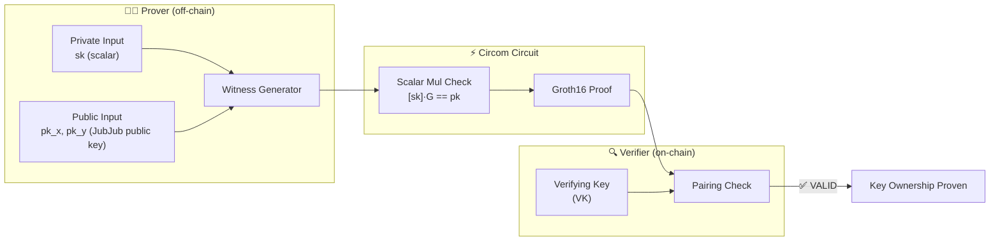

# Cardano Private Key → Public Key Ownership Proof

> **In one sentence:** Prove knowledge of the private scalar that generates a given public key — without revealing the private key.
>
> **Business angle:** This is the zk primitive behind wallet ownership proofs. A user can prove "I own this key" without exposing their private key, enabling trustless airdrops, KYC-gated DeFi, and proof-of-ownership for off-chain identity binding — all verified on-chain via a Groth16 proof.
>
> **Important caveat:** This circuit proves ownership of a **JubJub** key (a SNARK-friendly curve embedded in BLS12-381), NOT a standard Cardano **Ed25519** key. Curve25519 arithmetic is incompatible with BLS12-381's scalar field. The JubJub key can be linked to a Cardano identity via an off-chain commitment, but the ownership proof itself is for the JubJub key.

Prove that the prover knows a private scalar `sk` such that `pk = [sk] · G_JubJub`, where `G_JubJub` is the standard JubJub base point and `pk` is the corresponding public key.

**Status:** ✅ **Working end-to-end.** Circuit compiles, witness generates, ceremony runs, proof produces, and verification passes via the Rust `groth16-prover` CLI.

---

## System overview



**What happens:**
1. **Prover** knows the private scalar `sk` and the public key `(pk_x, pk_y)`, and wants to prove they are linked by the JubJub generator `G_JubJub`.
2. **Circuit** computes `[sk] · G_JubJub` (fixed-base scalar multiplication on JubJub) and asserts equality with `(pk_x, pk_y)`.
3. **Verifier** (Aiken smart contract) confirms the pairing check — the private scalar `sk` is never revealed.

---

## Why JubJub instead of Ed25519

Cardano uses **Ed25519 / Curve25519** keys natively:
- **Private key:** a 256-bit scalar
- **Public key:** `P = x · G` on Curve25519

To prove ownership inside a Groth16 circuit on **BLS12-381**, we must perform scalar multiplication on a curve whose base field matches BLS12-381's scalar field. **Curve25519 does not match** — its prime `p = 2²⁵⁵ − 19` is different from BLS12-381's scalar field `q = 52435875175126190479447740508185965837690552500527637822603658699938581184513`.

| Parameter | BLS12-381 scalar field | Curve25519 base field |
|-----------|------------------------|-----------------------|
| Prime | `52435875175126190479447740508185965837690552500527637822603658699938581184513` | `57896044618658097711785492504343953926634992332820282019728792003956564819949` |
| Bits | 255 | 255 |

**JubJub** solves this: it is a twisted Edwards curve embedded in the BLS12-381 scalar field, so all arithmetic is native to the Groth16 proving system. The trade-off is that we prove ownership of a **JubJub key**, not a Cardano Ed25519 key. A separate commitment can link the JubJub key to a Cardano address.

---

## Files

```
CardanoKeyOwnership/
├── cardano_key_ownership.circom   # Main circuit: scalar mul + equality assertion
├── input.json                       # Example witness input (sk, pk_x, pk_y)
├── witness.wtns                     # Generated witness (binary)
├── cardano_key_ownership.r1cs       # Compiled constraint system
├── cardano_key_ownership.sym        # Symbol file (debug)
├── cardano_key_ownership_js/
│   └── cardano_key_ownership.wasm   # Witness calculator (WebAssembly)
├── jubjub.circom                    # Copied from EdDSAJubJub (JubJubPbk template)
├── escalarmulfix_jubjub.circom      # Copied from EdDSAJubJub (fixed-base scalar mul)
├── jubjub_primitives.circom         # Copied from EdDSAJubJub (point addition, doubling)
├── scalarmul_jubjub.circom          # Copied from EdDSAJubJub (variable-base scalar mul)
├── pointbits_jubjub.circom         # Copied from EdDSAJubJub (point decompression)
└── README.md                        # This file
```

> **Why local copies?** The JubJub templates are copied from `../EdDSAJubJub/` so that `circom` resolves all includes locally without cross-directory path issues. The original files remain the source of truth; any edits should be made there and mirrored here.

---

## Pipeline — step by step

### 1. Prerequisites

| Tool | Version | How to get it |
|------|---------|---------------|
| circom | 2.0.0+ | `cargo install circom` or [github.com/iden3/circom](https://github.com/iden3/circom) |
| snarkjs | 0.7.x | `npm install -g snarkjs` |
| Rust prover | latest | `cargo build --release` in `groth16-prover/cli/` |

### 2. Generate a test key pair (optional)

The repo already includes `input.json` with a valid key pair. If you want to generate your own:

```bash
cd groth16-prover/circom/EdDSAJubJub
python3 -c "
from helpers_jubjub import SUBGROUP_GENERATOR, ed_mul
import json

sk = 12345  # or any scalar < JubJub subgroup order
pk = ed_mul(sk, SUBGROUP_GENERATOR[0], SUBGROUP_GENERATOR[1])
print(json.dumps({'sk': str(sk), 'pk_x': str(pk[0]), 'pk_y': str(pk[1])}))
"
```

Write the output to `CardanoKeyOwnership/input.json`.

### 3. Compile the circuit

```bash
cd groth16-prover/circom/CardanoKeyOwnership
circom --prime bls12381 -l ../EdDSAJubJub/node_modules/circomlib/circuits \
  cardano_key_ownership.circom --r1cs --wasm --sym
```

> **Critical flag:** `--prime bls12381` tells circom to compile for the BLS12-381 scalar field. Without it, circom defaults to BN128, and the witness will fail to satisfy constraints.

**Output:**
- `cardano_key_ownership.r1cs` — constraint system
- `cardano_key_ownership_js/cardano_key_ownership.wasm` — witness calculator
- `cardano_key_ownership.sym` — debug symbols

### 4. Generate the witness

```bash
cd groth16-prover/circom/CardanoKeyOwnership
snarkjs wtns calculate \
  cardano_key_ownership_js/cardano_key_ownership.wasm \
  input.json \
  witness.wtns
```

### 5. Run the dev ceremony

```bash
cd groth16-prover/cli
cargo run --release -- ceremony-dev \
  --circuit ../circom/CardanoKeyOwnership/cardano_key_ownership.r1cs \
  --proving-key /tmp/cardano_key_ownership.pk \
  --verifying-key /tmp/cardano_key_ownership.vk
```

### 6. Generate a proof

```bash
cd groth16-prover/cli
cargo run --release -- prove \
  --circuit ../circom/CardanoKeyOwnership/cardano_key_ownership.r1cs \
  --witness ../circom/CardanoKeyOwnership/witness.wtns \
  --proving-key /tmp/cardano_key_ownership.pk \
  --out /tmp/cardano_key_ownership_proof.bin
```

### 7. Verify the proof

```bash
cd groth16-prover/cli
cargo run --release -- verify \
  --proof /tmp/cardano_key_ownership_proof.bin \
  --public /tmp/cardano_key_ownership_proof.pub \
  --verifying-key /tmp/cardano_key_ownership.vk
```

**Expected output:** `Verification result: VALID`

---

## Circuit details

```circom
template CardanoKeyOwnership() {
    signal input sk;
    signal input pk_x;
    signal input pk_y;

    component derive = JubJubPbk();
    derive.in <== sk;

    pk_x === derive.Ax;
    pk_y === derive.Ay;
}
```

- **Public inputs:** `pk_x`, `pk_y` (JubJub public key coordinates)
- **Private input:** `sk` (scalar)
- **Constraints:** ~4,122 (fixed-base scalar multiplication over 254 bits)
- **Wires:** ~4,123
- **Memory:** ~1.5 MiB dense matrix (trivial for the dense prover)

The circuit uses `EscalarMulFixJubJub(254, BASE8)` — a fixed-base windowed scalar multiplication ported from circomlib with JubJub curve constants. The base point `BASE8` is the standard JubJub subgroup generator.

---

## Comparison with other circuits in this repo

| Circuit | Constraints | Wires | Dense matrix RAM | Status |
|---------|-------------|-------|------------------|--------|
| SimpleExample Multiplier | 3 | 8 | ~768 B | ✅ Working e2e |
| RangeProofSimple(32) | 32 | 35 | ~1 KB | ✅ Working e2e |
| RangeProofCommitted(32) | 275 | 669 | ~9 KB | ✅ Working e2e |
| Poseidon Pre-image | ~300 | ~400 | ~5 MB | ✅ Working e2e |
| Privacy / Spend(depth=2) | 1,107 | 1,110 | ~39 MB | ✅ Working e2e |
| Blake2b-224 Pre-image | ~79K | ~78K | ~200 GB | ✅ Unblocked (sparse prover) |
| Ed25519 Verify | ~4M | ~4M | ~512 TB (dense) / ~1.5 GiB (sparse) | ✅ Witness works — sparse prover should unblock |
| **CardanoKeyOwnership (JubJub)** | **~4K** | **~4K** | **~1.5 MiB** | **✅ Working e2e** |
| CardanoKeyOwnership (Curve25519) | ~4M | ~4M | ~512 TB (dense) | Not implemented — could use same templates as Ed25519Verify |

---

## References

- [Ed25519Verify/README.md](../Ed25519Verify/README.md) — Full Ed25519 signature verification circuit on BLS12-381 (witness works, sparse prover in progress)
- [EdDSAJubJub/README.md](../EdDSAJubJub/README.md) — JubJub curve parameters and point operations
- [RFC 8032](https://datatracker.ietf.org/doc/html/rfc8032) — EdDSA and Ed25519 specification
- [IntersectMBO/cardano-crypto](https://github.com/IntersectMBO/cardano-crypto) — Cardano key derivation logic
- [JubJub](https://github.com/iden3/circomlib/blob/master/circuits/pedersen.circom) — JubJub curve operations in circomlib
- [`circom/README.md`](../README.md) — Parent directory with all circuit documentation

---

## License

MIT (same as upstream circomlib and EdDSAJubJub circuits).
