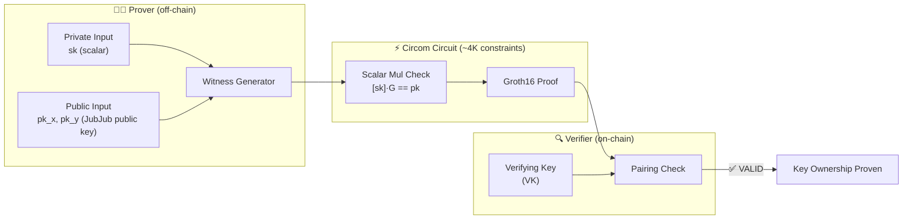

# Cardano Private Key → Public Key Ownership Proof

> **In one sentence:** Prove knowledge of the private scalar that generates a given public key — without revealing the private key.
>
> **Business angle:** This is the zk primitive behind wallet ownership proofs. A user can prove "I own this key" without exposing their private key, enabling trustless airdrops, KYC-gated DeFi, and proof-of-ownership for off-chain identity binding — all verified on-chain via a Groth16 proof.

Two variants are provided:

| Variant | Curve | Constraints | Status | Use case |
|---------|-------|-------------|--------|----------|
| **JubJub ownership** | JubJub (BLS12-381-native) | ~4K | ✅ Working e2e | Fast proof, but NOT a real Cardano key |
| **Ed25519 ownership** | Curve25519 (Ed25519) | ~1.97M | ✅ Working e2e | Proves real Cardano wallet key ownership |

---

## Executive summary: what we prove, with what, and what comes out

### What the circuit proves

The Groth16 circuit asserts a single mathematical statement:

> **I know a 255-bit scalar `sk` and a decompressed point `PointA` such that `PointA = [sk]·G` on Curve25519, and `PointCompress(PointA)` equals the public 256-bit compressed key `A`.**

In plain English: the prover demonstrates knowledge of the private key that generates a given Cardano Ed25519 public key — without ever revealing that private key. The verifier sees only the proof (192 bytes) and the public key; the scalar and the decompressed point remain secret.

### Inputs and outputs

| Artifact | Who provides it | Format | Size |
|----------|---------------|--------|------|
| **xsk** (extended signing key) | User (their wallet) | bech32 (`addr_xsk…`) | 96 bytes |
| **xvk / vk** (extended or plain public key) | User (their wallet) | bech32 (`addr_xvk…` or `addr_vk…`) | 64 or 32 bytes |
| **input.json** | Python helper (`gen_cardano_address_input.py`) | JSON bit/chunk arrays | ~5 KiB |
| **witness.wtns** | `snarkjs` (from `input.json` + `.wasm`) | Binary wire assignment | ~60 MiB |
| **Proof π** | `groth16-prover` CLI | 3 curve points (compressed) | **192 bytes** |
| **Public inputs** | Embedded in proof + `.pub` file | 256 public key bits | 32 bytes |

> **Do we need to recompile the circuit for every new key?** **No.** The Circom circuit is compiled **once** to `.r1cs` (the constraint system) and `.wasm` (the witness calculator). These files are **key-agnostic** — they describe the mathematical structure of the proof, not any specific key values. After compilation, you reuse the same `.r1cs` and proving key for **any** valid Ed25519 keypair. The only per-user files are `input.json` (generated by decoding your `xsk`/`vk`) and `witness.wtns` (computed from `input.json`).

### What each tool does in the pipeline

```
┌─────────────────┐     ┌──────────────────────┐     ┌──────────────────┐
│ cardano-address │────▶│ gen_cardano_address_ │────▶│   circom +       │
│  (mnemonic →    │     │ input.py             │     │   snarkjs        │
│   xsk / vk)     │     │  (bech32 → bits/     │     │  (.circom → .r1cs│
│                 │     │   chunks)            │     │   + .wasm → .wtns)│
└─────────────────┘     └──────────────────────┘     └──────────────────┘
                                                                │
                                                                ▼
┌─────────────────┐     ┌──────────────────────┐     ┌──────────────────┐
│  Aiken verifier │◀────│  groth16-prover CLI  │◀────│  groth16-prover  │
│  (on-chain,     │     │  (ceremony-dev +     │     │  CLI             │
│   pairing check)│     │   prove + verify)    │     │  (export-vk)     │
└─────────────────┘     └──────────────────────┘     └──────────────────┘
```

1. **`cardano-address`** — derives a real Cardano BIP32-Ed25519 keypair from a mnemonic (CIP-1852).
2. **`gen_cardano_address_input.py`** — decodes the bech32 `xsk`/`vk` files and turns them into the bit/chunk arrays the circuit expects.
3. **`circom`** — compiles the circuit **once** into `.r1cs` (constraints) and `.wasm` (witness calculator).
4. **`snarkjs`** — takes `input.json` + `.wasm` and produces `witness.wtns` (the full wire assignment).
5. **`groth16-prover` CLI** — runs the trusted-setup ceremony, generates the proof, and verifies it off-chain.
6. **`export-vk`** — converts the binary verifying key into Aiken source code for on-chain deployment.
7. **Aiken verifier** — the on-chain smart contract that checks the 192-byte proof against the public key with one pairing equation.

---

## Prerequisites

| Tool | How to get it | Why we need it |
|------|---------------|----------------|
| `circom` | `cargo install circom` or [github.com/iden3/circom](https://github.com/iden3/circom) | Compile `.circom` to `.r1cs` + `.wasm` |
| `snarkjs` | `npm install -g snarkjs` | Generate `.wtns` from `.wasm` + `input.json` |
| `cardano-address` | [IntersectMBO/cardano-addresses releases](https://github.com/IntersectMBO/cardano-addresses/releases) | Derive real Cardano keys from BIP-39 mnemonic (CIP-1852) |
| `bech32` (CLI) | [IntersectMBO/bech32 releases](https://github.com/IntersectMBO/bech32/releases) | Decode bech32 key files into hex for the Python helper |
| `groth16-prover` CLI | `cd groth16-prover/cli && cargo build --release` | Ceremony, proof generation, and verification |

> **Quick start.** If you already have the tools above installed, run `./setup_cardano_address.sh` in this directory. It generates a fresh mnemonic, derives the payment keys, and emits `input.json` in one command. You can then skip straight to [step 3 (compile)](#3-compile-the-circuit) below.

## What to expect (time / memory / disk)

> Benchmarks measured on a 16-core AMD Ryzen 9 7950X, 64 GiB RAM, `--release` build.

| Variant | Ceremony | Prove | Verify | Peak RAM | PK size (compressed) | VK size |
|---------|----------|-------|--------|----------|------------------------|---------|
| **JubJub (~4K constraints)** | ~1 s | ~1 s | ~1 s | ~1.5 MiB | ~0.5 MiB | ~1 KiB |
| **Ed25519 (~1.97M constraints, legacy)** | **~5 min** | **~1.7 min** | **~2 s** | **~2.5 GiB** | **~350 MiB** | **~3.8 MiB** |
| **Ed25519 (~1.97M constraints, h_scalar)** | **~5 min** | **~1.5 min** | **~2 s** | **~2.5 GiB** | **~180 MiB** | **~3.8 MiB** |

⚠️ **Critical:** The Ed25519 circuit **must** use `--sparse` for both `ceremony-dev` and `prove`. The dense path would allocate ~15 TB and OOM-kill immediately. The JubJub circuit is small enough that either path works, but sparse is still recommended.

> **Implementation 7 (h_scalar).** Add `--h-scalar` to `ceremony-dev` to store a single scalar instead of the full h_query vector. This halves the PK size (~350 MiB → ~180 MiB) and cuts prove time by ~10–15 % (~1.7 min → ~1.5 min) because the h_query MSM is eliminated. The prover auto-detects h_scalar with no extra flags. At 1.97M constraints the h_query vector has ~2M points, so the benefit is visible but not as dramatic as on the 4M-constraint Ed25519Verify circuit.

---

## Variant A: JubJub Key Ownership (fast, ~4K constraints)

> **Caveat:** This proves ownership of a **JubJub** key (a SNARK-friendly curve embedded in BLS12-381), NOT a standard Cardano **Ed25519** key. Curve25519 arithmetic is incompatible with BLS12-381's scalar field. The JubJub key can be linked to a Cardano identity via an off-chain commitment, but the ownership proof itself is for the JubJub key.

Prove that the prover knows a private scalar `sk` such that `pk = [sk] · G_JubJub`, where `G_JubJub` is the standard JubJub base point and `pk` is the corresponding public key.

**Status:** ✅ **Working end-to-end.** Circuit compiles, witness generates, ceremony runs, proof produces, and verification passes via the Rust `groth16-prover` CLI.

### System overview


```mermaid
flowchart LR
    subgraph Prover["🧑‍💻 Prover (off-chain)"]
        direction TB
        priv["Private Input<br/>sk (scalar)"]
        pub_pub["Public Input<br/>pk_x, pk_y (JubJub public key)"]
        wit["Witness Generator"]
    end

    subgraph Circuit["⚡ Circom Circuit (~4K constraints)"]
        direction TB
        check["Scalar Mul Check<br/>[sk]·G == pk"]
        zk["Groth16 Proof"]
    end

    subgraph Verifier["🔍 Verifier (on-chain)"]
        direction TB
        vk["Verifying Key<br/>(VK)"]
        pair["Pairing Check"]
    end

    priv --> wit
    pub_pub --> wit
    wit --> check
    check --> zk
    zk --> pair
    vk --> pair
    pair -->|"✅ VALID"| result["Key Ownership Proven"]
```

**What happens:**
1. **Prover** knows the private scalar `sk` and the public key `(pk_x, pk_y)`, and wants to prove they are linked by the JubJub generator `G_JubJub`.
2. **Circuit** computes `[sk] · G_JubJub` (fixed-base scalar multiplication on JubJub) and asserts equality with `(pk_x, pk_y)`.
3. **Verifier** (Aiken smart contract) confirms the pairing check — the private scalar `sk` is never revealed.

### Why JubJub instead of Ed25519

Cardano uses **Ed25519 / Curve25519** keys natively:
- **Private key:** a 256-bit scalar
- **Public key:** `P = x · G` on Curve25519

To prove ownership inside a Groth16 circuit on **BLS12-381**, we must perform scalar multiplication on a curve whose base field matches BLS12-381's scalar field. **Curve25519 does not match** — its prime `p = 2²⁵⁵ − 19` is different from BLS12-381's scalar field `q = 52435875175126190479447740508185965837690552500527637822603658699938581184513`.

| Parameter | BLS12-381 scalar field | Curve25519 base field |
|-----------|------------------------|-----------------------|
| Prime | `52435875175126190479447740508185965837690552500527637822603658699938581184513` | `57896044618658097711785492504343953926634992332820282019728792003956564819949` |
| Bits | 255 | 255 |

**JubJub** solves this: it is a twisted Edwards curve embedded in the BLS12-381 scalar field, so all arithmetic is native to the Groth16 proving system. The trade-off is that we prove ownership of a **JubJub key**, not a Cardano Ed25519 key. A separate commitment can link the JubJub key to a Cardano address.

---

## Variant B: Ed25519 Key Ownership (~1.97M constraints)

> **New:** Now that Ed25519 signature verification works end-to-end on BLS12-381 (see [`Ed25519Verify/README.md`](../Ed25519Verify/README.md)), we can reuse the same `ScalarMul` and `PointCompress` templates to prove ownership of a **real Cardano Ed25519 key**.

Prove that the prover knows the clamped Ed25519 scalar `a` (derived from the private key seed via SHA-512 and clamping) such that the public key `A` is the compression of `[a]·G` on Curve25519.

**Status:** ✅ **Working end-to-end.** Circuit compiles, witness generates, sparse ceremony completes, proof generates, and verification passes.

### What it proves

```
Public:   A[256]               — compressed Ed25519 public key bits
Private:  sk[255]              — clamped Ed25519 scalar bits
           PointA[4][3]         — decompressed public key in extended coordinates

Constraint: ScalarMul(sk, G) == PointA  &&  PointCompress(PointA) == A
```

This is a minimal subset of the full `Ed25519Verify` circuit: only one scalar multiplication on the base point `G`, plus point compression check. No SHA-512, no signature components, no second scalar multiplication.

### Files

```
CardanoKeyOwnership/
├── cardano_key_ownership.circom         # JubJub ownership (original, ~4K constraints)
├── cardano_ed25519_ownership.circom     # Ed25519 ownership (new, ~1.97M constraints)
├── gen_cardano_address_input.py         # Generate circuit input from cardano-address keys
├── setup_cardano_address.sh             # One-shot shell script: mnemonic → keys → circuit input
├── test_ownership_input.json            # Example witness input (random key)
├── witness_ownership.wtns              # Generated witness (binary)
├── cardano_ed25519_ownership.r1cs       # Compiled constraint system
├── cardano_ed25519_ownership_js/
│   └── cardano_ed25519_ownership.wasm   # Witness calculator
├── input.json                           # JubJub example input
├── witness.wtns                         # JubJub witness
├── cardano_key_ownership.r1cs           # JubJub R1CS
├── cardano_key_ownership_js/
│   └── cardano_key_ownership.wasm       # JubJub witness calculator
├── jubjub.circom                        # JubJub curve parameters
├── escalarmulfix_jubjub.circom         # Fixed-base scalar mul (JubJub)
├── jubjub_primitives.circom            # Point addition, doubling (JubJub)
├── scalarmul_jubjub.circom             # Variable-base scalar mul (JubJub)
├── pointbits_jubjub.circom            # Point decompression (JubJub)
└── README.md                            # This file
```

### Pipeline — Ed25519 ownership (step by step)

#### 1. Derive a real Cardano payment key

Instead of generating a random Ed25519 keypair, we derive a **standard Cardano address key** using the `cardano-address` CLI (CIP-1852 / BIP32-Ed25519). This means the proof attests ownership of a key that actually lives on Cardano mainnet.

**Step-by-step:**

```bash
cd groth16-prover/circom/CardanoKeyOwnership

# (a) Generate a 15-word recovery phrase
cardano-address recovery-phrase generate --size 15 > phrase.prv

# (b) Derive the extended root signing key from the mnemonic
cardano-address key from-recovery-phrase Shelley < phrase.prv > root.xsk

# (c) Derive the payment signing key (standard derivation path 1852H/1815H/0H/0/0)
cardano-address key child 1852H/1815H/0H/0/0 < root.xsk > pay.xsk

# (d) Extract the public payment key without chain code (simplifies the circuit input)
cardano-address key public --without-chain-code < pay.xsk > pay.vk
```

**What each file contains:**

| File | Format | Bytes | What it is |
|------|--------|-------|-----------|
| `phrase.prv` | 15 BIP-39 words | — | Recovery phrase (keep secret) |
| `root.xsk` | bech32 (`root_xsk…`) | 96 | Extended root signing key |
| `pay.xsk` | bech32 (`addr_xsk…`) | 96 | Extended payment signing key (first 32 bytes = kL, the clamped Ed25519 scalar) |
| `pay.vk` | bech32 (`addr_vk…`) | 32 | Compressed Ed25519 public key (no chain code) |

> **Key insight for (c) and (d).** The payment signing key `pay.xsk` encodes the Ed25519 scalar directly in its first 32 bytes (kL). In Cardano's BIP32-Ed25519 implementation, kL is **already clamped** — bits 0–2 are zero, bit 254 is zero, and bit 253 is set. This scalar is exactly what the circuit needs as the private witness `sk[255]`. The public key in `pay.vk` is the standard 32-byte Ed25519 compressed point, which the circuit checks via decompression and scalar multiplication.

#### 2. Generate the circuit witness input

A small Python helper decodes the bech32 files and converts the keys into the bit/chunk format expected by the Circom circuit:

```bash
cd groth16-prover/circom/CardanoKeyOwnership
python3 gen_cardano_address_input.py --xsk pay.xsk --vk pay.vk -o input.json
```

This produces `input.json` with:
- `A[256]`: compressed public key bits (little-endian, from `pay.vk`)
- `sk[255]`: clamped Ed25519 scalar bits (little-endian, first 255 bits of kL from `pay.xsk`)
- `PointA[4][3]`: decompressed public key in extended coordinates [X, Y, Z, T], each split into 3 chunks of 85 bits

> **Why `--without-chain-code`?** The chain code (last 32 bytes of an extended key) is only needed for further child derivation. The ownership circuit only needs the public key point itself. Omitting the chain code keeps `pay.vk` at 32 bytes — exactly the size of a standard Ed25519 public key — which simplifies decoding and avoids confusion.

#### 3. Compile the circuit

```bash
cd groth16-prover/circom/CardanoKeyOwnership
circom --prime bls12381 -l ../Ed25519Verify/node_modules/circomlib/circuits \
  cardano_ed25519_ownership.circom --r1cs --wasm --sym
```

**Output metrics:**
- Non-linear constraints: ~1,228,289
- Linear constraints: ~738,639
- Total constraints: ~1,966,928
- Public inputs: 256 (`A[256]`)
- Private inputs: 267 (`sk[255]`, `PointA[4][3]`)
- Wires: ~1,944,221

#### 4. Generate the witness

```bash
cd groth16-prover/circom/CardanoKeyOwnership
snarkjs wtns calculate \
  cardano_ed25519_ownership_js/cardano_ed25519_ownership.wasm \
  input.json \
  witness_ownership.wtns
```

#### 5. Run the sparse dev ceremony

⚠️ **Use `--sparse` flag.** The dense-matrix ceremony would require ~15 TB RAM and will OOM.

```bash
cd groth16-prover/cli
cargo run --release -- ceremony-dev --sparse \
  --circuit ../circom/CardanoKeyOwnership/cardano_ed25519_ownership.r1cs \
  --proving-key /tmp/cardano_ed25519_ownership.pk \
  --verifying-key /tmp/cardano_ed25519_ownership.vk
```

**Measured timings (16-core AMD Ryzen 9 7950X, 64 GiB RAM, `--release`):**

| Step | Time | Memory (RSS) |
|------|------|-------------|
| Sparse dev ceremony | **~5 min** | ~2.5 GiB |
| PK write (uncompressed) | ~4 s | — |
| VK write (uncompressed) | ~1 s | — |

#### 6. Generate a proof

```bash
cd groth16-prover/cli
cargo run --release -- prove --sparse \
  --circuit ../circom/CardanoKeyOwnership/cardano_ed25519_ownership.r1cs \
  --witness ../circom/CardanoKeyOwnership/witness_ownership.wtns \
  --proving-key /tmp/cardano_ed25519_ownership.pk \
  --out /tmp/cardano_ed25519_ownership_proof.bin
```

**Measured timings:**

| Sub-step | Time |
|----------|------|
| Circuit + witness load | ~5.5 s |
| PK read (uncompressed, unchecked) | ~7 s |
| `build_witness_polys_sparse` | ~15 s |
| `compute_quotient` (FFT `l * r`) | ~25 s |
| A MSM (G1, ~1.9M scalars) | ~7 s |
| B MSM (G2, ~1.9M scalars) | ~8 s |
| C_private MSM (G1, ~1.9M scalars) | ~15 s |
| h MSM (G1, ~2M scalars) | ~25 s |
| V MSM (G1, 257 scalars) | ~1 ms |
| **Total prove** | **~101 s (~1.7 min)** |

#### 7. Verify the proof

```bash
cd groth16-prover/cli
cargo run --release -- verify \
  --proof /tmp/cardano_ed25519_ownership_proof.bin \
  --public /tmp/cardano_ed25519_ownership_proof.pub \
  --verifying-key /tmp/cardano_ed25519_ownership.vk
```

**Expected output:** `Verification result: VALID`

**Measured time:** ~2 s (VK loaded uncompressed, unchecked)

#### 8. Export the VK to Aiken

```bash
cargo run --release -- export-vk \
  --verifying-key /tmp/cardano_ed25519_ownership.vk \
  --out /tmp/cardano_ed25519_ownership_vk.ak
```

#### 9. Total e2e time

| Variant | Ceremony | Prove | Verify | Total |
|---------|----------|-------|--------|-------|
| **JubJub** | ~1 s | ~1 s | ~1 s | **~3 s** |
| **Ed25519** | **~5 min** | **~1.7 min** | **~2 s** | **~7 min** |

---

## Circuit details — Ed25519 ownership

```circom
template CardanoEd25519Ownership() {
    signal input A[256];
    signal input sk[255];
    signal input PointA[4][3];
    signal output out;

    // Curve25519 base point G in extended coordinates [X, Y, Z, T]
    var G[4][3] = [[6836562328990639286768922, 21231440843933962135602345, 10097852978535018773096760],
                   [7737125245533626718119512, 23211375736600880154358579, 30948500982134506872478105],
                   [1, 0, 0],
                   [20943500354259764865654179, 24722277920680796426601402, 31289658119428895172835987]
                  ];

    // 1. Compute [sk]·G
    component pMul = ScalarMul();
    pMul.s <== sk;
    pMul.P <== G;

    // 2. Assert [sk]·G == PointA using projective coordinate equality
    component equal = PointEqual();
    equal.p <== pMul.sP;    // X, Y, Z of computed point
    equal.q <== PointA;      // X, Y, Z of provided point

    // 3. Compress PointA and assert it equals A
    component compressA = PointCompress();
    compressA.P <== PointA;
    compressA.out === A;

    out <== equal.out;
}
```

- **Public inputs:** `A[256]` (compressed Ed25519 public key bits)
- **Private inputs:** `sk[255]` (clamped scalar), `PointA[4][3]` (decompressed point)
- **Constraints:** ~1.97M (~1.23M non-linear + ~739K linear)
- **Wires:** ~1.94M
- **Memory (sparse):** ~2.5 GiB

The circuit uses `ScalarMul`, `PointEqual`, and `PointCompress` from `Ed25519Verify/` (Electron-Labs templates, adapted for BLS12-381). The `ScalarMul` template performs windowed scalar multiplication on Curve25519 using 85-bit chunked arithmetic. `PointEqual` checks projective coordinate equality via cross-multiplication (`X1*Z2 == X2*Z1`, `Y1*Z2 == Y2*Z1`).

---

## Comparison with other circuits in this repo

| Circuit | Constraints | Wires | Dense matrix RAM | Witness | Status |
|---------|-------------|-------|------------------|---------|--------|
| SimpleExample Multiplier | 3 | 8 | ~768 B | ✅ | ✅ Working e2e |
| Privacy / Spend(depth=2) | 1,107 | 1,110 | ~39 MB | ✅ | ✅ Working e2e |
| Poseidon Pre-image | ~300 | ~400 | ~5 MB | ✅ | ✅ Working e2e |
| Blake2b-224 Pre-image | ~79K | ~78K | ~200 GB (dense) / ~280 MiB (sparse) | ✅ | ✅ Working e2e — ceremony ~18 s, prove ~5 s |
| Ed25519 Verify | ~4M | ~4M | ~512 TB (dense) / ~3 GiB (sparse) | ✅ | ✅ Working e2e — ceremony ~16 min, prove ~5 min |
| **CardanoKeyOwnership (JubJub)** | **~4K** | **~4K** | **~1.5 MiB** | ✅ | ✅ Working e2e |
| **CardanoKeyOwnership (Ed25519)** | **~1.97M** | **~1.94M** | **~15 TB (dense) / ~2.5 GiB (sparse)** | ✅ | ✅ Working e2e — ceremony ~5 min, prove ~1.7 min |

---

## References

- [`Ed25519Verify/README.md`](../Ed25519Verify/README.md) — Full Ed25519 signature verification circuit on BLS12-381 (working e2e with sparse prover)
- [`EdDSAJubJub/README.md`](../EdDSAJubJub/README.md) — JubJub curve parameters and point operations
- [RFC 8032](https://datatracker.ietf.org/doc/html/rfc8032) — EdDSA and Ed25519 specification
- [Electron-Labs/ed25519-circom](https://github.com/Electron-Labs/ed25519-circom) — upstream Ed25519 Circom circuits (archived, MIT License)
- [IntersectMBO/cardano-addresses](https://github.com/IntersectMBO/cardano-addresses) — CLI for Cardano mnemonic, key derivation, and address generation (CIP-1852)
- [IntersectMBO/cardano-crypto](https://github.com/IntersectMBO/cardano-crypto) — Cardano key derivation logic
- [`circom/README.md`](../README.md) — Parent directory with all circuit documentation

---

## License

MIT (same as upstream circomlib and EdDSAJubJub/Ed25519Verify circuits).
