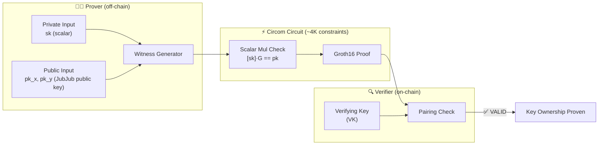

# Cardano Private Key → Public Key Ownership Proof

> **In one sentence:** Prove knowledge of the private scalar that generates a given public key — without revealing the private key.
>
> **Business angle:** This is the zk primitive behind wallet ownership proofs. A user can prove "I own this key" without exposing their private key, enabling trustless airdrops, KYC-gated DeFi, and proof-of-ownership for off-chain identity binding — all verified on-chain via a Groth16 proof.

Two variants are provided:

| Variant | Curve | Constraints | Status | Use case |
|---------|-------|-------------|--------|----------|
| **JubJub ownership** | JubJub (BLS12-381-native) | ~4K | ✅ Working e2e | Fast proof, but NOT a real Cardano key |
| **Ed25519 ownership** | Curve25519 (Ed25519) | ~1.97M | ✅ Working e2e | Proves real Cardano wallet key ownership |

---

## Variant A: JubJub Key Ownership (fast, ~4K constraints)

> **Caveat:** This proves ownership of a **JubJub** key (a SNARK-friendly curve embedded in BLS12-381), NOT a standard Cardano **Ed25519** key. Curve25519 arithmetic is incompatible with BLS12-381's scalar field. The JubJub key can be linked to a Cardano identity via an off-chain commitment, but the ownership proof itself is for the JubJub key.

Prove that the prover knows a private scalar `sk` such that `pk = [sk] · G_JubJub`, where `G_JubJub` is the standard JubJub base point and `pk` is the corresponding public key.

**Status:** ✅ **Working end-to-end.** Circuit compiles, witness generates, ceremony runs, proof produces, and verification passes via the Rust `groth16-prover` CLI.

### System overview


```mermaid
flowchart LR
    subgraph Prover["🧑‍💻 Prover (off-chain)"]
        direction TB
        priv["Private Input<br/>sk (scalar)"]
        pub_pub["Public Input<br/>pk_x, pk_y (JubJub public key)"]
        wit["Witness Generator"]
    end

    subgraph Circuit["⚡ Circom Circuit (~4K constraints)"]
        direction TB
        check["Scalar Mul Check<br/>[sk]·G == pk"]
        zk["Groth16 Proof"]
    end

    subgraph Verifier["🔍 Verifier (on-chain)"]
        direction TB
        vk["Verifying Key<br/>(VK)"]
        pair["Pairing Check"]
    end

    priv --> wit
    pub_pub --> wit
    wit --> check
    check --> zk
    zk --> pair
    vk --> pair
    pair -->|"✅ VALID"| result["Key Ownership Proven"]
```

**What happens:**
1. **Prover** knows the private scalar `sk` and the public key `(pk_x, pk_y)`, and wants to prove they are linked by the JubJub generator `G_JubJub`.
2. **Circuit** computes `[sk] · G_JubJub` (fixed-base scalar multiplication on JubJub) and asserts equality with `(pk_x, pk_y)`.
3. **Verifier** (Aiken smart contract) confirms the pairing check — the private scalar `sk` is never revealed.

### Why JubJub instead of Ed25519

Cardano uses **Ed25519 / Curve25519** keys natively:
- **Private key:** a 256-bit scalar
- **Public key:** `P = x · G` on Curve25519

To prove ownership inside a Groth16 circuit on **BLS12-381**, we must perform scalar multiplication on a curve whose base field matches BLS12-381's scalar field. **Curve25519 does not match** — its prime `p = 2²⁵⁵ − 19` is different from BLS12-381's scalar field `q = 52435875175126190479447740508185965837690552500527637822603658699938581184513`.

| Parameter | BLS12-381 scalar field | Curve25519 base field |
|-----------|------------------------|-----------------------|
| Prime | `52435875175126190479447740508185965837690552500527637822603658699938581184513` | `57896044618658097711785492504343953926634992332820282019728792003956564819949` |
| Bits | 255 | 255 |

**JubJub** solves this: it is a twisted Edwards curve embedded in the BLS12-381 scalar field, so all arithmetic is native to the Groth16 proving system. The trade-off is that we prove ownership of a **JubJub key**, not a Cardano Ed25519 key. A separate commitment can link the JubJub key to a Cardano address.

---

## Variant B: Ed25519 Key Ownership (~1.97M constraints)

> **New:** Now that Ed25519 signature verification works end-to-end on BLS12-381 (see [`Ed25519Verify/README.md`](../Ed25519Verify/README.md)), we can reuse the same `ScalarMul` and `PointCompress` templates to prove ownership of a **real Cardano Ed25519 key**.

Prove that the prover knows the clamped Ed25519 scalar `a` (derived from the private key seed via SHA-512 and clamping) such that the public key `A` is the compression of `[a]·G` on Curve25519.

**Status:** ✅ **Working end-to-end.** Circuit compiles, witness generates, sparse ceremony completes, proof generates, and verification passes.

### What it proves

```
Public:   A[256]               — compressed Ed25519 public key bits
Private:  sk[255]              — clamped Ed25519 scalar bits
           PointA[4][3]         — decompressed public key in extended coordinates

Constraint: ScalarMul(sk, G) == PointA  &&  PointCompress(PointA) == A
```

This is a minimal subset of the full `Ed25519Verify` circuit: only one scalar multiplication on the base point `G`, plus point compression check. No SHA-512, no signature components, no second scalar multiplication.

### Files

```
CardanoKeyOwnership/
├── cardano_key_ownership.circom      # JubJub ownership (original, ~4K constraints)
├── cardano_ed25519_ownership.circom  # Ed25519 ownership (new, ~1.97M constraints)
├── gen_ownership_input.py            # Python script to generate test inputs
├── test_ownership_input.json         # Example witness input
├── witness_ownership.wtns           # Generated witness (binary)
├── cardano_ed25519_ownership.r1cs    # Compiled constraint system
├── cardano_ed25519_ownership_js/
│   └── cardano_ed25519_ownership.wasm # Witness calculator
├── input.json                        # JubJub example input
├── witness.wtns                      # JubJub witness
├── cardano_key_ownership.r1cs        # JubJub R1CS
├── cardano_key_ownership_js/
│   └── cardano_key_ownership.wasm    # JubJub witness calculator
├── jubjub.circom                     # JubJub curve parameters
├── escalarmulfix_jubjub.circom      # Fixed-base scalar mul (JubJub)
├── jubjub_primitives.circom         # Point addition, doubling (JubJub)
├── scalarmul_jubjub.circom          # Variable-base scalar mul (JubJub)
├── pointbits_jubjub.circom         # Point decompression (JubJub)
└── README.md                         # This file
```

### Pipeline — Ed25519 ownership (step by step)

#### 1. Prerequisites

| Tool | Version | How to get it |
|------|---------|---------------|
| circom | 2.0.0+ | `cargo install circom` or [github.com/iden3/circom](https://github.com/iden3/circom) |
| snarkjs | 0.7.x | `npm install -g snarkjs` |
| Rust prover | latest | `cargo build --release` in `groth16-prover/cli/` |
| pynacl | latest | `pip install pynacl` |

#### 2. Generate a test Ed25519 key pair

```bash
cd groth16-prover/circom/CardanoKeyOwnership
python3 gen_ownership_input.py
```

This generates `test_ownership_input.json` with:
- `A[256]`: compressed public key bits
- `sk[255]`: clamped Ed25519 scalar bits (derived from SHA-512 of the raw private key)
- `PointA[4][3]`: decompressed public key in extended coordinates (3 chunks of 85 bits)

> **Note:** The scalar `sk` is the **clamped** Ed25519 scalar, not the raw private key bytes. Ed25519 key derivation: `a = clamp(SHA-512(private_key)[0:32])`. The circuit proves knowledge of `a`, which is the scalar that generates the public key.

#### 3. Compile the circuit

```bash
cd groth16-prover/circom/CardanoKeyOwnership
circom --prime bls12381 -l ../Ed25519Verify/node_modules/circomlib/circuits \
  cardano_ed25519_ownership.circom --r1cs --wasm --sym
```

**Output metrics:**
- Non-linear constraints: ~1,228,289
- Linear constraints: ~738,639
- Total constraints: ~1,966,928
- Public inputs: 256 (`A[256]`)
- Private inputs: 267 (`sk[255]`, `PointA[4][3]`)
- Wires: ~1,944,221

#### 4. Generate the witness

```bash
cd groth16-prover/circom/CardanoKeyOwnership
snarkjs wtns calculate \
  cardano_ed25519_ownership_js/cardano_ed25519_ownership.wasm \
  test_ownership_input.json \
  witness_ownership.wtns
```

#### 5. Run the sparse dev ceremony

⚠️ **Use `--sparse` flag.** The dense-matrix ceremony would require ~15 TB RAM and will OOM.

```bash
cd groth16-prover/cli
cargo run --release -- ceremony-dev --sparse \
  --circuit ../circom/CardanoKeyOwnership/cardano_ed25519_ownership.r1cs \
  --proving-key /tmp/cardano_ed25519_ownership.pk \
  --verifying-key /tmp/cardano_ed25519_ownership.vk
```

**Measured timings (16-core AMD Ryzen 9 7950X, 64 GiB RAM, `--release`):**

| Step | Time | Memory (RSS) |
|------|------|-------------|
| Sparse dev ceremony | **~5 min** | ~2.5 GiB |
| PK write (uncompressed) | ~4 s | — |
| VK write (uncompressed) | ~1 s | — |

#### 6. Generate a proof

```bash
cd groth16-prover/cli
cargo run --release -- prove --sparse \
  --circuit ../circom/CardanoKeyOwnership/cardano_ed25519_ownership.r1cs \
  --witness ../circom/CardanoKeyOwnership/witness_ownership.wtns \
  --proving-key /tmp/cardano_ed25519_ownership.pk \
  --out /tmp/cardano_ed25519_ownership_proof.bin
```

**Measured timings:**

| Sub-step | Time |
|----------|------|
| Circuit + witness load | ~5.5 s |
| PK read (uncompressed, unchecked) | ~7 s |
| `build_witness_polys_sparse` | ~15 s |
| `compute_quotient` (FFT `l * r`) | ~25 s |
| A MSM (G1, ~1.9M scalars) | ~7 s |
| B MSM (G2, ~1.9M scalars) | ~8 s |
| C_private MSM (G1, ~1.9M scalars) | ~15 s |
| h MSM (G1, ~2M scalars) | ~25 s |
| V MSM (G1, 257 scalars) | ~1 ms |
| **Total prove** | **~101 s (~1.7 min)** |

#### 7. Verify the proof

```bash
cd groth16-prover/cli
cargo run --release -- verify \
  --proof /tmp/cardano_ed25519_ownership_proof.bin \
  --public /tmp/cardano_ed25519_ownership_proof.pub \
  --verifying-key /tmp/cardano_ed25519_ownership.vk
```

**Expected output:** `Verification result: VALID`

**Measured time:** ~2 s (VK loaded uncompressed, unchecked)

#### 8. Export the VK to Aiken

```bash
cargo run --release -- export-vk \
  --verifying-key /tmp/cardano_ed25519_ownership.vk \
  --out /tmp/cardano_ed25519_ownership_vk.ak
```

#### 9. Total e2e time

| Variant | Ceremony | Prove | Verify | Total |
|---------|----------|-------|--------|-------|
| **JubJub** | ~1 s | ~1 s | ~1 s | **~3 s** |
| **Ed25519** | **~5 min** | **~1.7 min** | **~2 s** | **~7 min** |

---

## Circuit details — Ed25519 ownership

```circom
template CardanoEd25519Ownership() {
    signal input A[256];
    signal input sk[255];
    signal input PointA[4][3];
    signal output out;

    // Curve25519 base point G in extended coordinates [X, Y, Z, T]
    var G[4][3] = [[6836562328990639286768922, 21231440843933962135602345, 10097852978535018773096760],
                   [7737125245533626718119512, 23211375736600880154358579, 30948500982134506872478105],
                   [1, 0, 0],
                   [20943500354259764865654179, 24722277920680796426601402, 31289658119428895172835987]
                  ];

    // 1. Compute [sk]·G
    component pMul = ScalarMul();
    pMul.s <== sk;
    pMul.P <== G;

    // 2. Assert [sk]·G == PointA using projective coordinate equality
    component equal = PointEqual();
    equal.p <== pMul.sP;    // X, Y, Z of computed point
    equal.q <== PointA;      // X, Y, Z of provided point

    // 3. Compress PointA and assert it equals A
    component compressA = PointCompress();
    compressA.P <== PointA;
    compressA.out === A;

    out <== equal.out;
}
```

- **Public inputs:** `A[256]` (compressed Ed25519 public key bits)
- **Private inputs:** `sk[255]` (clamped scalar), `PointA[4][3]` (decompressed point)
- **Constraints:** ~1.97M (~1.23M non-linear + ~739K linear)
- **Wires:** ~1.94M
- **Memory (sparse):** ~2.5 GiB

The circuit uses `ScalarMul`, `PointEqual`, and `PointCompress` from `Ed25519Verify/` (Electron-Labs templates, adapted for BLS12-381). The `ScalarMul` template performs windowed scalar multiplication on Curve25519 using 85-bit chunked arithmetic. `PointEqual` checks projective coordinate equality via cross-multiplication (`X1*Z2 == X2*Z1`, `Y1*Z2 == Y2*Z1`).

---

## Comparison with other circuits in this repo

| Circuit | Constraints | Wires | Dense matrix RAM | Witness | Status |
|---------|-------------|-------|------------------|---------|--------|
| SimpleExample Multiplier | 3 | 8 | ~768 B | ✅ | ✅ Working e2e |
| Privacy / Spend(depth=2) | 1,107 | 1,110 | ~39 MB | ✅ | ✅ Working e2e |
| Poseidon Pre-image | ~300 | ~400 | ~5 MB | ✅ | ✅ Working e2e |
| Blake2b-224 Pre-image | ~79K | ~78K | ~200 GB | ✅ | ✅ Unblocked (sparse) |
| Ed25519 Verify | ~4M | ~4M | ~512 TB (dense) / ~3 GiB (sparse) | ✅ | ✅ Working e2e — ceremony ~16 min, prove ~5 min |
| **CardanoKeyOwnership (JubJub)** | **~4K** | **~4K** | **~1.5 MiB** | ✅ | ✅ Working e2e |
| **CardanoKeyOwnership (Ed25519)** | **~1.97M** | **~1.94M** | **~15 TB (dense) / ~2.5 GiB (sparse)** | ✅ | ✅ Working e2e — ceremony ~5 min, prove ~1.7 min |

---

## References

- [`Ed25519Verify/README.md`](../Ed25519Verify/README.md) — Full Ed25519 signature verification circuit on BLS12-381 (working e2e with sparse prover)
- [`EdDSAJubJub/README.md`](../EdDSAJubJub/README.md) — JubJub curve parameters and point operations
- [RFC 8032](https://datatracker.ietf.org/doc/html/rfc8032) — EdDSA and Ed25519 specification
- [Electron-Labs/ed25519-circom](https://github.com/Electron-Labs/ed25519-circom) — upstream Ed25519 Circom circuits (archived, MIT License)
- [IntersectMBO/cardano-crypto](https://github.com/IntersectMBO/cardano-crypto) — Cardano key derivation logic
- [`circom/README.md`](../README.md) — Parent directory with all circuit documentation

---

## License

MIT (same as upstream circomlib and EdDSAJubJub/Ed25519Verify circuits).
