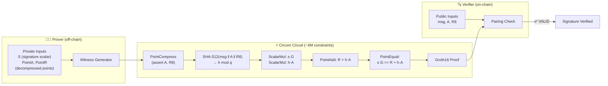

# Ed25519 Signature Verification In-Circuit

> **In one sentence:** Prove that a standard Ed25519 signature is valid — without revealing the signature, the message, or the public key on-chain.
>
> **Business angle:** Ed25519 is the signature scheme used by Cardano wallets, SSH keys, and many other blockchains. This circuit would enable a user to prove "a message was signed by the owner of this key" inside a zk-SNARK, unlocking cross-chain identity attestation, proof-of-ownership for off-chain assets, and private credential verification. A dApp could verify a user's wallet signature without ever publishing the signature or public key on-chain.

Verify a standard Ed25519 signature inside a Groth16 circuit — without revealing the signature components. This proves that a given message was signed by a specific Ed25519 public key, producing a zk-SNARK proof that can be verified on-chain (e.g., in Aiken on Cardano).

---

## System overview



**What happens:**
1. **Prover** knows the full Ed25519 signature (`S`, decompressed `PointA`, `PointR`) and wants to prove it is valid for a public message and public key bits (`A`, `R8`).
2. **Witness generator** performs point compression, SHA-512 hashing, and scalar multiplication on Curve25519 — all inside the circuit's arithmetic constraints.
3. **Circuit** (4M constraints) follows RFC 8032: compress points, hash, compute `s·G` and `h·A`, check equality. Produces a zk-SNARK proof.
4. **Verifier** (Aiken smart contract) receives the proof and the public message/key, confirms the signature is valid via pairing check — without ever seeing `S`, `PointA`, or `PointR`.


> **Status:** Circuit compiles successfully with `circom --prime bls12381`. Witness generation **fails** due to BLS12-381 field incompatibility with the circuit's internal chunked-arithmetic templates. End-to-end proving is blocked at Step 2.

---

## What it proves

```
Public:   msg[n], A[256], R8[256]     — message bits, pubkey bits, signature-R bits
Private:  S[255], PointA[4][3], PointR[4][3]  — signature scalar, decompressed pubkey/R

Constraint: Ed25519Verify(msg, A, R8, S, PointA, PointR) == 1
```

The circuit follows RFC 8032 Section 6:
1. Compress `PointA` and `PointR` and assert they equal `A` and `R8`.
2. Hash `R8 || A || msg` with SHA-512 and reduce modulo `q`.
3. Compute `s·G` and `h·A` via scalar multiplication on Curve25519.
4. Assert `s·G == R + h·A` via point equality check.

**Use case:** Attest to off-chain events signed by standard Ed25519 keys (SSH, TLS, other blockchains, Cardano wallet signatures). This enables cross-chain identity verification and proof-of-signature without revealing the actual signature on-chain.

---

## Circuit structure

| File | Purpose | Source |
|------|---------|--------|
| `verify.circom` | `Ed25519Verifier(n)` template — top-level verification logic | Electron-Labs/ed25519-circom (archived, MIT License) |
| `ed25519_verify.circom` | **New** — wrapper instantiating `Ed25519Verifier(256)` with `public [msg, A, R8]` | This project |
| `scalarmul.circom` | `ScalarMul()` — point multiplication on Curve25519 | Electron-Labs |
| `point-addition.circom` | `PointAdd()` — extended-coordinate point addition | Electron-Labs |
| `pointcompress.circom` | `PointCompress()` — compress extended point to 256 bits | Electron-Labs |
| `modulus.circom` | `ModulusWith25519Chunked51`, `ModulusAgainst2PChunked51`, etc. | Electron-Labs |
| `chunkedmul.circom` | `ChunkedMul()` — 85-bit/51-bit chunked multiplication | Electron-Labs |
| `chunkedadd.circom`, `chunkedsub.circom` | `ChunkedAdd()`, `ChunkedSub()` — chunked modular add/sub | Electron-Labs |
| `chunkify.circom` | `Chunkify()` — bit chunking utilities | Electron-Labs |
| `binadd.circom`, `binmul.circom`, `binsub.circom` | Binary adders/multipliers | Electron-Labs |
| `modinv.circom` | `BigModInv51()` — modular inverse via extended Euclid | Electron-Labs |
| `inversemodulo.circom` | Helper for modular inverse | Electron-Labs |
| `lt.circom` | `LessThanPower()`, `LessThanBounded()` — comparison gadgets | Electron-Labs |
| `utils.circom` | `calculateNumOutputs()` and other helpers | Electron-Labs |
| `node_modules/@electron-labs/sha512/circuits/sha512/sha512.circom` | `Sha512()` — SHA-512 hash (80 rounds, 1024-bit block) | `@electron-labs/sha512` npm package |
| `node_modules/circomlib/circuits/comparators.circom`, `gates.circom`, `bitify.circom` | `IsEqual()`, `AND()`, `Num2Bits()` | `circomlib` |

**Key design decisions from upstream:**
- Points are represented in **extended homogeneous coordinates** `[X, Y, Z, T]` with each coordinate split into **base-2⁸⁵ chunks** (3 chunks of 85 bits each).
- The circuit uses a **trick** to avoid expensive point decompression: the prover provides both the compressed bit representation and the decompressed point, and the circuit compresses the point and asserts equality.
- All modular arithmetic (add, sub, mul, inv) is performed via **custom chunked templates** rather than native field operations, because Curve25519's prime `2²⁵⁵ − 19` does not match either BN254 or BLS12-381.

---

## Compilation results

```bash
cd groth16-prover/circom/Ed25519Verify
circom ed25519_verify.circom --r1cs --wasm --sym --prime bls12381
```

| Metric | Value |
|--------|-------|
| **Non-linear constraints** | 2,564,493 |
| **Linear constraints** | 1,482,528 |
| **Total constraints** | ~4,047,021 |
| **Public inputs** | 768 (`msg[256]`, `A[256]`, `R8[256]`) |
| **Private inputs** | 279 (`S[255]`, `PointA[4][3]`, `PointR[4][3]`) |
| **Public outputs** | 1 (`out`) |
| **Wires** | 4,000,207 |
| **Labels** | 11,792,090 |
| **Template instances** | 210 |
| **Proving key size (est.)** | ~1.6 GB (per upstream benchmark on BN254) |
| **Powers of Tau needed** | 2²² (4,194,304 max constraints) |

The circuit compiles successfully and the WebAssembly witness generator is produced. However, **witness generation fails** (see below).

---

## Witness generation — BLOCKED

```bash
snarkjs wtns calculate ed25519_verify_js/ed25519_verify.wasm input.json witness.wtns
```

**Result:** `Error: Assert Failed` during witness computation.

Even using the **exact RFC 8032 test vectors** from the upstream test suite (`msg = 33455`, known `A`, `R8`, `S`, `PointA`, `PointR`), witness generation fails at the `compressA.out[i] === A[i]` constraint (line 46 of `verify.circom`).

### What works in isolation

The `PointCompress` template compiles and witness-generates on its own when fed decompressed point inputs. However, the computed output bits are **all zeros**, not the expected compressed public-key bits.

### Root cause: BLS12-381 field incompatibility

The `ed25519-circom` circuit was originally designed for **BN254** (the default snarkjs curve). It uses custom chunked-arithmetic templates (`ChunkedMul`, `ModulusWith25519Chunked51`, `BigModInv51`) that rely on Circom's `<--` witness hints and `===` constraints. These hints compute intermediate values using Python-style integer arithmetic, but the results must still fit within the native scalar field.

| Parameter | BN254 | BLS12-381 |
|-----------|-------|-----------|
| Scalar field prime | 21888242871839275222246405745257275088548364400416034343698204186575808495617 | 52435875175126190479447740508185965837690552500527637822603658699938581184513 |
| Bits | 254 | 255 |

Both primes are ~255 bits, but the **exact values differ**. The `ed25519-circom` templates contain hard-coded constants and hint logic tuned to BN254's field arithmetic (e.g., `ModulusAgainst2PChunked51` uses `p = 2⁸⁵ − 19` represented as `[38685626227668133590597613, 38685626227668133590597631, 38685626227668133590597631, 0]`). When compiled for BLS12-381, the witness hints produce values that do not satisfy the constraints, causing assertion failures.

**In short:** The circuit's internal modular-arithmetic gadgets are **curve-specific** to BN254 and do not port cleanly to BLS12-381 without a full rewrite of the arithmetic templates.

---

## End-to-end pipeline (not yet executed)

The standard 6-step pipeline is blocked at Step 2 (witness generation):

1. ✅ **Compile** — `circom ed25519_verify.circom --r1cs --wasm --prime bls12381`
2. ❌ **Generate witness** — `snarkjs wtns calculate ... input.json witness.wtns` → Assert Failed
3. ⏳ **Dev ceremony** — `groth16-prover ceremony-dev --circuit ... --proving-key ... --verifying-key ...`
4. ⏳ **Generate proof** — `groth16-prover prove --circuit ... --witness ... --proving-key ...`
5. ⏳ **Export VK** — `groth16-prover export-vk --verifying-key ... --out ...`
6. ⏳ **Verify in Aiken** — paste VK + proof into `aiken/groth16` test

Even if the witness issue were resolved, the ceremony (Step 3) would face the same **dense-matrix memory bottleneck** that blocks Blake2b-224:
- Dense matrix entries: ~4M constraints × ~4M wires ≈ **16 trillion entries**
- Each `Fr` = 32 bytes
- **Total RAM needed: ~512 TB** (impossible)

A sparse-matrix rewrite of `circom_adapter` would be required for any circuit above ~5K constraints.

---

## Comparison with other circuits in this repo

| Circuit | Constraints | Wires | Dense matrix RAM | Witness | Status |
|---------|-------------|-------|------------------|---------|--------|
| SimpleExample Multiplier | 3 | 8 | ~768 B | ✅ | ✅ Working e2e |
| Privacy / Spend(depth=2) | 1,107 | 1,110 | ~39 MB | ✅ | ✅ Working e2e |
| Poseidon Pre-image | ~300 | ~400 | ~5 MB | ✅ | ✅ Working e2e |
| **Blake2b-224 Pre-image** | **79,312** | **78,605** | **~200 GB** | ✅ | ⏳ Blocked (memory) |
| **Ed25519 Verify** | **~4M** | **~4M** | **~512 TB** | ❌ | ⏳ Blocked (field + memory) |

---

## Why Ed25519 in-circuit is hard

Ed25519 verification involves:
1. **SHA-512 hashing** (non-arithmetization-friendly, ~80 rounds of 64-bit operations)
2. **Scalar multiplication** on Curve25519 (~255 point doublings + additions)
3. **Point decompression / compression** (modular inverse, square root)
4. **Modular reduction** by `q = 2²⁵² + 27742317777372353535851937790883648493` and `p = 2²⁵⁵ − 19`

All of these operations are expensive in R1CS. The upstream circuit uses chunked arithmetic to keep each operation within 85-bit limbs, but this still produces ~2.5M non-linear constraints for a single signature verification.

For comparison, a **Poseidon hash** over BLS12-381 costs ~250 constraints per permutation. Ed25519 verification costs **10,000× more** constraints than a Poseidon hash, making it fundamentally unsuited for zk-SNARKs unless the proving infrastructure is massively scaled (sparse matrices, distributed proving, or a different proof system like STARKs).

---

## Path forward

| Approach | Description | Feasibility |
|----------|-------------|-------------|
| **1. Port to BLS12-381-native chunked arithmetic** | Rewrite `ModulusWith25519Chunked51`, `ChunkedMul`, `BigModInv51` etc. to work correctly on BLS12-381's scalar field. Would require deep understanding of the upstream hint logic and extensive testing. | Hard — significant mathematical refactor |
| **2. Compile on BN254 and bridge curves** | Run the circuit on BN254 (where it is known to work), then use a curve-bridging proof to connect to BLS12-381. Adds complexity and trust assumptions. | Hard — research-grade; no off-the-shelf recipe |
| **3. Find a BLS12-381-native Ed25519 circuit** | Search for an alternative Circom/Noir/Cairo implementation specifically designed for BLS12-381. | Medium — may not exist |
| **4. Use a SNARK-friendly signature scheme** | Instead of proving Ed25519 verification, use a SNARK-friendly signature (e.g., Schnorr over JubJub, or Poseidon-based signatures) that natively fits inside a Groth16 circuit with fewer constraints. | Recommended for production |
| **5. Accept the limitation and document** | Document that Ed25519 in-circuit verification is currently infeasible with this prover stack. Focus on use cases that can use SNARK-friendly primitives (Poseidon, MiMC). | Low-hanging — just documentation |

---

## Files

```
Ed25519Verify/
├── verify.circom                # Ed25519Verifier(n) — main logic (from upstream)
├── ed25519_verify.circom        # Top-level wrapper (this project)
├── scalarmul.circom             # Scalar multiplication on Curve25519
├── point-addition.circom        # Extended-coordinate point addition
├── pointcompress.circom         # Point compression (compress & assert)
├── modulus.circom               # Modular reduction templates
├── chunkedmul.circom            # Chunked multiplication
├── chunkedadd.circom           # Chunked addition
├── chunkedsub.circom           # Chunked subtraction
├── chunkify.circom              # Bit chunking
├── binadd.circom, binmul.circom, binsub.circom  # Binary arithmetic
├── modinv.circom                # Modular inverse
├── inversemodulo.circom         # Inverse helper
├── lt.circom                    # Comparison gadgets
├── utils.circom                 # Utility functions
├── batchverify.circom           # Batch verification (not used)
├── test_verify16.circom         # Test wrapper with n=16 (for debugging)
├── test_compress*.circom      # Isolated PointCompress debug circuits
├── gen_input.py                 # Python script to generate test inputs
├── gen_test16_input.py          # Python script for RFC test vectors
├── input.json                   # Test input (random Ed25519 signature)
├── test16_input.json            # RFC 8032 test vector input
├── ed25519_verify.r1cs          # Compiled R1CS (~4M constraints)
├── ed25519_verify_js/           # WebAssembly witness generator
├── package.json                 # npm dependencies (circomlib, @electron-labs/sha512)
├── node_modules/                # Resolved dependencies
└── README.md                    # This file
```

---

## References

- [Electron-Labs/ed25519-circom](https://github.com/Electron-Labs/ed25519-circom) — upstream Ed25519 Circom circuits (archived, MIT License)
- [RFC 8032](https://datatracker.ietf.org/doc/html/rfc8032) — EdDSA and Ed25519 specification
- [circomlib](https://github.com/iden3/circomlib) — standard Circom gadgets (`comparators`, `gates`, `bitify`)
- [@electron-labs/sha512](https://www.npmjs.com/package/@electron-labs/sha512) — SHA-512 Circom implementation
- [`groth16-prover/circom/README.md`](../../circom/README.md) — Parent directory with full pipeline documentation
- [`groth16-prover/circom/Blake2b224Preimage/README.md`](../Blake2b224Preimage/README.md) — Sister circuit with similar end-to-end blocking
