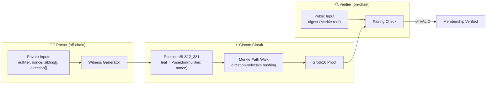

# Poseidon-based Merkle Membership

> **In one sentence:** Prove a secret commitment is in a public Merkle tree without revealing the secret, the leaf, or the path.
>
> **Business angle:** This is the core building block of private airdrops, anonymous voting, and confidential asset registries. A user can prove their account or credential belongs to a published allow-list while keeping the identifier, the leaf, and the Merkle path completely hidden. On Cardano, this lets smart contracts enforce eligibility checks (e.g., “only approved wallets can claim”) without ever publishing the list of approved wallets.

Prove that `Poseidon(nullifier, nonce)` is a leaf of a public Merkle tree.

---

## System overview



**What happens:**
1. **Prover** knows a secret `(nullifier, nonce)` pair and wants to prove it is included in a public Merkle root.
2. **Witness generator** computes the leaf as `Poseidon(nullifier, nonce)` and the leaf-to-root Merkle path.
3. **Circuit** constrains the Poseidon leaf computation and walks the Merkle path, at each level selecting the correct order of the current hash and the sibling hash based on the private direction bit.
4. **Circuit** checks that the final computed root equals the public `digest`.
5. **Verifier** (Aiken smart contract) receives the proof and the public Merkle root, then runs a pairing check to confirm membership — without any private value being revealed.

> **What it proves.** Given a public Merkle root `digest`, the prover demonstrates knowledge of a private `(nullifier, nonce)` and a valid leaf-to-root path such that `digest` is the root of a tree containing `Poseidon(nullifier, nonce)`.

> **Pipeline overview.** This example walks through every artifact produced and consumed by each tool in the stack. Only the witness-generation step uses snarkjs; proving and verifying are done by our own Rust CLI and Aiken on-chain verifier respectively.

---

## Circuit

```
leaf     = PoseidonBLS12_381(nullifier, nonce)
computed = merkle_root(leaf, sibling[], direction[])
digest  === computed
```

| Signal | Visibility | Meaning |
|--------|-----------|---------|
| `digest` | public | Merkle root of the approved set |
| `nullifier` | private | Secret leaf identifier |
| `nonce` | private | Secret leaf blinding factor |
| `sibling[depth]` | private | Sibling hash at each level from leaf to root |
| `direction[depth]` | private | `1` if the sibling is on the left, `0` if on the right |

The Poseidon permutation uses BLS12-381 parameters:
- **State width (t):** 3
- **S-box exponent (alpha):** 5
- **Full rounds (RF):** 8
- **Partial rounds (RP):** 57
- **Total rounds:** 65

Round constants and MDS matrix are from ZeroJ's `PoseidonParamsBLS12_381T3`, generated via the Grain LFSR following the Poseidon paper specification.

---

## Files

| File | Description |
|------|-------------|
| `poseidon_merkle.circom` | Generic `PoseidonMerkle(depth)` template with `IfThenElse`, `SelectiveSwitch`, and Merkle walk |
| `poseidon_merkle_depth2.circom` | Top-level circuit: `PoseidonMerkle(2)` with public `digest` |
| `helpers_py/poseidon_merkle.py` | Python helper: Poseidon hash, sparse Merkle tree, and `input.json` generator |
| `input.json` | Sample witness input for a depth-2 tree with three leaves |

---

## Pipeline — step by step

### Step 0: Generate the witness input (helper)

```bash
cd groth16-prover/circom/PoseidonMerkle
python3 helpers_py/poseidon_merkle.py
```

This writes `input.json` for a depth-2 tree with three commitments:

```json
{
  "digest": "27767334007479604591235432116682333146862525275372337062481971253587464115996",
  "nullifier": "42",
  "nonce": "100",
  "sibling": [
    "40167831797072142495438953750007479172037627641309526282988113076539514524238",
    "3151303060808712839339769101107190003311353059947575224887439515815985614133"
  ],
  "direction": ["0", "0"]
}
```

You can also use the helper as a library:

```python
from helpers_py.poseidon_merkle import compute_input

input_json = compute_input(
    depth=2,
    transcript=[[42, 100], [7, 200], [123, 300]],
    nullifier=42,
)
```

---

### Step 1: Compile the circuit (circom)

**Input:** `poseidon_merkle_depth2.circom` (+ `poseidon_merkle.circom` + `../PoseidonPreimage/poseidon_bls12_381.circom`)

**Outputs:**

| File | What it is |
|------|------------|
| `poseidon_merkle_depth2.r1cs` | Rank-1 constraint system (binary, consumed by the Rust prover) |
| `poseidon_merkle_depth2_js/poseidon_merkle_depth2.wasm` | Witness calculator (WebAssembly, consumed by snarkjs) |
| `poseidon_merkle_depth2.sym` | Symbol file (human-readable wire names, optional) |

```bash
cd groth16-prover/circom/PoseidonMerkle
circom poseidon_merkle_depth2.circom --r1cs --wasm --sym --prime bls12381
```

> **BLS12-381 only.** The `--prime bls12381` flag is required. Without it, Circom defaults to BN254 and the Rust prover will fail at the QAP quotient step. This project does not support BN254.

---

### Step 2: Generate the witness (snarkjs — temporary)

**Input:** `poseidon_merkle_depth2_js/poseidon_merkle_depth2.wasm` (from Step 1) + `input.json`  
**Output:** `witness.wtns` — binary witness file consumed by the Rust prover

```bash
snarkjs wtns calculate poseidon_merkle_depth2_js/poseidon_merkle_depth2.wasm input.json witness.wtns
```

> **Why snarkjs?** Circom produces a `.wasm` witness calculator. Until we have a Rust-native witness generator, snarkjs runs that WASM to produce the `.wtns` file. The proving and verifying steps below use **only** our Rust tools.

---

### Step 3: Run the dev ceremony (groth16-prover CLI)

**Inputs:**
- `poseidon_merkle_depth2.r1cs` — constraints from Step 1

**Outputs:**
- `/tmp/poseidon_merkle_depth2.pk` — binary proving key
- `/tmp/poseidon_merkle_depth2.vk` — binary verifying key

```bash
cd ../../cli
cargo run --release -- ceremony-dev \
  --circuit ../circom/PoseidonMerkle/poseidon_merkle_depth2.r1cs \
  --proving-key /tmp/poseidon_merkle_depth2.pk \
  --verifying-key /tmp/poseidon_merkle_depth2.vk
```

> **What happens.** The CLI loads the `.r1cs`, counts public variables (`n_public = 2` — constant wire + `digest`), then runs a single-party trusted setup.

---

### Step 4: Produce the proof (groth16-prover CLI)

**Inputs:**
- `poseidon_merkle_depth2.r1cs` — constraints from Step 1
- `witness.wtns` — witness from Step 2
- `/tmp/poseidon_merkle_depth2.pk` — proving key from Step 3

**Outputs:**
- `/tmp/poseidon_merkle_depth2.proof` — binary Groth16 proof (192 bytes)
- `/tmp/poseidon_merkle_depth2.pub` — binary public-input commitment (48 bytes)

```bash
cargo run --release -- prove \
  --circuit ../circom/PoseidonMerkle/poseidon_merkle_depth2.r1cs \
  --witness ../circom/PoseidonMerkle/witness.wtns \
  --proving-key /tmp/poseidon_merkle_depth2.pk \
  --engine fft --prover pippenger \
  --out /tmp/poseidon_merkle_depth2.proof
```

The CLI uses `FftQapEngine` + `PippengerProver` internally for fast proof generation.

---

### Step 5: Verify the proof off-chain

```bash
cargo run --release -- verify \
  --proof /tmp/poseidon_merkle_depth2.proof \
  --public /tmp/poseidon_merkle_depth2.pub \
  --verifying-key /tmp/poseidon_merkle_depth2.vk
```

Expected output: `Verification result: VALID`

---

### Step 6: Export the verification key for Aiken

```bash
cargo run --release -- export-vk \
  --verifying-key /tmp/poseidon_merkle_depth2.vk \
  --out /tmp/poseidon_merkle_depth2_vk.ak
```

The generated `/tmp/poseidon_merkle_depth2_vk.ak` is a self-contained Aiken function returning a `VerificationKey`. Because `n_public = 2`, the `ic` list contains two points (constant wire + `digest`).

---

### Step 7: Verify on-chain (Aiken test)

The on-chain verification test is checked in at `aiken/groth16/lib/groth16/verifier.ak`:

```aiken
test test_verify_poseidon_merkle_depth2_proof() {
  verify(
    poseidon_merkle_depth2_proof(),
    [1, 27767334007479604591235432116682333146862525275372337062481971253587464115996],
    poseidon_merkle_depth2_vk(),
  )
}
```

Run it with:

```bash
cd ../../../aiken/groth16
aiken check
```

---

## Notes

- The helper uses the exact same Poseidon permutation parameters as the Circom circuit, so the generated `digest` and siblings are guaranteed to satisfy the constraints.
- The default example is a depth-2 tree. The generic `PoseidonMerkle(depth)` template can be instantiated with any depth by changing the `component main` line in a new top-level `.circom` file.
- All Merkle-path inputs are private; only the root `digest` is public.
