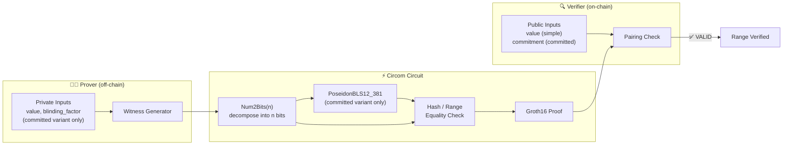

# Range Proof + Poseidon Commitment

> **In one sentence:** Prove a secret number is between 0 and 2^32 — without revealing the number itself.
>
> **Business angle:** This is the mathematical engine behind confidential transactions. A Cardano user can prove "I am sending a valid amount (non-negative and within the uint32 range)" while keeping the exact amount hidden behind a cryptographic commitment. This enables private DeFi, concealed payroll, and regulatory-compliant stablecoin transfers where balances remain secret but range validity is publicly verifiable on-chain.

Prove that a committed value lies in a range `[0, 2^n)` without revealing the value itself. This is the building block for confidential transaction amounts, sealed-bid auctions, and any zk-SNARK application that needs bounded private inputs.

---

## System overview



**What happens (committed variant):**
1. **Prover** knows a secret `value` (e.g., transaction amount) and a secret `blinding_factor`, and wants to prove the value is within a valid range.
2. **Witness generator** decomposes `value` into `n` bits and computes the Poseidon commitment `Poseidon(value, blinding_factor)`.
3. **Circuit** constrains every bit to `{0,1}` (proving `0 ≤ value < 2^n`) and checks that the commitment matches the public commitment, producing a zk-SNARK proof.
4. **Verifier** (Aiken smart contract) receives the proof and the public commitment (or public value for the simple variant), confirms validity via pairing check — the exact amount and blinding factor remain completely secret.


> **Status:** ✅ **Complete.** Both circuits compile, generate witnesses, and produce valid Groth16 proofs end-to-end on BLS12-381.

---

## What it proves

### Circuit A — Simple Range Proof (`RangeProofSimple`)

```
Public:  value
Prove:   value ∈ [0, 2^n)
```

The circuit decomposes `value` into `n` bits and enforces that each bit is either 0 or 1. If `value >= 2^n`, the decomposition would require more than `n` bits, causing a constraint violation.

**Use case:** Proving a counter, timestamp, or index is within bounds. No commitment — the value itself is public.

### Circuit B — Committed Range Proof (`RangeProofCommitted`)

```
Public:  commitment
Private: value, blinding_factor
Prove:   value ∈ [0, 2^n)  AND  commitment == Poseidon(value, blinding_factor)
```

The prover reveals only the commitment (a single field element). The actual value and blinding factor remain secret. The verifier checks:
1. The commitment was correctly formed from the hidden value and blinding factor.
2. The hidden value fits within `n` bits (i.e., is non-negative and less than `2^n`).

**Use case:** Confidential transaction amounts. A user can prove "I know an amount `v` such that `0 <= v < 2^32` and `commit = Poseidon(v, r)`" without revealing `v` or `r`.

---

## Circuit structure

| Circuit | Template | What it does | Constraints |
|---------|----------|--------------|-------------|
| `range_proof_simple.circom` | `RangeProofSimple(n)` | `Num2Bits(n)` decomposition + bit validity | ~`n` |
| `range_proof_committed.circom` | `RangeProofCommitted(n)` | `Num2Bits(n)` + `PoseidonBLS12_381` hash equality | ~`n + 250` |
| `PoseidonBLS12_381` (imported) | `PoseidonBLS12_381()` | BLS12-381 Poseidon permutation (t=3, alpha=5, RF=8, RP=57) | ~250 |
| `Num2Bits` (from circomlib) | `Num2Bits(n)` | Decompose signal into `n` bits, each constrained to `{0,1}` | ~`n` |

**Key design decisions:**
- **Poseidon for commitment:** SNARK-friendly hash (~250 constraints) vs Blake2b (~77K constraints) or SHA-256 (~thousands). We already have `PoseidonBLS12_381` in this repo with BLS12-381 round constants.
- **Num2Bits for range proof:** Standard, minimal-constraint approach. No curve-specific constants — works on any field.
- **BLS12-381 safe:** Unlike Ed25519 (which uses chunked Curve25519 arithmetic), `Num2Bits` and Poseidon are fully compatible with BLS12-381.

---

## Parameter: n = 32

We instantiate both circuits with `n = 32`, proving a 32-bit unsigned integer range:

| Circuit | Constraints | Wires | Dense matrix RAM | Status |
|---------|-------------|-------|------------------|--------|
| `RangeProofSimple(32)` | ~32 | ~35 | ~1 KB | ✅ Working e2e |
| `RangeProofCommitted(32)` | ~282 | ~669 | ~9 KB | ✅ Working e2e |

Both are **orders of magnitude smaller** than our smallest working end-to-end circuit (`PoseidonPreimage` at ~300 constraints). No memory risk.

---

## End-to-end pipeline (validated)

### Circuit A — Simple Range Proof

```bash
# 1. Compile (run from the circuit directory)
cd groth16-prover/circom/RangeProof
circom range_proof_simple.circom --r1cs --wasm --sym --prime bls12381

# 2. Generate witness (value = 123456789, which is < 2^32)
echo '{"value": 123456789}' > input.json
snarkjs wtns calculate range_proof_simple_js/range_proof_simple.wasm input.json witness.wtns

# 3. Dev ceremony (run from cli/)
cd ../../cli
cargo run --release -- ceremony-dev \
  --circuit ../circom/RangeProof/range_proof_simple.r1cs \
  --proving-key /tmp/rp_simple.pk \
  --verifying-key /tmp/rp_simple.vk

# 4. Generate proof
cargo run --release -- prove \
  --circuit ../circom/RangeProof/range_proof_simple.r1cs \
  --witness ../circom/RangeProof/witness.wtns \
  --proving-key /tmp/rp_simple.pk \
  --out /tmp/proof_simple.bin

# 5. Verify
cargo run --release -- verify \
  --proof /tmp/proof_simple.bin \
  --public /tmp/proof_simple.pub \
  --verifying-key /tmp/rp_simple.vk
# → Verification result: VALID
```

**Invalid case (value >= 2^32):**
```bash
cd groth16-prover/circom/RangeProof
echo '{"value": 4294967297}' > input_invalid.json
snarkjs wtns calculate range_proof_simple_js/range_proof_simple.wasm input_invalid.json witness_invalid.wtns
# → ERROR: Assert Failed (Num2Bits constraint violated)
```

### Circuit B — Committed Range Proof

```bash
# 1. Compile (run from the circuit directory)
cd groth16-prover/circom/RangeProof
circom range_proof_committed.circom --r1cs --wasm --sym --prime bls12381

# 2. Generate test inputs with correct Poseidon commitment
#    (commitment must be passed as a STRING to avoid JS precision loss)
python3 -c "
import json
# Poseidon(987654321, 42) = 14552169037149848092889607379555146473462630327079531275196027443808903025477
d = {'commitment': '14552169037149848092889607379555146473462630327079531275196027443808903025477',
     'value': 987654321, 'blinding_factor': 42}
json.dump(d, open('input.json', 'w'))
"

# 3. Generate witness
snarkjs wtns calculate range_proof_committed_js/range_proof_committed.wasm input.json witness.wtns

# 4. Dev ceremony (run from cli/)
cd ../../cli
cargo run --release -- ceremony-dev \
  --circuit ../circom/RangeProof/range_proof_committed.r1cs \
  --proving-key /tmp/rp_committed.pk \
  --verifying-key /tmp/rp_committed.vk

# 5. Generate proof
cargo run --release -- prove \
  --circuit ../circom/RangeProof/range_proof_committed.r1cs \
  --witness ../circom/RangeProof/witness.wtns \
  --proving-key /tmp/rp_committed.pk \
  --out /tmp/proof_committed.bin

# 6. Verify
cargo run --release -- verify \
  --proof /tmp/proof_committed.bin \
  --public /tmp/proof_committed.pub \
  --verifying-key /tmp/rp_committed.vk
# → Verification result: VALID
```

**Invalid case (value out of range, same commitment):**
```bash
cd groth16-prover/circom/RangeProof
python3 -c "
import json
d = {'commitment': '14552169037149848092889607379555146473462630327079531275196027443808903025477',
     'value': 4294967297, 'blinding_factor': 42}
json.dump(d, open('input_invalid.json', 'w'))
"
snarkjs wtns calculate range_proof_committed_js/range_proof_committed.wasm input_invalid.json witness_invalid.wtns
# → ERROR: Assert Failed (Num2Bits constraint violated)
```

---

## ⚠️ Important: JSON integer precision

BLS12-381 field elements are ~255-bit integers (~77 decimal digits). **JavaScript's `Number` type only preserves integers up to 2^53 (~16 decimal digits).** When passing large field elements (like Poseidon commitments) in `input.json`, you must pass them as **strings**, not raw numbers.

**Wrong (loses precision):**
```json
{"commitment": 14552169037149848092889607379555146473462630327079531275196027443808903025477}
```

**Correct (preserves precision):**
```json
{"commitment": "14552169037149848092889607379555146473462630327079531275196027443808903025477"}
```

This is a common pitfall when using snarkjs with BLS12-381. Always use strings for field elements larger than `Number.MAX_SAFE_INTEGER`.

---

## Comparison with other circuits in this repo

| Circuit | Constraints | Wires | Dense matrix RAM | Status |
|---------|-------------|-------|------------------|--------|
| SimpleExample Multiplier | 3 | 8 | ~768 B | ✅ Working e2e |
| **RangeProofSimple(32)** | **32** | **35** | **~1 KB** | ✅ Working e2e |
| **RangeProofCommitted(32)** | **275** | **669** | **~9 KB** | ✅ Working e2e |
| Poseidon Pre-image | ~300 | ~400 | ~5 MB | ✅ Working e2e |
| Privacy / Spend(depth=2) | 1,107 | 1,110 | ~39 MB | ✅ Working e2e |
| Blake2b-224 Pre-image | ~79K | ~78K | ~200 GB | ⏳ Blocked (memory) |
| Ed25519 Verify | ~4M | ~4M | ~512 TB | ⏳ Blocked (field + memory) |

---

## Files

```
RangeProof/
├── range_proof_simple.circom        # Simple range proof (public value)
├── range_proof_committed.circom     # Committed range proof (private value + blinding)
├── package.json                     # npm dependency manifest (circomlib)
├── package-lock.json                # (generated by npm install)
└── README.md                        # This file
```

Dependencies (imported from sibling directories / npm):
- `../PoseidonPreimage/poseidon_bls12_381.circom` — Poseidon permutation
- `../PoseidonPreimage/poseidon_constants_bls12_381.circom` — Round constants
- `circomlib` (via npm) — `Num2Bits`, comparators

---

## References

- [circomlib](https://github.com/iden3/circomlib) — Standard Circom gadgets (`Num2Bits`, comparators)
- [`PoseidonPreimage/README.md`](../PoseidonPreimage/README.md) — Our BLS12-381 Poseidon implementation
- [Poseidon paper](https://eprint.iacr.org/2019/458.pdf) — Original Poseidon hash function specification
- [ZeroJ PoseidonParamsBLS12_381T3](https://github.com/bloxbean/zeroj) — Round constants and MDS matrix source
