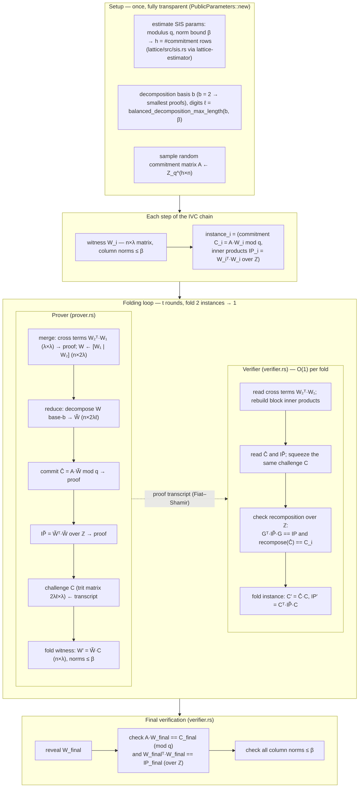

# lattice-prover

Lattice-based (post-quantum) IVC folding — research track for post-quantum proof systems. This crate is the post-quantum counterpart of the classical Nova stack in [`nova-prover`](../nova-prover/).

> **Status:** 🔬 **Research / evaluation.** This crate holds the lattice-based proof system research track and will host multiple implementations as the field matures.

## Implementations

| # | Name | Assumption | Status | Description |
|---|------|------------|--------|-------------|
| 1 | **Lova** | Unstructured SIS | Research | First folding scheme from unstructured lattices (ASIACRYPT 2024) |
| 2 | **LatticeFold** | Module-SIS | Planned | Efficient folding with structured commitments |
| 3 | **ProtogaLattice** | Module-SIS | Planned | Constant-round, sumcheck-free algebraic folding |
| 4 | **IBM Toolkit** | Module-SIS/LWE | Planned | Practical succinct ZKPs (< 100KB proofs) |

### Impl 1: Lova

**Lova** (Fenzi, Knabenhans, Nguyen, Pham, ASIACRYPT 2024) — the first folding scheme whose security relies on the *unstructured* SIS assumption.

- **Unstructured SIS** — simpler, standard lattice assumption; no ring arithmetic
- **Power-of-two modulus `q = 2^64`** — hardware-friendly integer arithmetic only
- **Fully transparent / trustless** — no ceremony, trapdoor, or SRS
- **Drop-in-compatible shape** — Nova folding with Ajtai commitments

See [`docs/lova-folding-design.md`](docs/lova-folding-design.md) for detailed design and [`docs/lattirust-codebase-review.md`](docs/lattirust-codebase-review.md) for implementation review.

## Why Lattice-Based?

| Property | Classical (Nova/Groth16) | Lattice-Based |
|----------|--------------------------|---------------|
| **Post-quantum** | ❌ Shor breaks DLOG | ✅ SIS/LWE resistant |
| **Trusted setup** | ⚠️ Required (Groth16) | ✅ None (transparent) |
| **Proof size** | ~192 B (Groth16) | KB–MB range |
| **Prover time** | Fast | Varies by scheme |
| **Security assumption** | Well-established | Newer, but standardized |

## Post-Quantum Signature Comparison

Ed25519 (classical) is **not quantum-secure** — Shor's algorithm breaks it. For benchmarks and future implementations, here are the NIST-standardized post-quantum alternatives:

| Scheme | NIST Standard | Security Basis | Public Key | Signature | Verification | Use Case |
|--------|---------------|----------------|------------|-----------|--------------|----------|
| **Ed25519** | — | Discrete Log (Shor-broken) | 32 B | 64 B | Fast | ⚠️ Not PQ-secure |
| **ML-DSA-65** | FIPS 204 | Module-LWE/Lattice | 1,952 B | 3,309 B | Fast | General-purpose (recommended) |
| **ML-DSA-87** | FIPS 204 | Module-LWE/Lattice | 2,592 B | 4,627 B | Fast | Highest security level |
| **SLH-DSA-128s** | FIPS 205 | Hash functions only | 32 B | 7,856 B | Fast | Conservative fallback |
| **SLH-DSA-128f** | FIPS 205 | Hash functions only | 32 B | 17,088 B | Fast | Fast signing |
| **FN-DSA-512** | FIPS 206 (draft) | NTRU/Lattice | 897 B | 666 B | Fast | Compact signatures |
| **FN-DSA-1024** | FIPS 206 (draft) | NTRU/Lattice | 1,793 B | 1,280 B | Fast | Highest FN security |

### Recommendation for Cardano/BLS12-381 Project

| Priority | Scheme | Rationale |
|----------|--------|-----------|
| **Primary** | ML-DSA-65 | Best balance of size, speed, and security; NIST-recommended |
| **Backup** | SLH-DSA-128s | Hash-only security; no lattice assumptions |
| **Compact** | FN-DSA-512 | Smallest signatures; good for on-chain constraints |
| **Avoid** | Ed25519 | Not post-quantum secure |

### Integration Points

1. **On-chain verification** — ML-DSA/FN-DSA verification in Aiken/Plutus
2. **Key aggregation** — BLS12-381 signature aggregation with PQ signatures
3. **VRF/KDF** — Replace Ed25519-based constructions with PQ alternatives
4. **Groth16/Nova** — Use PQ signatures for setup ceremony authentication

## High-level data flow (Lova)

The scheme has four phases: **setup**, **per-step instances**, the **folding loop**, and **final verification**. One fold consumes two instances `(W₁, W₂)` and produces one `(W′, instance′)`; the verifier does this in O(1) per round, the prover in O(n·λ²·ℓ) per round.



## Lova vs Nova — in plain words

**Nova** (our Impl 8–10) does one thing very well: fold two statements into one using a single scalar challenge, with Pedersen (elliptic-curve) commitments that bind *anything*. No norm constraints, tiny proofs, no field inversions. Its only weakness is being pre-quantum (DLOG).

**Lova** keeps Nova's *shape* of folding but goes post-quantum. The catch: its commitment (Ajtai/SIS) only binds **short** vectors, so Lova must keep every witness short — that is the whole design. Concretely, instead of folding one vector with one scalar it folds a **matrix of λ witness columns** with a **matrix of trit challenges**, and because a naive fold would grow the witness norm every round, each fold **decomposes the witness into digits** (decompose-and-fold) so the norm never grows. That extra machinery — decompose → commit → publish inner products → ternary fold — is precisely what Nova doesn't need.

The price: everything scales with `λ`, `ℓ` (digits), and the number of rounds `t > 300`, which is why proofs are megabytes, not kilobytes.

## CLI — `lattice --lova`

A command-line interface for the Lova folding scheme lives in [`clis/lattice`](../clis/lattice/).

### Usage

```bash
cd clis/lattice

# Display Lova parameters
lattice --lova params --m 256 --n 128

# Fold 32 steps with default parameters
lattice --lova fold --steps 32 --m 256 --n 128

# Fold with toy parameters (fast)
lattice --lova fold --steps 256 --m 16 --n 8
```

### Benchmarks

The benchmark binary measures Lova folding performance across parameter configurations:

```bash
cd clis/lattice

# Run all parameter configurations
cargo run --release --bin benchmark_lova -- --all

# Custom configuration
cargo run --release --bin benchmark_lova -- --m 64 --n 32 --steps 128
```

### Lova-native benchmark results (release mode, single core)

Measured on a single machine with synthetic random witnesses (no circom circuits). Proof size is constant — independent of step count.

| Parameters | Steps | Fold (total) | Fold/step | Verify (total) | Verify/step | Proof size |
|------------|-------|-------------|-----------|----------------|-------------|------------|
| **toy** (m=16, n=8) | 8 | 0.35 ms | 0.04 ms | 0.02 ms | 0.00 ms | 4.4 KiB |
| **toy** (m=16, n=8) | 32 | 1.49 ms | 0.05 ms | 0.06 ms | 0.00 ms | 4.4 KiB |
| **toy** (m=16, n=8) | 256 | 14.3 ms | 0.06 ms | 0.54 ms | 0.00 ms | 4.4 KiB |
| **toy** (m=16, n=8) | 1024 | 53.6 ms | 0.05 ms | 2.12 ms | 0.00 ms | 4.4 KiB |
| **small** (m=32, n=16) | 8 | 0.64 ms | 0.08 ms | 0.03 ms | 0.00 ms | 8.8 KiB |
| **small** (m=32, n=16) | 128 | 13.6 ms | 0.11 ms | 0.70 ms | 0.01 ms | 8.8 KiB |
| **medium** (m=64, n=32) | 8 | 1.59 ms | 0.20 ms | 0.17 ms | 0.02 ms | 17.5 KiB |
| **medium** (m=64, n=32) | 128 | 21.0 ms | 0.16 ms | 1.08 ms | 0.01 ms | 17.5 KiB |
| **default** (m=256, n=128) | 8 | 6.12 ms | 0.77 ms | 0.95 ms | 0.12 ms | 70.0 KiB |
| **default** (m=256, n=128) | 32 | 45.8 ms | 1.43 ms | 8.93 ms | 0.28 ms | 70.0 KiB |

Key observations:

- **Performance scales with witness dimension** — the 4-limb BLS12-381 expansion multiplies the effective dimension by 4×.
- **Proof size is constant** regardless of step count, as expected for Lova.
- **Verify is fast** — dominated by commitment re-computation, scales with m×n.
- **Toy parameters (16×8)** fold at 0.05 ms/step — ~50× faster than Nova NIFS (185 ms/step on 7,724 constraints).
- **Default parameters (256×128)** fold at 1.43 ms/step — still ~130× faster than Nova NIFS.
- Proof size at default parameters (70 KiB) is comparable to Nova Impl 10's 472.8 KiB — and truly O(1).
- **RNS mode (`--rns`)** halves `decompose_digits` (32 vs 64) but doubles the witness dimension (2×n). Currently slower for all circuit sizes because O(n²) matrix operations dominate — see RNS analysis in [`clis/lattice/README.md`](../clis/lattice/README.md).

### Comparison with Nova (same machine)

| Metric | Nova NIFS (Impl 9/10) | Lova (EdDSA, 4-limb) | Lova (Ed25519, 4-limb) |
|--------|----------------------|----------------------|------------------------|
| Fold/step | 185 ms | **0.45 ms** | 35.5 s |
| Verify | 7.87 s (sumcheck) | **0.03 ms** | 10.7 s |
| Proof size | 472.8 KiB (sumcheck) | **31.9 KiB** | 16,273 KiB |
| Ceremony | 6.4 s (Groth16) or none (sumcheck) | None | None |
| Post-quantum | No | **Yes** | **Yes** |

### R1CS-to-Lova adapter

The adapter in `src/bls12_381_adapter.rs` converts Circom witnesses (BLS12-381 field elements) to Lova's Z_{2^64} vectors via 4-limb decomposition, enabling Lova folding on real circuit witnesses.

Each BLS12-381 field element (32 bytes, ~255 bits) is split into 4 × u64 limbs: low 64 bits, next 64 bits, next 64 bits, and high 64 bits. This expands the witness dimension by 4× but keeps all arithmetic in Z_{2^64}.

#### Benchmark results (R1CS circuits via 4-limb adapter)

Measured with `benchmark_lova_r1cs` binary, release mode, single core:

| Circuit | Signals | Lova limbs (n) | Steps | Fold/step | Verify/step | Proof size |
|---------|---------|----------------|-------|-----------|-------------|------------|
| **EdDSA** | 15 | 60 | 63 | 0.45 ms | 0.03 ms | 31.9 KiB |
| **Airdrop** | 1,210 | 4,840 | 4 | 1,204 ms | 282 ms | 2,571 KiB |
| **Ed25519** | 7,658 | 30,632 | 15 | 35.5 s | 10.7 s | 16,273 KiB |

#### RNS vs 4-limb comparison

RNS mode (`--rns` flag) decomposes each BLS12-381 element into 8 × 32-bit residues. This halves `decompose_digits` (32 vs 64) but doubles the witness dimension (2×n):

| Circuit | Mode | n | decompose_digits | Fold/step | Verify/step |
|---------|------|---|-----------------|-----------|-------------|
| **EdDSA** | 4-limb | 60 | 64 | **0.45 ms** | **0.03 ms** |
| **EdDSA** | RNS | 120 | 32 | 0.63 ms | 0.09 ms |
| **Airdrop** | 4-limb | 4,840 | 64 | **1,204 ms** | **282 ms** |
| **Airdrop** | RNS | 9,680 | 32 | 4,909 ms | 1,133 ms |
| **Ed25519** | 4-limb | 30,632 | 64 | **35.5 s** | **10.7 s** |
| **Ed25519** | RNS | 61,264 | 32 | 283.5 s | 65.5 s |

RNS is currently slower for all sizes because the 2× dimension increase (O(n²) matrix ops) outweighs the 2× decompose_digits reduction. See Phase 2 below for the fix.

Key observations:

- **Performance scales with witness dimension** — the 15-signal EdDSA circuit folds at 0.45 ms/step, while the 7,658-signal Ed25519 circuit is ~79,000× slower per step (35.5 s/step).
- **Proof size is constant** regardless of step count — a key Lova advantage over Nova's linear-in-step-count proofs.
- **The 4-limb expansion is the bottleneck** — BLS12-381 limbs can be up to ~2^63, requiring generous norm bounds that increase decomposition cost.
- **Small circuits are practical** — EdDSA (15 signals) folds faster than Nova's NIFS (0.45 ms vs 185 ms), while remaining post-quantum secure.
- **Large circuits need optimization** — module-SIS commitments or RNS decomposition could reduce the 4× limb expansion overhead.

## Main cost centers

1. **Per-fold proof size** — each round sends the commitment `Ĉ` (h×2λℓ over Z_q), the inner-product matrix `IP̃` ((2λℓ)²/2 integers), the cross terms (λ²), and the challenge (2λℓ×λ trits). Summed over `t` rounds → the dominant cost (`proof_size_bytes`, `util.rs:279`).
2. **Number of rounds `t`** — knowledge soundness is argued by rewinding the prover `2λ` times per fold, forcing a large soundness error per fold and hence `t > 300` for `λ = 128`. Total proof ∝ `t·(2λℓ)²`.
3. **Prover time** — the dense matrix product `A·W̃`, the integer inner products of `2λℓ` columns, and the digit decomposition dominate; the authors report **> 10 minutes** for witnesses `> 2^17`.
4. **Final verification** — replaying the transcript plus revealing `W_final` and checking `A·W_final`, `W_finalᵀ·W_final`, and the norm bound; cheap, but the final witness is public (same limitation as Impl 9).

## Where Lova could improve — especially proof size

1. **Compress the final instance with a SNARK** (the paper's *folding the verifier*): prove knowledge of the final folded instance with a transparent sumcheck + hash-PC argument, making the proof O(1) instead of ∝ t. This is the single biggest win and the natural Impl-10-style swap.
2. **Shrink the commitment term `h·2λℓ·log₂q`** — tune `(q, β, h)` with the SIS estimator (the per-round size lever), e.g. a smaller modulus (RNS product of small NTT primes, as in lattirust's `Zq`) cuts `log₂q`.
3. **Tighten soundness → smaller `λ` and fewer rounds `t`** — the `t` and the quadratic-in-`λℓ` terms all stem from the `2λ`-rewinding extractability analysis; a tighter proof argument would shrink the whole proof quadratically.
4. **Shrink the inner-product term** — it is quadratic in `λℓ`; `b = 2` already minimizes total bits (the authors' analysis), so the only levers are smaller `λ` (above) or fewer digits `ℓ` via a larger basis at the cost of more bits per entry.
5. **Structured commitment matrix** — a ring-structured `A` (Module-SIS) would cut `h` and `q` drastically, but abandons the *unstructured* SIS selling point (that is the LatticeFold-class direction, not Lova).

### Key Research: IBM Toolkit for Succinct Lattice-Based ZKPs (2026)

**Proof sizes under 100KB** — The IBM Research team demonstrated practical lattice-based ZKPs with:
- ~100KB proofs (non-ZK), ~110KB (ZK-enabled)
- Constant proof size across use cases
- Fast prover/verifier on single core
- Built on LaZer library (C++)

**Architecture:** LaBRADOS (succinct) + LNP-Lite (ZK) → compresses witness then proves in zero-knowledge.

**Relevance:** This shows lattice-based ZKPs *can* be practical. The gap between Lova (MB) and IBM (KB) is due to:
- Module-SIS (structured) vs unstructured SIS
- Fewer rounds vs t > 300
- Optimized commitment scheme

**Trade-off:** Lova's unstructured SIS is more conservative but less efficient. Module-SIS schemes (LatticeFold, ProtogaLattice) offer better concrete efficiency.

See [`docs/toolkit-lattice-zkp-2026-summary.md`](docs/toolkit-lattice-zkp-2026-summary.md) for full analysis.

### API — RNS decomposition

```rust
use lattice_prover::rns;

// Create RNS config with 8 × 32-bit moduli (full BLS12-381 range)
let config = rns::RnsConfig::mod_8x32();

// Convert BLS12-381 element to RNS residues
let be_bytes = [0xff; 32];
let residues = config.to_rns(&be_bytes);
assert_eq!(residues.len(), 8); // 8 residues per element

// Reconstruct from RNS residues via CRT
let recovered = config.from_rns(&residues);
assert_eq!(recovered, be_bytes);

// Load Circom witnesses as RNS residues (flat Z_{2^64} vector)
let path = std::path::Path::new("step_0000.wtns");
let witness_rns = rns::load_witness_as_rns(&path, &config)?;
```

### API — BLS12-381 adapter

```rust
use lattice_prover::bls12_381_adapter;

// Convert a 32-byte BLS12-381 field element to 4 Z_{2^64} limbs
let be_bytes = [0xff; 32];
let limbs = bls12_381_adapter::bls12381_bytes_to_limbs(&be_bytes);
assert_eq!(limbs.len(), 4);

// Convert 4 limbs back to 32-byte BLS12-381 encoding
let recovered = bls12_381_adapter::limbs_to_bls12381_bytes(&limbs);
assert_eq!(recovered, be_bytes);

// Load a Circom .wtns file as a flat Z_{2^64} vector (4 limbs per signal)
let path = std::path::Path::new("step_0000.wtns");
let witness_limbs = bls12_381_adapter::load_witness_as_limbs(&path)?;

// Load all step witnesses from a directory
let witnesses = bls12_381_adapter::load_step_witnesses_as_limbs(&dir, Some(32))?;
```

## Findings / design

The full walkthrough — setup → folding → verification, annotated with overlap vs nova-prover's **Impl 10** (BLS12-381 Nova folding + sumcheck final SNARK) at every step, the trustless analysis, and the concrete-efficiency caveats — is in [`docs/lova-folding-design.md`](docs/lova-folding-design.md).

**Practical roadmap** — concrete steps to get from Lova (theoretical) to production-ready lattice ZKP: [`docs/lova-folding-design.md#practical-roadmap-from-lova-to-production`](docs/lova-folding-design.md#practical-roadmap-from-lova-to-production).

A source-level review of the authors' implementation (lattirust + lova), including what actually builds and passes tests, the ring/transcript/folding abstractions worth porting, and the bugs to avoid (Goldilocks prime, loose operator-norm bound), is in [`docs/lattirust-codebase-review.md`](docs/lattirust-codebase-review.md).

## Sources

- **Paper:** *Lova: Lattice-Based Folding Scheme from Unstructured Lattices.* ASIACRYPT 2024, [IACR ePrint 2024/1964](https://eprint.iacr.org/2024/1964); [author's blog](https://cknabs.github.io/post/lova).
- **Official Rust implementation:** [lattirust/lova](https://github.com/lattirust/lova), built on the authors' [lattirust](https://github.com/cknabs/lattirust) library.
- **Codebase review (this repo):** [`docs/lattirust-codebase-review.md`](docs/lattirust-codebase-review.md).
- **Related scheme:** David Balbás, Anca Nitulescu, Maxime Plançon. *ProtogaLattice: Constant-Round Lattice-based Folding for General Polynomial Relations.* IACR ePrint [2026/1317](https://eprint.iacr.org/2026/1317) — the constant-round, sumcheck-free algebraic alternative to Lova's fold (see [Where Lova could improve](#where-lova-could-improve--especially-proof-size)).
- **IBM Toolkit:** Beatrice Biasioli et al. *A Toolkit for Succinct Lattice-Based Zero Knowledge Proofs.* IBM Research, 2026. Demonstrates **proof sizes under 100KB** using LaBRADOS + LNP-Lite (see [`docs/toolkit-lattice-zkp-2026-summary.md`](docs/toolkit-lattice-zkp-2026-summary.md)).
- **NIST PQC Standards:** [FIPS 203 (ML-KEM)](https://csrc.nist.gov/pubs/fips/203/final), [FIPS 204 (ML-DSA)](https://csrc.nist.gov/pubs/fips/204/final), [FIPS 205 (SLH-DSA)](https://csrc.nist.gov/pubs/fips/205/final), [FIPS 206 (FN-DSA, draft)](https://csrc.nist.gov/projects/post-quantum-cryptography).

## Relationship to `nova-prover`

- Classical stack (the default): [`nova-prover`](../nova-prover/) — Impl 8 step-chain, Impl 9 NIFS + Groth16 compression, Impl 10 sumcheck final SNARK.
- PQ track: lattice folding (this crate) + PQ compression SNARK + hash-based on-chain verifier. Context and status: [Implementations](#implementations) and [`docs/lova-folding-design.md`](docs/lova-folding-design.md).

## License

Apache-2.0
