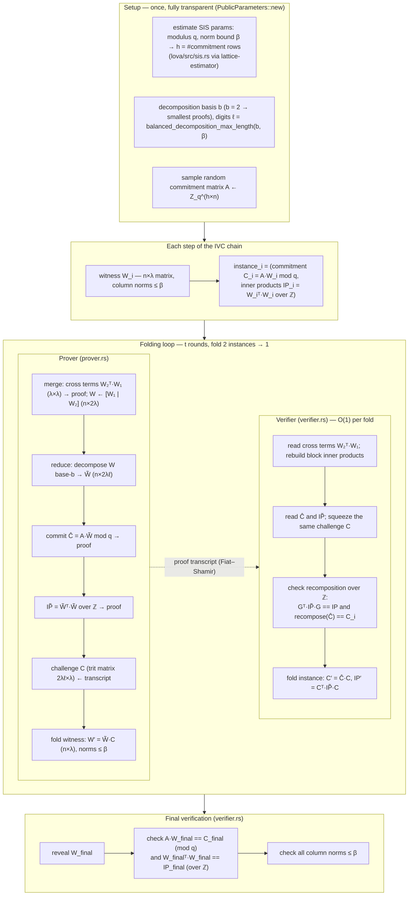

# lova-prover

Lattice-based (post-quantum) IVC folding — research track for **Lova** (Fenzi, Knabenhans, Nguyen, Pham, ASIACRYPT 2024), the first folding scheme whose security relies on the *unstructured* SIS assumption. This crate is the post-quantum counterpart of the classical Nova stack in [`nova-prover`](../nova-prover/).

> **Status:** 🔬 **Research / evaluation.** No code yet. Lova is the post-quantum counterpart of the classical Nova stack in [`nova-prover`](../nova-prover/) — a long-term item, not a committed path. This crate holds the research track and will host the lattice IVC prover if/when it is pursued.

## Why Lova

- **Unstructured SIS** (vs. Module-SIS for LatticeFold) — a simpler, standard lattice assumption; no ring arithmetic.
- **Power-of-two modulus `q = 2^64`** — hardware-friendly integer arithmetic only; no finite-field library, no inversions, no `Fr` big-int ops.
- **Fully transparent / trustless** — public random matrix `A`, public-coin Fiat–Shamir, no ceremony, trapdoor, or SRS.
- **Drop-in-compatible shape** — Nova folding is commitment-agnostic (any additively-homomorphic commitment); swapping Pedersen (DLOG-based, Shor-broken) for an Ajtai commitment makes the fold post-quantum with the same IVC structure.

## High-level data flow (startup → verification)

The scheme has four phases: **setup**, **per-step instances**, the **folding loop**, and **final verification**. One fold consumes two instances `(W₁, W₂)` and produces one `(W′, instance′)`; the verifier does this in O(1) per round, the prover in O(n·λ²·ℓ) per round.

## Lova vs Nova — in plain words

**Nova** (our Impl 8–10) does one thing very well: fold two statements into one using a single scalar challenge, with Pedersen (elliptic-curve) commitments that bind *anything*. No norm constraints, tiny proofs, no field inversions. Its only weakness is being pre-quantum (DLOG).

**Lova** keeps Nova's *shape* of folding but goes post-quantum. The catch: its commitment (Ajtai/SIS) only binds **short** vectors, so Lova must keep every witness short — that is the whole design. Concretely, instead of folding one vector with one scalar it folds a **matrix of λ witness columns** with a **matrix of trit challenges**, and because a naive fold would grow the witness norm every round, each fold **decomposes the witness into digits** (decompose-and-fold) so the norm never grows. That extra machinery — decompose → commit → publish inner products → ternary fold — is precisely what Nova doesn't need.

The price: everything scales with `λ`, `ℓ` (digits), and the number of rounds `t > 300`, which is why proofs are megabytes, not kilobytes.

## Main cost centers

1. **Per-fold proof size** — each round sends the commitment `Ĉ` (h×2λℓ over Z_q), the inner-product matrix `IP̃` ((2λℓ)²/2 integers), the cross terms (λ²), and the challenge (2λℓ×λ trits). Summed over `t` rounds → the dominant cost (`proof_size_bytes`, `util.rs:279`).
2. **Number of rounds `t`** — knowledge soundness is argued by rewinding the prover `2λ` times per fold, forcing a large soundness error per fold and hence `t > 300` for `λ = 128`. Total proof ∝ `t·(2λℓ)²`.
3. **Prover time** — the dense matrix product `A·W̃`, the integer inner products of `2λℓ` columns, and the digit decomposition dominate; the authors report **> 10 minutes** for witnesses `> 2^17`.
4. **Final verification** — replaying the transcript plus revealing `W_final` and checking `A·W_final`, `W_finalᵀ·W_final`, and the norm bound; cheap, but the final witness is public (same limitation as Impl 9).

## Where Lova could improve — especially proof size

1. **Compress the final instance with a SNARK** (the paper's *folding the verifier*): prove knowledge of the final folded instance with a transparent sumcheck + hash-PC argument, making the proof O(1) instead of ∝ t. This is the single biggest win and the natural Impl-10-style swap.
2. **Shrink the commitment term `h·2λℓ·log₂q`** — tune `(q, β, h)` with the SIS estimator (the per-round size lever), e.g. a smaller modulus (RNS product of small NTT primes, as in lattirust's `Zq`) cuts `log₂q`.
3. **Tighten soundness → smaller `λ` and fewer rounds `t`** — the `t` and the quadratic-in-`λℓ` terms all stem from the `2λ`-rewinding extractability analysis; a tighter proof argument would shrink the whole proof quadratically.
4. **Shrink the inner-product term** — it is quadratic in `λℓ`; `b = 2` already minimizes total bits (the authors' analysis), so the only levers are smaller `λ` (above) or fewer digits `ℓ` via a larger basis at the cost of more bits per entry.
5. **Structured commitment matrix** — a ring-structured `A` (Module-SIS) would cut `h` and `q` drastically, but abandons the *unstructured* SIS selling point (that is the LatticeFold-class direction, not Lova).

## Findings / design

The full walkthrough — setup → folding → verification, annotated with overlap vs nova-prover's **Impl 10** (BLS12-381 Nova folding + sumcheck final SNARK) at every step, the trustless analysis, and the concrete-efficiency caveats — is in [`docs/lova-folding-design.md`](docs/lova-folding-design.md).

A source-level review of the authors' implementation (lattirust + lova), including what actually builds and passes tests, the ring/transcript/folding abstractions worth porting, and the bugs to avoid (Goldilocks prime, loose operator-norm bound), is in [`docs/lattirust-codebase-review.md`](docs/lattirust-codebase-review.md).

## Sources

- **Paper:** *Lova: Lattice-Based Folding Scheme from Unstructured Lattices.* ASIACRYPT 2024, [IACR ePrint 2024/1964](https://eprint.iacr.org/2024/1964); [author's blog](https://cknabs.github.io/post/lova).
- **Official Rust implementation:** [lattirust/lova](https://github.com/lattirust/lova), built on the authors' [lattirust](https://github.com/cknabs/lattirust) library.
- **Codebase review (this repo):** [`docs/lattirust-codebase-review.md`](docs/lattirust-codebase-review.md).
- **Related scheme:** David Balbás, Anca Nitulescu, Maxime Plançon. *ProtogaLattice: Constant-Round Lattice-based Folding for General Polynomial Relations.* IACR ePrint [2026/1317](https://eprint.iacr.org/2026/1317) — the constant-round, sumcheck-free algebraic alternative to Lova's fold (see [Where Lova could improve](#where-lova-could-improve--especially-proof-size)).

## Relationship to `nova-prover`

- Classical stack (the default): [`nova-prover`](../nova-prover/) — Impl 8 step-chain, Impl 9 NIFS + Groth16 compression, Impl 10 sumcheck final SNARK.
- PQ track: lattice folding (this crate) + PQ compression SNARK + hash-based on-chain verifier. Context and status: [Why Lova](#why-lova) and [`docs/lova-folding-design.md`](docs/lova-folding-design.md).

## License

Apache-2.0
