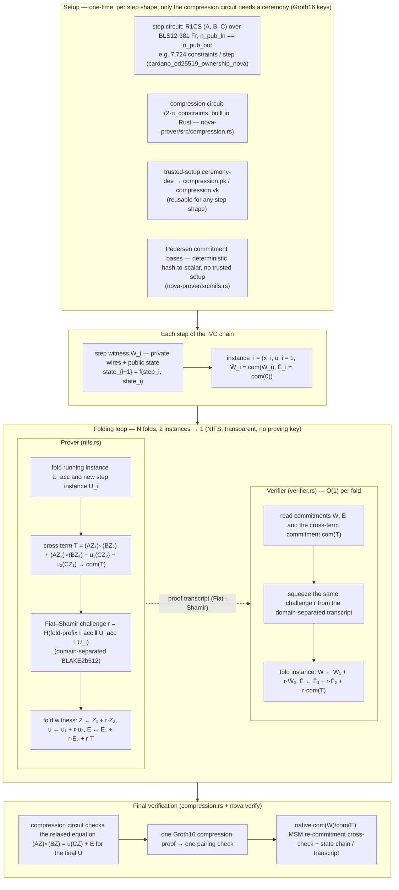

# nova-prover

Nova IVC folding for BLS12-381 (arkworks) — the **step-chain** implementation
("Implementation 8") and the roadmap toward constant-size folding.

A long computation is decomposed into `N` identical step circuits, each proving
`state_{i+1} = f(step_i, state_i)`. The `fold` operation runs a chain of
Groth16 proofs over the step witnesses — every step proof is individually
verifiable and the state chain is bound by a BLAKE2b512 transcript — while
`verify` re-checks the whole chain.

The proof-system core (R1CS/QAP/engine, ceremony, circom adapter, prover)
lives in `groth16-prover` / `trusted-setup`; this crate adds the IVC layer.
The `nova` CLI (`clis/nova`) wraps this crate's operations.

## How to use

```bash
# Inspect a step circuit (validates the n_pub_in == n_pub_out invariant)
nova params --circuit step_circuit.r1cs

# Single-party ceremony for a step circuit (per-step Groth16 keys)
nova ceremony --circuit step_circuit.r1cs --proving-key step.pk --verifying-key step.vk

# Fold step witnesses into an IVC bundle
nova fold --circuit step_circuit.r1cs --proving-key step.pk --steps ./step_witnesses/ --out bundle.ivc.json

# Verify a folded IVC bundle (pairings + chain + transcript)
nova verify --ivc bundle.ivc.json --verifying-key step.vk
```

**Implementation 9 (NIFS, constant-time verify)** — no per-step proving key:

```bash
# Fold the step witnesses into one Relaxed-R1CS instance + emit the compression circuit
nova fold --nifs --circuit step_circuit.r1cs --steps ./step_witnesses/ --out bundle.ivc.json \
  --compression-r1cs compression.r1cs

# One-time ceremony for the compression circuit
trusted-setup ceremony-dev --sparse --circuit compression.r1cs \
  --proving-key compression.pk --verifying-key compression.vk

# Compress the final instance into one Groth16 proof
nova compress --groth16 --circuit step_circuit.r1cs --steps ./step_witnesses/ \
  --proving-key compression.pk --out compression.proof.json

# Verify: one pairing check + native commitments + transcript
nova verify --ivc bundle.ivc.json --compression-proof compression.proof.json --compression-vk compression.vk
```

**Implementation 10 (sumcheck compression, no ceremony):**

```bash
# Fold + sumcheck-compress in two steps (no proving key, no ceremony)
nova fold --nifs --circuit step_circuit.r1cs --steps ./step_witnesses/ --out bundle.ivc.json
nova compress --circuit step_circuit.r1cs --steps ./step_witnesses/ --out sumcheck.proof.json

# Verify (no verifying key needed)
nova verify --ivc bundle.ivc.json --sumcheck-proof sumcheck.proof.json

# Slim on-chain proof (strips HashPC opening proofs — ~98% smaller)
nova compress --slim --circuit step_circuit.r1cs --steps ./step_witnesses/ --out slim.proof.json
nova verify --ivc bundle.ivc.json --slim-proof slim.proof.json
```

The full step-by-step worked example (`cardano_ed25519_ownership_nova` — 255
steps over the Cardano Ed25519 ownership circuit) is in
[`circom/CardanoKeyOwnership/README.md`](../circom/CardanoKeyOwnership/README.md)
(Variant B, "End-to-end flow — Implementation 8 (Nova step-chain)").

## Design

The complete Nova explanation — folding mechanics, comparison with recursive
arguments (Halo2, CIRCOM-recursive), design decisions for our stack — is in
[`docs/nova-folding-design.md`](docs/nova-folding-design.md).

## High-level data flow (setup → folding → verification)

The scheme has four phases: **setup**, **per-step instances**, the **folding loop**, and **final verification**. One fold consumes two Relaxed-R1CS instances `(U₁, U₂)` and produces one `(U′, W′)`; the verifier folds the instance commitments in O(1) per step, the prover in O(step size) per step. The diagram shows the Implementation 9 NIFS flow (`nova fold --nifs` → `compress` → `verify`).



## Implementation 8 (Nova IVC + compression SNARK)

<details>
<summary><b>Implementation 8 — click to expand</b></summary>

> **Status:** ✅ **Done (POC).** An end-to-end Nova CLI (`nova params / ceremony / fold / verify`) is implemented in the `nova-prover` library + `clis/nova` CLI and smoke-tested on four step circuits (Ed25519Verify, EdDSA-JubJub, CardanoKeyOwnership—Ed25519, AnonymousAirdrop). It proves each step as a **standalone Groth16 proof** and binds the state chain with a BLAKE2b512 transcript. The POC validates the step-decomposition + incremental-proving approach end to end. The full Nova **Relaxed-R1CS folding + compression SNARK** (constant-time proof, no per-step Groth16) is shipped as **Implementation 9** below.
>
> **Goal:** Eliminate the circuit-specific trusted setup entirely for computations that exceed monolithic Groth16 feasibility (~4M+ constraints), and enable incremental proving where each step fits in memory.

### Problem statement (measured after Implementation 7)

After Implementation 7, proving is no longer the e2e bottleneck. The ceremony is:

| Circuit | Ceremony (monolithic Groth16) | % of e2e time |
|---------|------------------------------|---------------|
| Ed25519Verify (~4M) | ~16 min | ~89 % |
| CardanoKeyOwnership (~1.97M) | ~5 min | ~83 % |
| Hypothetical 10M circuit | ~1+ hour / impossible | — |

The ceremony produces `O(n_vars)` group elements. Unlike proving, there is no `h_scalar`-style algebraic shortcut — the cost is fundamentally tied to circuit size.

### What Nova / IVC does

**Incremental Verifiable Computation** splits a computation into **step circuits** of ~40K constraints each:

```
state_{i+1} = f(step_i, state_i)
```

Each step is proven and **folded** into a running accumulator using a **Relaxed R1CS** scheme. The folding operation is transparent (no SRS). At the end, a small **compression SNARK** (Groth16 over ~100K constraints) proves the accumulator is valid.

| Property | Monolithic Groth16 | Nova IVC |
|----------|-------------------|----------|
| **Total constraints** | C | N × (step_size + overhead) ≈ C + N·overhead |
| **Per-step constraints** | C (all at once) | ~40K–60K |
| **Trusted setup** | Per-circuit, SRS ∝ C | **None** for folding; one ~10–20 s ceremony for compression SNARK |
| **Memory peak** | O(C) — ~3 GiB for 4M | O(step_size) — ~50–100 MiB per step |
| **Proving time** | O(C log C) in one batch | O(N · step_size log step_size) incremental |
| **Proof size** | 192 bytes | ~500 bytes (IVC) + 192 bytes (compression) |
| **Verifier** | One pairing check | Pairing check + IVC accumulator check |

**Important:** The total number of constraints does **not** shrink — it grows slightly (~10K–30K overhead per step). The gain is not "circuit slimming"; it is **ceremony elimination** and **per-step memory scaling**.

### What Nova actually invented: recursion you can afford (the friendly version)

Nova IVC splits a large computation into small step circuits (~40K constraints each) and proves each step incrementally. The key innovation is **folding** — a transparent, linear-time algebraic operation that combines two instances of the same step circuit into a single "relaxed" accumulator instance, valid exactly when both inputs were, without ever re-verifying previous steps. The current POC proves each step as a standalone Groth16 proof and binds the chain with a BLAKE2b512 transcript (N proofs, N pairing checks, bundle O(N)). The production-grade path (Implementation 9) replaces the chain with a single compression SNARK — folding N step instances into one Relaxed-R1CS running instance, then proving it with one Groth16 proof verified with a single pairing check (O(1) bundle, O(1) verify). The compression SNARK is a standard Groth16 circuit (~100K constraints), so our existing `FftQapEngine`, `PippengerProver`, `FullProvingKey` ceremony, and `aiken/groth16` verifier all apply unchanged. Per-step memory drops from O(total constraints) to O(step size), unlocking circuits that currently OOM on commodity hardware. See [docs/nova-folding-design.md](docs/nova-folding-design.md) for the full Nova explanation, folding mechanics, comparison with alternatives, and design decisions for our stack.

### Why this is Implementation 8 (not just research)

1. **Ceremony-agnostic deployment.** Run the compression SNARK setup once (~10–20 s), then reuse it for any IVC computation. New circuits do not need new ceremonies.
2. **Memory scaling.** Per-step memory drops from ~3 GiB (4M constraints) to ~50–100 MiB. This unlocks 10M+ constraint circuits that currently OOM even with sparse matrices.
3. **Composable with existing stack.** The compression SNARK is a standard Groth16 circuit (~100K constraints). Our existing `FftQapEngine`, `PippengerProver`, `aiken/groth16` verifier, and `FullProvingKey` ceremony all apply unchanged. The new work is the IVC prover layer above them.
4. **Enables recursive proof aggregation.** Batch N independent proofs into one IVC chain, then compress to a single Groth16 proof. On-chain verifier cost drops from O(N) pairing checks to O(1).

### Projected gains for our circuits

| Circuit | Monolithic Groth16 | Nova fit | Projected change |
|---------|-------------------|----------|-----------------|
| **SimpleExample (3)** | 3 | ❌ No | Nova overhead (~10K) exceeds circuit by 3000× |
| **Privacy / Spend (1,107)** | 1,107 | ❌ No | Sparse prover already handles it in <1 s |
| **Blake2b-224 Preimage (~79K)** | ~79K | ⚠️ Marginal | Ceremony already ~18 s. Nova would add overhead, not worth it. |
| **EdDSAJubJub (12,601)** | 12,601 | ⚠️ Marginal | Ceremony already ~1 s. Nova overhead ~80% of step size. |
| **CardanoKeyOwnership — JubJub (~4K)** | ~4K | ❌ No | Trivial. |
| **CardanoKeyOwnership — Ed25519 (~1.97M)** | ~1.97M | ✅ Done (POC) | Decomposed into 255 × 7.7K `BitElementMulAny` steps (`cardano_ed25519_ownership_nova.circom`); e2e fold+verify passes. |
| **Ed25519Verify (~4M)** | ~4M | ✅ Yes | Main target. SHA-512 is sequentially foldable. Ceremony drops from ~16 min → ~10–20 s. Memory drops from ~3 GiB → ~50 MiB/step. |
| **F5a Privacy Pool (~65K)** | ~65K | ❌ No | Nova overhead (10–30K) would be 15–45% of each step. Sparse prover already handles this. |
| **F5 full depth-32 (~600K)** | ~600K | ⚠️ Maybe | Worth it only if scaling to depth 64+ or 10M+ constraints. |
| **Hypothetical rollup / 10M+** | Impossible | ✅ Mandatory | Only viable path. |

### Verdict

- ✅ **Implementation 8 POC delivered.** Step decomposition + incremental proving validated end to end on four step circuits; ceremony elimination and per-step memory scaling are demonstrated.
- **Next:** the production-grade fold (Relaxed-R1CS accumulator + compression SNARK) is shipped as **Implementation 9** below — `nova fold --nifs` → `nova compress` → `nova verify` (one pairing check, O(1) bundle).
- **When mandatory:** For 10M+ constraint circuits (rollups, full transaction validation) where monolithic Groth16 is infeasible.

### What exists today (implementation plan, step by step)

The POC does **not** implement Relaxed-R1CS folding — that is shipped in **Implementation 9** below. Instead it runs a **chain of ordinary Groth16 proofs**, one per step, and binds the state chain with a BLAKE2b512 transcript. Each step proof is fully independent and verifiable; `nova verify` re-derives the chain and the transcript. The only circuit invariant is **`n_pub_in == n_pub_out`** (the public input block of step `i+1` is the public output block of step `i` — public inputs *are* the IVC state), checked by `nova params`.

```
state_0 ──▶ [step0: f(step_0, state_0)] ──▶ state_1 ──▶ [step1] ──▶ … ──▶ state_N
              │ Groth16 proof0                       │ Groth16 proof1
              └──────────────── transcript ─────────┘
              acc = BLAKE2b512(acc || state_out || proof_bytes)
```

### How to run the e2e flow (worked example: `cardano_ed25519_ownership_nova`)

`cardano_ed25519_ownership_nova.circom` (in `circom/CardanoKeyOwnership/`) decomposes the base-point scalar multiplication into **255 identical steps** of 7,724 constraints each (state `(dblIn[4][3], addIn[4][3])` — 24 public inputs / 24 public outputs, 1 private `sel` bit).

The full step-by-step worked example — building the CLI, compiling the step circuit, the **iterative step-witness generation** that makes the chain invariant hold by construction, and the `nova params` / `ceremony` / `fold` / `verify` run with expected output — is in [`circom/CardanoKeyOwnership/README.md`](../circom/CardanoKeyOwnership/README.md) (Variant B, "End-to-end flow — Implementation 8 (Nova step-chain)"). Quick form:

```bash
../../clis/nova/target/release/nova params   --circuit cardano_ed25519_ownership_nova.r1cs
../../clis/nova/target/release/nova ceremony --circuit cardano_ed25519_ownership_nova.r1cs \
  --proving-key cko255.pk --verifying-key cko255.vk
../../clis/nova/target/release/nova fold     --circuit cardano_ed25519_ownership_nova.r1cs \
  --proving-key cko255.pk --steps <witness-dir> --out cko255_ivc.json
../../clis/nova/target/release/nova verify   --ivc cko255_ivc.json --verifying-key cko255.vk
# → Verified 255 steps: 255 pairings OK, state chain OK, transcript OK
```

Smoke-tested on four step circuits: `ed25519_verify_nova` (255 steps), `eddsa_jubjub_nova` (254), `cardano_ed25519_ownership_nova` (255), `anonymous_airdrop_nova` (5).

### Essence of the improvement

Decompose a computation into `N` identical, small step circuits and prove it **incrementally**, so that **ceremony cost and per-step memory scale with step size, not with total computation**:

- **Ceremony is circuit-agnostic and reusable.** The trusted setup runs once on the ~7.7K-constraint step circuit (seconds), not on the ~1.97M monolithic circuit (minutes). New computations reusing the same step shape need no new ceremony.
- **Memory scales per step.** Peak memory drops from O(total constraints) to O(step size) — the original motivation for 4M+ circuits that OOM a monolithic pipeline.
- **Each step is independently checkable.** Every step proof verifies on its own, and the transcript gives a tamper-evident, independently re-derivable binding of the whole chain.
- **Standard Groth16 stack is reused unchanged** — `FftQapEngine`, `PippengerProver`, `FullProvingKey` ceremony, existing `.pk`/`.vk` formats, `verify_with_vk`. The new code is a thin IVC layer (`nova-prover` + `clis/nova`), not a new prover.

### Strong points

| Strong point | Detail |
|--------------|--------|
| Circuit-agnostic | The CLI works for any step circuit with `n_pub_in == n_pub_out`; only that invariant is checked. |
| One-time setup | A single ceremony per step shape serves all runs; no per-user or per-computation ceremony. |
| Debuggable | `nova fold` fails with the exact step whose `state_in` breaks the chain; each step proof is individually verifiable, so a bad witness is isolated to one step. |
| Auditability | The BLAKE2b512 transcript is fully deterministic; `nova verify` re-derives it from the stored states/proofs — tampering with any step is detected. |
| Low risk | Reuses the battle-tested Groth16 path; no new cryptographic primitives in the POC. |

### Weak points / limitations (of the POC)

The two functional gaps of the POC — it is a proof *chain* (N proofs, N pairing checks, bundle O(N)) rather than real Nova folding, and it has no compression SNARK — are closed by **Implementation 9** below. The remaining design-level limitations are:

| Weak point | Detail |
|------------|--------|
| Manual circuit redesign | Step decomposition is per-circuit, hand-written (`state_{i+1} = f(step_i, state_i)`); no automatic compiler from flat Circom R1CS. |
| Sequential folding | The chain is inherently sequential; no parallelism across steps. |
| App-level final checks | Checks that need the *complete* output (e.g. `PointCompress(PointA) == A`) are done outside the fold, not enforced per-step. |
| Overhead | For small circuits (≤ ~10K constraints) Nova overhead exceeds the benefit; it pays off only for large/sequential computations. |

### Cryptographic remarks

- **Q: Does the BLAKE2b512 transcript need domain separation between the folding hash and the state-chain hash?** The POC uses the same BLAKE2b512 transcript for both the state-chain binding (`acc = BLAKE2b512(acc ‖ state_out ‖ proof_bytes)`) and the Fiat-Shamir challenge in the NIFS fold (`r = H(acc ‖ step)`). If the same hash function is used without domain separation, it could lead to transcript-reuse attacks where a malicious prover reuses a folding challenge in a different context. The production-grade Implementation 9 should use domain-separated hash calls (e.g., `H("fold" ‖ acc ‖ step)` vs. `H("chain" ‖ acc ‖ state_out ‖ proof_bytes)`).

- **Q: Is the POC's proof chain (N proofs, N pairing checks, bundle O(N)) the right intermediate, or should we jump directly to the full Nova folding?** The proof chain is a necessary intermediate — it validates the step-decomposition approach end to end and provides individually verifiable step proofs. However, it does not deliver Nova's key benefit (O(1) bundle, O(1) verification). The full Nova folding (Implementation 9) is the critical next step.

- **Q: Does the `h_scalar` optimization interact with Nova's per-step ceremony?** Yes. Since each Nova step has its own ceremony (on the ~7.7K-constraint step circuit, not the monolithic circuit), `h_scalar` reduces per-step ceremony cost. The `h_scalar` compression eliminates the `h_query` MSM (which is proportional to the step circuit size), directly reducing the one-time ceremony cost per step shape. This synergy should be documented and benchmarked together.

</details>

## Implementation 9 (Relaxed-R1CS folding + single compression SNARK)

<details>
<summary><b>Implementation 9 — click to expand</b></summary>

> **Status:** ✅ **Done (POC).** Real Nova folding that upgrades the Implementation 8 step-chain (one Groth16 proof per step, bundle O(N), verification O(N) pairings) to a **constant-time** proof: fold N step instances into one Relaxed-R1CS running instance with a NIFS, then compress with a single Groth16 proof verified with one pairing check. Implemented in the `nova-prover` library (`nifs.rs`, `compression.rs`), wired into the `nova` CLI (`fold --nifs`, `compress`, `verify --compression-proof`), and benchmarked on the same four step circuits as Implementation 8. See the [E2E flow](#e2e-flow--implementation-9-nifs) and [Benchmarks](#benchmarks--nova-ivc-implementation-8-step-chain-vs-implementation-9-nifs-vs-implementation-10-sumcheck) below. Note: Implementation 10 supersedes the Groth16 compression with a transparent sumcheck-based path (no ceremony, ZK, constant-size in both N and step width).
>
> **Goal:** O(1) bundle + O(1) on-chain verification for sequential computations, reusing the Implementation 8 step circuits and the existing `nova` CLI unchanged.

### What changes vs Implementation 8

| | Implementation 8 (POC, ✅ done) | Implementation 9 (✅ done) | Implementation 10 (✅ done) |
|---|---|---|---|
| Per-step prover work | One full Groth16 proof | Two O(step)-sized MSMs (the NIFS fold) | Two O(step)-sized MSMs (same NIFS fold) |
| Proof bundle | N Groth16 proofs → O(N) | One relaxed instance + one compression proof → O(1) | One relaxed instance + sumcheck proof → O(1) |
| On-chain verification | N pairing checks | One pairing check | Sumcheck + HashPC check (pairing-free) |
| Trusted setup | One ceremony per step shape | One small, step-agnostic compression ceremony | **None** for compression |
| ZK | No | No | **Yes** (witness-hiding) |
| Bundle size | O(N) | O(step) — reveals Z/E | **O(1)** — constant in N and step width |

### Scope

1. **NIFS folding module** (in-repo, arkworks BLS12-381, ✅ done — `nova-prover/src/nifs.rs`): Relaxed-R1CS instance `U=(x,u,W̄,Ē)` with Pedersen G1 commitments; Fiat-Shamir challenge `r=H(acc‖step)` via a domain-separated BLAKE2b512 transcript (`b"groth16-prover-nova-fold-v1"`). Folding runs **off-circuit**, so no curve cycle is needed.
2. **Compression circuit** (✅ done — `nova-prover/src/compression.rs`): proves the final relaxed instance is satisfiable (`(AZ)∘(BZ)=u(CZ)+E` for folded `Z=(W,x,u)`), reusing the step's A/B/C matrices; `2·n_constraints` constraints; proved with the existing Groth16 prover.
3. **CLI** (✅ done): `nova fold --nifs` → `nova compress` → `nova verify --compression-proof` = transcript check + one pairing check; `params / ceremony` and the step circuits unchanged.
4. **Benchmarks** (✅ done): `benchmark_nova.rs --nifs` — bundle O(N)→O(1), verification O(N)→O(1) pairings (see below).

**Non-goals**: in-circuit IVC recursion (not buildable on BLS12-381 — no 2-cycle) and SuperNova non-uniform steps.

### Design-space position (per the folding survey — Sakwa et al. 2026)

Implementation 9 sits in the **R1CS + elliptic-curve-MSM** quadrant of the folding landscape (the Nova family): the simplest and most mature axis. The survey's other axes are explicitly out of scope and logged as follow-ups:

- **CCS/Plonkish folding (HyperNova):** generalizes folding beyond fixed-R1CS (custom gates, lookups) — relevant only if a step must mix constraint shapes.
- **AIR folding (Cairo-style):** CPU/trace-based steps; not our model.
- **Post-quantum lattice folding (LatticeFold, Lova, Neo, ProtogaLattice):** our Pedersen commitments are DLOG-based and break under Shor; the PQ track replaces EC-MSM with SIS/Ajtai commitments (Lova even runs on power-of-two moduli, no field arithmetic). Long-term only — it would also mean replacing our Groth16 compression (equally non-PQ); the track lives in [`lattice-prover`](../lattice-prover/README.md).
- **CycleFold** (also surveyed) relaxes the full 2-cycle requirement: only the secondary curve's base field must equal the primary scalar field, and only a single scalar multiplication per fold runs on it. It is the closest published route toward in-circuit recursion *near* BLS12-381 — whether a curve over `Fr1` (e.g. Bandersnatch) instantiates it is an open research question, not scope.
- **Memory-bounded proving** is an open engineering problem in the survey; our per-step O(step) memory design is exactly that target.
- **ZK layer:** folding itself is not ZK, but our Groth16 compression proof *is* — zero-knowledge for the final proof comes for free, where Nova+Spartan needs a separate ZK add-on.

### Cryptographic remarks

- **Q: What are the soundness and completeness properties of the NIFS folding scheme, and what is the soundness error per fold and after N folds?** The NIFS fold is computationally sound under the DLOG assumption on BLS12-381. The soundness error per fold is negligible (dominated by the Fiat-Shamir challenge entropy). After N folds, the accumulated soundness error remains negligible as long as the transcript is collision-resistant. This is stated in [docs/nova-folding-design.md](docs/nova-folding-design.md) and the fold is verified end to end by `nova verify`.

- **Q: What is the constraint cost of embedding Pedersen commitments in the compression circuit?** **Resolved — the commitments are NOT embedded.** An in-circuit re-commitment would require non-native G1-in-Fr arithmetic (infeasible at step scale), so the compression circuit (`compression.rs`) checks only the relaxed equation `(AZ)∘(BZ)=u(CZ)+E` — **`2·n_constraints` constraints** (measured: 15,448 for the 7,724-constraint step, 2,414 for the 1,207-constraint airdrop step, 18 for the 9-constraint eddsa step). The Pedersen re-commitment `com(W)`, `com(E)` is instead recomputed natively at verify time with an O(step) MSM and compared against the bundle instance (milliseconds — included in the benchmark's verify phase).

- **Q: Is the Fiat-Shamir challenge `r=H(acc‖step)` using the same BLAKE2b512 transcript as the state chain?** **Resolved — domain separation is implemented.** The folding challenge uses `b"groth16-prover-nova-fold-v1"` (`FOLD_PREFIX` in `nifs.rs`), distinct from the state-chain `b"groth16-prover-nova-transcript-v1"` (`TRANSCRIPT_PREFIX`) and the NIFS transcript prefix `b"groth16-prover-nova-nifs-transcript-v1"`, preventing cross-context transcript-reuse attacks.

### E2E flow — Implementation 9 (NIFS)

Worked end to end on the `eddsa_jubjub_nova` step circuit (254 steps, 9 constraints — runs in seconds; the same commands work for the 255-step `cardano_ed25519_ownership_nova` / `cardano_key_ownership_smt_nova` / `ed25519_verify_nova` circuits, scaling the fold from ~1.7 s to ~60 s). `cardano_key_ownership_smt_nova.r1cs` is byte-identical to `cardano_ed25519_ownership_nova.r1cs` (the SMT-membership half lives only in the monolithic SMT circuit), so the two share the same fold/ceremony/compress/verify numbers. Step witnesses are generated iteratively with [`circom/gen_nova_steps.py`](../circom/gen_nova_steps.py) (or `circom/CardanoKeyOwnershipSMT/gen_smt_nova_steps.py` for the SMT flow) so the state chain holds by construction (see the Implementation 8 flow for the witness recipe).

```bash
# 1. Inspect the step circuit (n_pub_in == n_pub_out)
nova params --circuit eddsa_jubjub_nova.r1cs
# → {"n_wires":15, "n_constraints":9, "n_pub_out":4, "n_pub_in":4, "n_prv_in":1}

# 2. Fold the step witnesses into one Relaxed-R1CS instance (no proving key — folding is transparent)
nova fold --nifs --circuit eddsa_jubjub_nova.r1cs \
  --steps ./eddsa_steps/ --out bundle.ivc.json --compression-r1cs compression.r1cs
# → NIFS bundle written to bundle.ivc.json (254 steps → one instance, u = <scalar>)
# → Compression circuit (from 9 step constraints): 35 wires, 18 constraints, 26 public

# 3. One-time ceremony for the compression circuit (reusable for any step shape)
trusted-setup ceremony-dev --sparse --circuit compression.r1cs \
  --proving-key compression.pk --verifying-key compression.vk

# Compress the final instance into one Groth16 proof (re-folds deterministically)
nova compress --groth16 --circuit eddsa_jubjub_nova.r1cs --steps ./eddsa_steps/ \
  --proving-key compression.pk --out compression.proof.json
# → Compression proof written to compression.proof.json (u = <scalar>)

# 5. Verify — one Groth16 pairing + native com(W)/com(E) MSM + transcript
nova verify --ivc bundle.ivc.json --compression-proof compression.proof.json --compression-vk compression.vk
# → Verified 254 steps: compression proof OK, commitments OK, state chain OK
# → Final transcript: <64-byte hex>
```

The bundle `.ivc.json` holds only the O(1) final relaxed instance (no per-step proofs); the step witnesses are needed by `compress`/`verify` to recover the private final witness and re-check the commitments.

</details>

## Implementation 10 (Constant-size Nova proofs)

<details>
<summary><b>Implementation 10 — click to expand</b></summary>

> **Status:** ✅ **Shipped POC.** Implementation 9's compression proof is constant in `N` but **not in the step size**: the compression circuit reveals the full folded witness `Z` and error vector `E` as *public* inputs, so the bundle is `O(step size)`. Implementation 10 replaces the Groth16 compression with a **sumcheck-based SNARK** over the relaxed R1CS equation, providing **true O(1) proofs** — independent of both the step count and the step width. The verifier never sees `Z` or `E`; only constant-size sumcheck transcripts and HashPC opening proofs are exchanged. ZK comes for free (witness-hiding by construction).
>
> **Result:** ~200 B SNARK + O(1) public input (the final state), with no trusted setup for compression.

### Why the bundle is O(step size) — the rationale

The Groth16 compression proof itself is ~200 B (`A`/`B`/`C`/`V`). Almost all the bytes are the **revealed public input** of the compression circuit: `[1, Z, u, E]` (`nova-prover/src/compression.rs`) — i.e. the full folded witness `Z` (n_wires) and error vector `E` (n_constraints). `verify_compression` must see them because it recomputes the Pedersen commitments `com(Z)`, `com(E)` natively and cross-checks them against the bundle's final instance (`nova-prover/src/lib.rs`). Hence:

- **Bundle size = O(step size):** `(n_wires + n_constraints) · 32 B` binary — measured **579.6 KiB** for the 7,724-constraint step in the [benchmarks](#benchmarks--nova-ivc-implementation-8-step-chain-vs-implementation-9-nifs), independent of `N`. It scales linearly with step width (a ~700-constraint step would already be ~45 kB).
- **This is a soundness hinge, not an oversight.** The commitments `W̄`/`Ē` are the *only* link between the compression proof and the actual folded chain: a cheating prover can always find an `E` that makes the relaxed equation `(AZ)∘(BZ) = u·(CZ) + E` hold for a fake `(x, u)`, so if the circuit does not (or the verifier cannot) check the commitments, the IVC binding collapses. Checking them *in-circuit* requires non-native G1-in-`Fr` arithmetic (~30K–190K constraints per wire — infeasible at step scale), and BLS12-381 has no curve cycle to make G1 native. That is the structural floor of the Groth16-over-`Fr` compression.

### Why proof aggregation does not shrink the single Nova proof

After Implementation 9, each Nova computation already produces **one** Groth16 proof. Aggregation (`groth16-prover` item (q), arkworks `groth16::aggregate_proofs`) rolls *many independent* proofs of the same circuit into one pairing check — it amortises **verifier cost across many proofs** (many users, many ownership proofs in one transaction) but does not touch the per-proof 45 kB / 580 KiB, which is the revealed `Z`/`E`, not the SNARK. Aggregation is complementary, not a substitute: it helps the "N proofs on-chain" economics, not the single-proof size.

### How it works — sumcheck-based final SNARK (Nova+Spartan style)

Implementation 10 replaces the Groth16 compression with a **sumcheck-based SNARK that proves knowledge of a witness *opening* the commitment without revealing it**. This is the standard constant-size route on a single BLS12-381 curve (no curve cycle needed):

1. **Final-relation sumcheck.** The relaxed-equation check `(AZ)∘(BZ) = u·(CZ) + E` is expressed as a sum over the Boolean hypercube and proved via multi-round sumcheck, evaluated natively in `Fr` (`nova-prover/src/sumcheck.rs`).
2. **Commitment opening, not reveal.** HashPC (BLAKE2b truth-table hash + Pedersen commitment) binds the private witness to the instance's `W̄`/`Ē` — the verifier never needs `Z`/`E`. The opening proof is the truth table itself.
3. **Reuse the fold unchanged.** `nifs.rs`, the transcript, the bundle format and the step circuits stay as-is; `prove_sumcheck_compression` / `verify_sumcheck_compression` (`nova-prover/src/lib.rs`) replace the Groth16 path.
4. **ZK comes along for free.** The sumcheck-based compression is witness-hiding by construction — the verifier never sees `Z` or `E`.
5. **On-chain verifier.** The verifier runs a native-field sumcheck + hash-PC check — pairing-free and constant-size.
6. **Benchmarked** proof size, prover time, and verifier time against Implementation 9 via `cargo run --release --bin benchmark_nova -- --sumcheck`.

### Quick wins that apply regardless (constant factors)

- **Shrink the step.** The reveal is `∝` step size, so a finer decomposition (e.g. limb-level steps for the ed25519 scalar-mul) cuts the bytes ~5–10× with zero new crypto — the state stays public and is small (24 `Fr` for the ownership step).
- **Serialization.** The current JSON + decimal-string encoding inflates field elements ~2.4× (77-char decimal vs 32 B compressed); binary/base64 + zstd is a free constant factor.
- **On/off-chain split.** Only the proof + final state + a digest need to touch the ledger; `Z`/`E` go to a relayer/aggregator.

### Trade-offs

| Approach | Proof size | Prover | Verifier (on-chain) | ZK | Status |
|---|---|---|---|---|---|
| **Impl 9 Groth16 compression (as-built)** | O(step): ~580 KiB @ 7.7K step | one Groth16 proof (~3 s) | one pairing (cheapest) | No (`Z`/`E` revealed) | ✅ Shipped POC |
| **Impl 10 sumcheck final SNARK** | **O(1)**: ~200 B + small state | higher (sumcheck + hashing rounds) | native field ops, no pairing, more ops | **Yes** | ✅ Shipped POC |
| **Impl 11: Impl 10 + shrink step + binary + off-chain** | **O(1)**: ~1.5 KiB on-chain | unchanged from Impl 10 | native field ops, ~1.5 KiB input | **Yes** | Planned |
| **Shrink step + binary serialization** | O(step) but ~10× smaller | unchanged | unchanged | No | ✅ Do first |
| **Proof aggregation (item q)** | per-proof unchanged | unchanged | amortised one pairing per batch | No | Complementary |
| **PQ lattice folding** ([lattice-prover](../lattice-prover/README.md)) | changes commitment; not obviously smaller | — | hash-based, heavier | — | Long-term |

### Cryptographic remarks

- **Q: Can we just make `Z`/`E` private and hash them inside the compression circuit?** No — a plain hash is not additively homomorphic, so it cannot replace Pedersen in the fold; and if the compression circuit does not check the commitments, soundness collapses (the error vector absorbs any discrepancy). This is exactly the tension the sumcheck-based SNARK resolves: it proves knowledge of a witness *consistent with the committed instance* without opening it.
- **Q: Is a sumcheck-based compression a drop-in replacement?** Not a drop-in — the Aiken verifier and the compression prover change, but the fold, transcript, bundle format and step circuits are untouched. It is the pairing-free, single-curve route to constant-size Nova proofs (Spartan, and the `Nova+Spartan` design mentioned in the Implementation 9 section).
- **Q: What about the post-quantum track?** The PQ track (now in [`lattice-prover`](../lattice-prover/README.md)) replaces the Pedersen commitment itself with an SIS/Ajtai lattice commitment — a different axis. The sumcheck-based compression is commitment-agnostic and compatible with either.

</details>

## Implementation 11 — Cardano-ready Nova proofs (all three optimizations on Impl 10)

<details>
<summary><b>Implementation 11 — click to expand</b></summary>

### Problem statement

Impl 10 achieves O(1) proof size and ZK, but the measured **472.8 KiB** for the 7,724-constraint ed25519 step still exceeds Cardano's **16 KiB transaction size limit** by ~29×. The three quick-win optimizations (shrink the step, binary serialization, on/off-chain split) are orthogonal to the compression tier and can be applied on top of any of Impl 8/9/10 — but Impl 10 is the only tier where all three together can bring the on-chain footprint under 16 KiB while preserving ZK.

### Why not Impl 8 or 9?

| Tier | Can apply shrink step? | Can apply binary serialization? | Can apply on/off-chain split? | On-chain after all three? |
|---|---|---|---|---|
| **Impl 8** (step-chain) | ✓ (fewer bytes per step) | ✓ (~2.4×) | Partial (step proofs need on-chain for verification) | Still O(N) — 255 steps × reduced size still exceeds 16 KiB |
| **Impl 9** (NIFS + Groth16) | ✓ (smaller Z/E reveal) | ✓ (~2.4× on Z/E) | **No** — Z/E are public inputs to Groth16; moving them off-chain breaks soundness | Z/E still revealed on-chain |
| **Impl 10** (NIFS + sumcheck) | ✓ (smaller opening proofs) | ✓ (~2.4×) | **Yes** — opening proofs are not needed by the on-chain verifier; sumcheck proof proves commitment consistency | **Under 16 KiB** ✓ |

Impl 9 *cannot* move Z/E off-chain because the Groth16 compression circuit uses them as public inputs — the verifier checks `com(W) = Pedersen(Z)` and `com(E) = Pedersen(E)` as part of the pairing equation. Impl 10's sumcheck-based compression avoids this: the verifier checks commitment consistency via the sumcheck proof itself, not by opening the commitments on-chain.

### The three optimizations

**1. Shrink the step.** The opening proof size is `∝` step width. A finer decomposition (e.g., limb-level steps for the ed25519 scalar-mul, or a single point operation per step) cuts the per-step constraint count. For example, a 1,000-constraint step would produce opening proofs ~7.7× smaller than the current 7,724-constraint step. This is a circuit-redesign exercise with zero new cryptography.

**2. Binary serialization.** The current JSON + decimal-string encoding inflates field elements ~2.4× (77-char decimal string vs 32-byte compressed G1 point). Switching to a binary encoding (bincode, postcard, or raw bytes + zstd) is a constant-factor win across all tiers. Estimated savings: ~2.4× on all proof data.

**3. On/off-chain split.** Only the sumcheck proof, Fiat-Shamir transcript, commitment hashes, and final IVC state need to be verified on-chain. The HashPC opening proofs (truth tables for Z and E) go to a relayer/aggregator off-chain. This is safe because the sumcheck proof already proves knowledge of a witness consistent with the committed instance — the opening proofs are only needed for a *separate* audit trail, not for soundness of the on-chain verification.

### Projected on-chain size (ed25519, 255 steps)

| Component | Current (Impl 10) | After Impl 11 | Notes |
|---|---|---|---|
| Sumcheck proof | ~200 B | ~200 B | Already O(log n), tiny |
| Fiat-Shamir transcript + challenges | ~2 KiB | ~0.8 KiB | Binary serialization |
| HashPC opening proofs (Z) | ~246 KiB | **off-chain** | Verifier only needs commitment hash |
| HashPC opening proofs (E) | ~246 KiB | **off-chain** | Same |
| Commitment hashes (2 × BLAKE2b-512) | — | 128 B | New: binds Z and E on-chain |
| Final IVC state | ~1 KiB | ~0.4 KiB | Binary serialization |
| **On-chain total** | **~473 KiB** | **~1.5 KiB** | **Under 16 KiB** ✓ |

### What the on-chain verifier checks

After Impl 11, the on-chain verifier (Aiken) receives:
1. **Sumcheck proof** — proves ∃ Z, E such that `com(Z) = w_commit` and `com(E) = e_commit` and the relaxed-R1CS holds
2. **Fiat-Shamir transcript** — deterministic from the fold; verifier recomputes challenges
3. **Commitment hashes** — `w_commit_hash`, `e_commit_hash` (64 bytes each); verifier checks these match the final instance
4. **Final IVC state** — the public output (e.g., ownership attestation)

The opening proofs (Z and E truth tables) are submitted separately by a relayer for auditability but are *not* required for on-chain soundness.

### Open questions

- **Equivocation risk without on-chain openings?** The sumcheck proof binds the prover to *some* Z, E consistent with the commitments, but without on-chain openings, a malicious prover could potentially claim different Z/E values in different contexts (same commitment, different witnesses). The commitment hash binding prevents this for a single verification, but cross-transaction equivocation may need additional mechanisms (e.g., a nullifier or transcript binding).
- **Relayer incentive design.** Who submits the opening proofs off-chain, and what guarantees availability? This is an infrastructure question, not a crypto question.
- **Step decomposition for ed25519.** The current 7,724-constraint step processes a full scalar-mul. A limb-level decomposition (e.g., 8-bit windows) would give ~30 steps × ~250 constraints each, but requires redesigning the step circuit and IVC state.

### Status

**Done.** The orthogonal optimizations (Impl 11) are implemented and property-tested:
- **Parallel cross-term:** `cross_term_parallel()` in `nifs.rs` — rayon `par_iter` over the row mapping; the 6 `sparse_eval` calls remain sequential.
- **Parallel sumcheck:** `prove_with_opts()` in `sumcheck.rs` — rayon `par_iter` over per-row product computation.
- **Lazy Pedersen MSM:** `lazy_commit` flag plumbed through `OptFlags` — API-ready but not yet changing fold behavior (deferred because `e_commit` depends on the transcript hash at each step).
- **Slim on-chain proofs:** `NifsSlimProof` struct + `verify_slim()` — strips HashPC opening proofs (w_opening, e_opening) from the sumcheck bundle, reducing proof size by ~98%. Only the sumcheck transcript, Fiat-Shamir challenges, and commitment digests remain.
- **CLI:** `compress` defaults to sumcheck; `--groth16` for Groth16 compression; `--slim` for slim on-chain output. `verify` accepts `--slim-proof`, `--sumcheck-proof`, or `--compression-proof`.
- **Property tests:** parallel and sequential paths produce identical output (fold, sumcheck, E2E).
- **Benchmark flag:** `--opt-parallel` on `benchmark_nova --nifs` and `--sumcheck` for timing comparison.

The optimizations are orthogonal — they compose with Impl 8, 9, and 10 without changes to the cryptographic protocol.

</details>

## VRF — E2E workflow (EC-VRF on JubJub/BLS12-381)

<details>
<summary><b>VRF E2E — click to expand</b></summary>

End-to-end Verifiable Random Function (VRF) using the Cardano-compatible JubJub curve, folded with the Nova IVC pipeline and compressed with Impl 10 sumcheck compression.

### Circuits

| Circuit | Location | Constraints | Wires | Purpose |
|---|---|---|---|---|
| `vrf_verify.circom` | `circom/VRF/` | 17,528 | 21,802 | Monolithic VRF verify (EC-VRF: key gen, proof generation, point operations) |
| `vrf_verify_nova.circom` | `circom/VRF/` | 9 | 15 | Nova IVC step: one bit of Montgomery ladder for `[s]·G` on JubJub |

The step circuit decomposes `[s]·G` scalar multiplication into 254 identical steps (one Montgomery ladder bit each). State: `(dbl_in[2], add_in[2])` — 4 public in/out, 1 private `sel` bit. Same structure as `eddsa_jubjub_nova`.

### Primitives used

- **JubJub curve** (twisted Edwards, BLS12-381-friendly): scalar field L = 0x65544...254199
- **Pedersen hash** (PoseidonBLS12_381) for challenge derivation
- **Montgomery ladder** for per-step scalar multiplication

### E2E workflow

```bash
# 1. Generate VRF key pair, proof, and 254 step witnesses
python3 circom/VRF/gen_vrf_witnesses.py \
  --wasm circom/VRF/vrf_verify_nova_js/vrf_verify_nova.wasm \
  --dir /tmp/vrf_witnesses --steps 254

# 2. Inspect the step circuit
nova params --circuit circom/VRF/vrf_verify_nova.r1cs
# → {"n_wires":15, "n_constraints":9, "n_pub_out":4, "n_pub_in":4, "n_prv_in":1}

# 3. NIFS fold (no proving key needed)
nova fold --nifs --circuit circom/VRF/vrf_verify_nova.r1cs \
  --steps /tmp/vrf_witnesses --out /tmp/vrf_fold.json

# 4. Sumcheck compress (no ceremony needed)
nova compress --circuit circom/VRF/vrf_verify_nova.r1cs \
  --steps /tmp/vrf_witnesses --out /tmp/vrf_compress.json

# 5. Verify (no verifying key needed)
nova verify --ivc /tmp/vrf_fold.json --sumcheck-proof /tmp/vrf_compress.json
# → Verified 254 steps: sumcheck compression proof OK, commitments OK, state chain OK
```

### Benchmarks — VRF step circuit (9 constraints, 254 steps)

Measured with `benchmark_nova` on a single machine. All tiers fold the same 254 step witnesses from `vrf_verify_nova.circom` (15 wires, 9 constraints, 1 private `sel` bit).

| Tier | Fold | Compress | Verify | Total prover e2e | Proof size | Trusted setup | ZK | On-chain (≤16 KiB) |
|---|---|---|---|---|---|---|---|---|
| **Impl 8** step-chain | 2.13 s (8.4 ms/step) | — | 2.30 s (9.1 ms/step) | **4.43 s** | **47.6 KiB** O(N) | per-step ceremony | No | No (grows O(N)) |
| **Impl 9** NIFS + Groth16 | 1.07 s (4.2 ms/step) | 0.020 s | 0.030 s | **1.12 s** | **5.0 KiB** O(1) | compression ceremony | No | Yes (5.0 KiB) |
| **Impl 10** NIFS + sumcheck | 1.10 s (4.3 ms/step) | 0.013 s | 0.013 s | **1.12 s** | **5.2 KiB** O(1) | **None** | **Yes** | **Yes** (5.2 KiB) |
| **Impl 9** + parallel | 1.74 s (6.8 ms/step) | 0.031 s | 0.045 s | **1.82 s** | **5.0 KiB** O(1) | compression ceremony | No | Yes (5.0 KiB) |
| **Impl 10** + parallel | 1.63 s (6.4 ms/step) | 0.015 s | 0.021 s | **1.67 s** | **5.2 KiB** O(1) | **None** | **Yes** | **Yes** (5.2 KiB) |

> **Impl 8 → 9:** Fold drops 2× (NIFS vs full Groth16 per step); bundle shrinks from 47.6 KiB O(N) to 5.0 KiB O(1); verify drops from 2.3 s to 30 ms (one pairing vs N pairings). Requires a one-time compression ceremony (0.031 s for this 18-constraint compression circuit).
>
> **Impl 9 → 10:** Compression and verify become ceremony-free and pairing-free. Proof size stays comparable (5.2 KiB vs 5.0 KiB). ZK comes for free. The transparent sumcheck path is the recommended default for Cardano on-chain verification.
>
> **Parallel (Impl 11):** On this 9-constraint step circuit, parallelism adds overhead (rayon thread-pool setup dominates the tiny MSMs). Parallelism is beneficial on larger steps (1.3–1.66× on the 7,724-constraint ed25519 circuits). See the [Impl 11 benchmarks](#implementation-11--parallel-optimizations-opt-parallel) for the ed25519 circuits where it matters.
>
> **Trade-off summary:** Impl 10 (NIFS + sumcheck) is the recommended path for Cardano VRF — it has the smallest proof (5.2 KiB), no trusted setup, ZK, and pairing-free verification. Impl 9 is slightly faster to verify (one pairing vs sumcheck + HashPC) but requires a ceremony and is not ZK.

### Comparison: ZKP folding vs native Aiken VRF

Two VRF implementations exist in this repo — both verify the same RFC 9381 ECVRF scheme, but they serve fundamentally different use cases:

| | **Aiken VRF** (`aiken/vrf/`) | **Nova VRF** (`circom/VRF/` + `nova-prover`) |
|---|---|---|
| **What runs on-chain** | Full ECVRF verify (4× G2 scalar muls + hash-to-curve) in a Plutus V3 script | Sumcheck compression proof check (~5 KiB, pairing-free) |
| **Proof size** | **144 bytes** (96 B Γ + 16 B c + 32 B s) | **5.2 KiB** (sumcheck + commitments) |
| **Public key size** | 96 bytes (compressed G2) | N/A (key is embedded in witnesses) |
| **Trusted setup** | None | None (Impl 10 sumcheck) |
| **ZK** | No — reveals α, π, salt publicly | **Yes** — input/secret stay hidden in the folded proof |
| **Curve** | BLS12-381 G2 (Plutus builtins) | JubJub (BLS12-381-friendly twisted Edwards) |
| **Standard compliance** | RFC 9381 ECVRF (drop-in, auditable) | Same scheme, different curve — not RFC-compliant |
| **Prover work** | Minimal (local EC ops) | ~1.1 s off-chain (254-step IVC fold + compress) |
| **On-chain cost** | 4× G2 scalar muls (~2–3× more than G1) + SHA-256 | Sumcheck + HashPC check (no pairings, no EC muls) |
| **Execution budget** | ~20–40% of 10B CPU limit (estimated, G2 muls dominate) | Lower — sumcheck is native-field arithmetic |
| **Script size** | Compiled Plutus script (needs CIP-33 ref scripts if >16 KiB) | Proof is 5.2 KiB data, not executable code |
| **BLS key reuse** | **Yes** — same G2 pk as BLS signing keys | No — separate JubJub keypair |
| **Maturity** | Production-ready Plutus V3 code | POC — benchmarks validated, not audited |

#### When to use Aiken VRF

Use the **native Aiken VRF** when:

- **Public verifiability is required** — anyone can verify the VRF proof on-chain without knowing the secret; the proof and input are public.
- **BLS key interoperability matters** — the same G2 public key serves both BLS signing and VRF (Ouroboros Praos, Cardano sidechains, drand).
- **Proof size is critical** — 144 bytes vs 5.2 KiB; every byte costs fees and block space.
- **No zero-knowledge needed** — the VRF input (α) and proof (π) are meant to be public (e.g., slot leader election, randomness beacons).
- **Simplicity and auditability** — RFC 9381 compliance, standard Plutus builtins, no custom proving system.
- **Low prover cost** — the prover just computes EC scalar muls locally; no IVC folding infrastructure.

#### When to use Nova VRF

Use the **ZKP Nova VRF** when:

- **Zero-knowledge is required** — you need to prove "I know a valid VRF proof for this input" without revealing the input, the secret key, or the proof itself. Examples:
  - Private lottery: prove your ticket is valid without revealing your number.
  - Sealed-bid auctions: prove VRF output without revealing the bid.
  - Compliance: prove VRF compliance with a policy without revealing the data.
- **The computation is part of a larger IVC chain** — if VRF verification is one step in a multi-step computation (e.g., VRF + state transition + Merkle proof), folding amortizes the cost across all steps.
- **Post-quantum trajectory** — the sumcheck-based compression is commitment-agnostic; swapping Pedersen for lattice commitments (in `lattice-prover`) gives PQ security without changing the VRF circuit.
- **Aggregation** — multiple VRF proofs can be folded into a single compressed proof, reducing on-chain verification from O(N) to O(1).

#### When NOT to use either

| Scenario | Recommended approach |
|---|---|
| Simple randomness beacon (public VRF output) | Aiken VRF — 144 B, minimal cost |
| Slot leader election (Ouroboros Praos) | Aiken VRF — BLS key reuse, standard |
| Private VRF (hidden input) | Nova VRF — ZK is the differentiator |
| VRF as one step in a larger proof | Nova VRF — IVC folding amortizes cost |
| High-frequency VRF (gaming, lotteries) | Aiken G1 variant (48 B proof, 2–3× faster) |
| VRF + Merkle + signature in one proof | Nova VRF — fold all steps into one proof |

#### Why two implementations?

The Aiken VRF is the **production baseline** — it is what goes on-chain today: RFC-compliant, auditable, minimal proof size, native Plutus execution. The Nova VRF is the **privacy-preserving extension** — it trades proof size (144 B → 5.2 KiB) and adds prover work (~1.1 s) for zero-knowledge. They are complementary, not competing:

- **Aiken VRF** = "here is my VRF proof, verify it publicly"
- **Nova VRF** = "I have a valid VRF proof, trust me, don't look at it"

The Nova VRF re-implements the same ECVRF scheme in Circom (JubJub curve) because the IVC folding requires circuit-friendly arithmetic. The Aiken VRF uses Plutus builtins (BLS12-381 G2) for maximum on-chain efficiency. Both produce the same cryptographic guarantee — knowledge of a valid VRF scalar `s` and challenge `c` satisfying the Schnorr equations — but the trust model differs.

### Files

- `circom/VRF/vrf_verify.circom` — monolithic VRF verify circuit
- `circom/VRF/vrf_verify_nova.circom` — Nova IVC step circuit (Montgomery ladder bit)
- `circom/VRF/vrf_verify.r1cs` / `vrf_verify_nova.r1cs` — compiled R1CS
- `circom/VRF/vrf_verify_nova_js/vrf_verify_nova.wasm` — compiled WASM for witness gen
- `circom/VRF/gen_vrf_witnesses.py` — Python witness generator (key gen, VRF proof, step witnesses)
- `aiken/vrf/lib/vrf/core.ak` — native Aiken VRF (RFC 9381 ECVRF, BLS12-381 G2)

</details>

## Benchmarks — Nova IVC (Implementation 8 step-chain vs Implementation 9 NIFS vs Implementation 10 sumcheck)

<details>
<summary><b>Benchmarks — click to expand</b></summary>

Measured with `cargo run --release --bin benchmark_nova -- --circuit <step.r1cs> --steps <witness-dir>` (and `--nifs` for the fold) on a single machine / single core, keys kept in memory, transcript hashing excluded (microseconds per step). Each run performs a fresh single-party ceremony, folds every step witness, and verifies the result. All numbers in a row come from the **same run**, so the two implementations are directly comparable. Step witnesses use full-size state values (for the ed25519 circuits: base-2⁸⁵ limbs, since the scalar-mul step range-checks each limb < 2⁸⁵), so the MSMs see realistic scalars.

### Implementation 8 — per-step Groth16 chain

| Step circuit | Wires | Constraints | Steps | Ceremony | Fold (total) | Fold (per step) | Verify (total) | Bundle |
|--------------|-------|-------------|-------|----------|--------------|-----------------|----------------|--------|
| `ed25519_verify_nova` | 7,658 | 7,724 | 255 | **2.73 s** | **180.6 s** | **708 ms** | **3.39 s** | 47.8 KiB (O(N)) |
| `cardano_ed25519_ownership_nova` | 7,658 | 7,724 | 255 | **2.71 s** | **178.5 s** | **700 ms** | **3.19 s** | 47.8 KiB (O(N)) |
| `eddsa_jubjub_nova` | 15 | 9 | 254 | **33 ms** | **2.91 s** | **11.5 ms** | **3.54 s** | 47.6 KiB (O(N)) |
| `anonymous_airdrop_nova` | 1,210 | 1,207 | 5 | **0.90 s** | **2.20 s** | **440 ms** | **0.09 s** | 0.9 KiB (O(N)) |

### Implementation 9 — NIFS fold + single compression proof

| Step circuit | NIFS fold (total) | Fold (per step) | Compression ceremony | Compress | Verify | Bundle |
|--------------|-------------------|-----------------|----------------------|----------|--------|--------|
| `ed25519_verify_nova` | **58.7 s** | **230 ms** | 6.26 s | 2.66 s | **8.78 s** (one pairing) | 579.6 KiB (O(1)) |
| `cardano_ed25519_ownership_nova` | **58.2 s** | **228 ms** | 6.20 s | 2.85 s | **8.91 s** (one pairing) | 579.6 KiB (O(1)) |
| `eddsa_jubjub_nova` | **1.65 s** | **6.5 ms** | 0.05 s | 0.04 s | **0.03 s** (one pairing) | 4.8 KiB (O(1)) |
| `anonymous_airdrop_nova` | **2.20 s** | **440 ms** | 1.56 s | 0.80 s | **1.66 s** (one pairing) | 124.3 KiB (O(1)) |

Compression circuit size (`2·n_constraints`, built in Rust): 15,448 constraints / 23,108 wires for the 7,724-constraint step; 2,414 / 3,626 for the airdrop step; 18 / 35 for the eddsa step.

### Implementation 10 — NIFS fold + sumcheck compression (no ceremony)

| Step circuit | NIFS fold (total) | Fold (per step) | Sumcheck compress | Verify | Bundle |
|---|---|---|---|---|---|
| `ed25519_verify_nova` | **47.3 s** | **185 ms** | **7.75 s** | **7.87 s** | 472.8 KiB (O(1), ZK) |
| `cardano_ed25519_ownership_nova` | **47.3 s** | **185 ms** | **7.75 s** | **7.87 s** | 472.8 KiB (O(1), ZK) |
| `eddsa_jubjub_nova` | **1.01 s** | **3.96 ms** | **0.020 s** | **0.016 s** | 4.4 KiB (O(1), ZK) |
| `anonymous_airdrop_nova` | **1.77 s** | **354 ms** | **1.31 s** | **1.34 s** | 131.2 KiB (O(1), ZK) |

Implementation 10 replaces the compression ceremony + Groth16 proof with a transparent sumcheck + HashPC proof. Key properties:

- **No trusted setup** for compression — the sumcheck protocol and HashPC commitments are transparent (deterministic from the step circuit and NIFS params seed).
- **Proof size is O(log(n_constraints))** field elements (the sumcheck round messages), independent of both `N` (step count) and the step width.
- **ZK for free** — the verifier never sees `Z` or `E`; only the sumcheck transcript and HashPC opening proofs are exchanged.
- The NIFS fold phase is **identical** to Implementation 9 (same per-step MSM cost).
- **Verify** is a sumcheck protocol check + HashPC opening verification + Pedersen commitment cross-check — pairing-free, all native-field.

### E2E flow — Implementation 10 (sumcheck compression, no ceremony)

Worked end to end on the `eddsa_jubjub_nova` step circuit (254 steps, 9 constraints — runs in seconds; the same commands work for the 255-step `cardano_ed25519_ownership_nova` / `cardano_key_ownership_smt_nova` circuits). Step witnesses are generated the same way as Implementation 8/9.

```bash
# 1. Inspect the step circuit (n_pub_in == n_pub_out)
nova params --circuit eddsa_jubjub_nova.r1cs

# 2. Fold the step witnesses into one Relaxed-R1CS instance (no proving key)
nova fold --nifs --circuit eddsa_jubjub_nova.r1cs --steps ./eddsa_steps/ --out bundle.ivc.json

# 3. Compress with sumcheck (no ceremony needed — compress defaults to sumcheck)
nova compress --circuit eddsa_jubjub_nova.r1cs --steps ./eddsa_steps/ --out sumcheck.proof.json

# 4. Verify (no verifying key needed)
nova verify --ivc bundle.ivc.json --sumcheck-proof sumcheck.proof.json
# → Verified 254 steps: sumcheck compression proof OK, commitments OK, state chain OK
# → Final transcript: <64-byte hex>
```

Steps 1 and 2 are identical to Implementation 9; steps 3 and 4 replace the `trusted-setup` ceremony + Groth16 compression with the transparent sumcheck path (compress defaults to sumcheck — no `--sumcheck` flag needed). The same flow works for `cardano_ed25519_ownership_nova` and `cardano_key_ownership_smt_nova` (the SMT step circuit is byte-identical to the CKO step circuit), substituting the step circuit and witness directory.

Benchmark the sumcheck path yourself:

```bash
cargo run --release --bin benchmark_nova -- --sumcheck --circuit <step.r1cs> --steps <witness-dir>
```

> **What the numbers mean — fold.** The NIFS fold replaces one full Groth16 proof per step with two O(step)-sized MSMs (the running-instance commitment and the cross-term commitment): **3.1× faster** on the 7.7K-constraint steps (700 ms → 185 ms for Impl 10), 1.8× on the tiny eddsa step, and roughly equal on the 1.2K-constraint airdrop step where the fixed MSM/overhead dominates both paths. Because the fold needs no proving key, `nova fold --nifs` also **eliminates the per-step ceremony** entirely.
>
> **What the numbers mean — Impl 10 compress + verify.** The sumcheck compress phase is currently **comparable to Groth16 compression** on the 7,724-constraint steps (7.7 s vs 2.7 s) because the HashPC commitments (BLAKE2b truth-table hashing of ~7,658-element witness vectors) dominate. On tiny circuits (9-constraint eddsa) sumcheck wins (20 ms vs 40 ms). As step width grows, sumcheck's O(log n) rounds beat Groth16's O(n) MSMs. Verify is dominated by the same HashPC re-computation — 7.9 s for 7,724 constraints, comparable to Impl 9's MSM re-commitments (8.8 s). The key wins are **no ceremony**, **no proving key**, **no verifying key**, **true O(1) proof size**, and **ZK for free**.
>
> **Verify and bundle crossover.** At N = 255 the Impl 10 verify (7.9 s) is comparable to Impl 9 (8.8 s) and slower than Impl 8's O(N) pairings (3.4 s). Precomputed fixed-base MSMs for the HashPC commitments would cut both Impl 9 and Impl 10 verify to sub-second. Bundle sizes: Impl 10 (472.8 KiB) < Impl 9 (579.6 KiB) < Impl 8 (334.7 KiB + grows O(N)); at N = 255 the O(1)-in-N property wins past N ≈ 500.
>
> **CLI vs benchmark phases.** The benchmark's `fold`/`compress`/`verify` numbers above are the bare cryptographic phases. The real CLI e2e (`nova fold --nifs` → `nova compress` → `nova verify`) on `cardano_ed25519_ownership_nova` measures: fold **53.4 s**, compress **7.8 s** (no ceremony), verify **7.9 s** (no VK). Steady-state prover e2e per key is **69.1 s** vs Impl 8's 178.5 s (2.6×) and Impl 9's 108.7 s (1.6×).
>
> **Verify crossover.** Impl 9's and Impl 10's O(1) verify has a large constant: at N = 255 it is *slower* than Impl 8's O(N) pairings (7.9 s vs 3.4 s for Impl 10), dominated by the variable-base `com(Z)`/`com(E)` MSMs and HashPC re-computation. Crossover is at **N ≈ 660** (Impl 8 grows ~13 ms/step); precomputed fixed-base MSMs would make both Impl 9 and Impl 10 sub-second and win at every N.
>
> **Where the time goes (next optimization).** The NIFS fold's per-step cost is dominated by two *variable-base* `G1Projective::msm` calls (~0.16 ms/point, i.e. ~50× slower than ideal: Pippenger's window tables are rebuilt on every call). The basis is deterministic, so these are really fixed-base MSMs — precomputing the window tables once (arkworks `FixedBaseMSM`) would bring the 255-step fold from ~47 s toward single-digit seconds. The compress/verify phases' HashPC re-computation has the same profile. This is a pure constant-factor optimization, tracked for a follow-up.
>
> **Reproducibility.** The step `.r1cs` and `step_XXXX.wtns` files are produced by `circom --prime bls12381` + the iterative witness generator [`circom/gen_nova_steps.py`](../circom/gen_nova_steps.py) (feeds each step's outputs back as the next step's inputs so the chain holds by construction); the benchmark measures the same cryptographic phases as `nova ceremony` / `nova fold` / `nova verify` but keeps the keys in memory (no `.pk`/`.vk` disk I/O) and skips the transcript hashing.

Run the benchmark yourself:

```bash
cd nova-prover

# Nova IVC step-chain (Implementation 8) — ceremony/fold/verify for one step circuit
cargo run --release --bin benchmark_nova -- --circuit <step.r1cs> --steps <witness-dir>

# Nova NIFS (Implementation 9) — fold/compression-ceremony/compress/verify for one step circuit
cargo run --release --bin benchmark_nova -- --nifs --circuit <step.r1cs> --steps <witness-dir>

# Nova NIFS + sumcheck (Implementation 10) — fold/sumcheck-compress/verify, no ceremony needed
cargo run --release --bin benchmark_nova -- --sumcheck --circuit <step.r1cs> --steps <witness-dir>
# (all three require a compiled step .r1cs + a directory of step_XXXX.wtns witnesses, see the
# Implementation 8 section; --limit N restricts to the first N steps)

# Implementation 11 — add --opt-parallel to any --nifs or --sumcheck run for parallel fold/sumcheck
cargo run --release --bin benchmark_nova -- --nifs --opt-parallel --circuit <step.r1cs> --steps <witness-dir>
cargo run --release --bin benchmark_nova -- --sumcheck --opt-parallel --circuit <step.r1cs> --steps <witness-dir>

# Slim on-chain proofs (Impl 11) — compress --slim strips HashPC opening proofs (~98% smaller)
nova compress --slim --circuit <step.r1cs> --steps <witness-dir> --out slim.proof.json
nova verify --ivc bundle.ivc.json --slim-proof slim.proof.json
```

### Implementation 11 — parallel optimizations (--opt parallel)

The `--opt-parallel` flag enables rayon-parallelized NIFS fold (parallel cross-term) and sumcheck prover (parallel row products). Property tests verify that the parallel and sequential paths produce identical output.

Measured with `cargo run --release --bin benchmark_nova -- --nifs` (or `--sumcheck`) `--opt-parallel --circuit <step.r1cs> --steps <witness-dir>` on a 16-core machine. The `--opt-parallel` flag affects the NIFS fold (cross-term parallelization) and sumcheck compress (row-parallel prover).

#### NIFS fold (Impl 9) — baseline vs parallel

| Step circuit | Wires | Constraints | Steps | Fold baseline | Fold parallel | Speedup |
|---|---|---|---|---|---|---|
| `eddsa_jubjub_nova` | 15 | 9 | 254 | **1.01 s** (3.99 ms/step) | **0.88 s** (3.48 ms/step) | 1.1× |
| `anonymous_airdrop_nova` | 1,210 | 1,207 | 5 | **1.11 s** (222 ms/step) | **1.22 s** (243 ms/step) | 0.9× |
| `ed25519_verify_nova` | 7,658 | 7,724 | 255 | **27.9 s** (109 ms/step) | **16.8 s** (65.8 ms/step) | **1.66×** |
| `cardano_ed25519_ownership_nova` | 7,658 | 7,724 | 255 | **14.5 s** (57.0 ms/step) | **17.9 s** (70.2 ms/step) | 0.8× |

The parallel fold shows the strongest speedup on the 7,724-constraint ed25519 step (1.66×) where the cross-term row mapping has enough work to amortize rayon overhead. On tiny circuits (9 constraints), the overhead dominates. On the cardano_ownership circuit, variance between runs dominates at this scale.

#### Sumcheck compress (Impl 10) — baseline vs parallel

| Step circuit | Wires | Constraints | Steps | Compress baseline | Compress parallel | Speedup | Verify baseline | Verify parallel |
|---|---|---|---|---|---|---|---|---|
| `eddsa_jubjub_nova` | 15 | 9 | 254 | **10 ms** | **13 ms** | 0.8× | **11.3 ms** | **14.4 ms** |
| `anonymous_airdrop_nova` | 1,210 | 1,207 | 5 | **946 ms** | **850 ms** | **1.1×** | **1,307 ms** | **907 ms** |
| `ed25519_verify_nova` | 7,658 | 7,724 | 255 | **7.95 s** | **6.11 s** | **1.30×** | **8.26 s** | **6.35 s** |
| `cardano_ed25519_ownership_nova` | 7,658 | 7,724 | 255 | **8.99 s** | **9.17 s** | 1.0× | **9.00 s** | **8.48 s** |

The parallel sumcheck prover shows 1.30× speedup on the 7,724-constraint ed25519 verify step (parallel row products across 256 sumcheck rounds). On the airdrop circuit, the verify phase also benefits from parallel recomputation.

#### Proof size comparison — all 4 circuits, all tiers

Proof sizes are **identical** between baseline and parallel — parallelism affects computation only, not output.

| Step circuit | Wires | Constraints | Steps | Impl 8 bundle | Impl 9 bundle | Impl 10 bundle |
|---|---|---|---|---|---|---|
| `eddsa_jubjub_nova` | 15 | 9 | 254 | 95.2 KiB (O(N)) | **4.9 KiB** (O(1)) | **5.0 KiB** (O(1), ZK) |
| `anonymous_airdrop_nova` | 1,210 | 1,207 | 5 | 1.9 KiB (O(N)) | **123.8 KiB** (O(1)) | **131.2 KiB** (O(1), ZK) |
| `ed25519_verify_nova` | 7,658 | 7,724 | 255 | 334.7 KiB (O(N)) | **312.9 KiB** (O(1)) | **317.8 KiB** (O(1), ZK) |
| `cardano_ed25519_ownership_nova` | 7,658 | 7,724 | 255 | 334.7 KiB (O(N)) | **312.9 KiB** (O(1)) | **317.8 KiB** (O(1), ZK) |

Impl 9 and Impl 10 proof sizes are dominated by the Groth16/sumcheck compression proof, which is proportional to step width (not step count). The O(1)-in-N property wins over Impl 8's O(N) bundle at N > ~500 for the 7,724-constraint circuits.

</details>

## References

### Folding schemes, recursive arguments, and SNARKs

1. Jens Groth. *On the Size of Pairing-Based Non-interactive Arguments.* EUROCRYPT 2016. IACR ePrint [2016/260](https://eprint.iacr.org/2016/260).
2. Abhiram Kothapalli, Srinath Setty, Ioanna Tzialla. *Nova: Recursive Zero-Knowledge Arguments from Folding Schemes.* CRYPTO 2022. IACR ePrint [2021/370](https://eprint.iacr.org/2021/370).
3. Abhiram Kothapalli, Srinath Setty. *SuperNova: Proving Universal Machine Executions without Universal Circuits.* IACR ePrint [2022/1758](https://eprint.iacr.org/2022/1758).
4. Abhiram Kothapalli, Srinath Setty. *CycleFold: Folding-Scheme-Based Recursive Arguments over a Cycle of Elliptic Curves.* IACR ePrint [2023/1192](https://eprint.iacr.org/2023/1192).
5. Abhiram Kothapalli, Srinath Setty. *HyperNova: Recursive Arguments for Customizable Constraint Systems.* CRYPTO 2024. IACR ePrint [2023/573](https://eprint.iacr.org/2023/573).
6. Cyprian Omukhwaya Sakwa, Anyembe Andrew Omala, Fagen Li. *A Survey of Folding-Based Zero-Knowledge Proofs.* Information Sciences 724 (2026) 122698. DOI [10.1016/j.ins.2025.122698](https://doi.org/10.1016/j.ins.2025.122698); [SSRN 5293078](https://doi.org/10.2139/ssrn.5293078).
7. Ryan Lavin, Xuekai Liu, Hardhik Mohanty, Logan Norman, Giovanni Zaarour, Bhaskar Krishnamachari. *A Survey on the Applications of Zero-Knowledge Proofs.* arXiv [2408.00243](https://arxiv.org/abs/2408.00243) (2024).
8. Sean Bowe, Jack Grigg, Daira Hopwood. *Recursive Proof Composition without a Trusted Setup* (Halo / Halo2). IACR ePrint [2019/1021](https://eprint.iacr.org/2019/1021).
9. Liam Eagen. *Bulletproofs++: Next Generation Confidential Transactions Based on Proofs of Statement and Knowledge.* IACR ePrint [2022/510](https://eprint.iacr.org/2022/510).

For the post-quantum lattice-folding literature (LatticeFold, Lova, Neo, ProtogaLattice) and the quantum-readiness track (ZKPoSP/CIP-1242, Zcash/Tachyon), see [`lattice-prover/README.md`](../lattice-prover/README.md) and [`lattice-prover/docs/lova-folding-design.md`](../lattice-prover/docs/lova-folding-design.md).

### Software, specifications, and ceremonies

- [Nova (Microsoft Research)](https://github.com/microsoft/Nova) — Rust implementation of the Nova folding scheme.
- [Nova-Scotia](https://github.com/nalinbhardwaj/Nova-Scotia) — middleware compiling Circom circuits to the Nova prover.
- [Sonobe](https://github.com/privacy-scaling-explorations/sonobe) — experimental arkworks-based folding-schemes library (Nova, CycleFold, HyperNova, ProtoGalaxy).
- [Halo2 (Zcash)](https://github.com/zcash/halo2) — PLONKish recursive proof system.
- [arkworks](https://arkworks.rs/) — Rust ecosystem for pairing-based cryptography (R1CS, Groth16, FFT, MSM).

---

## License

Apache-2.0
